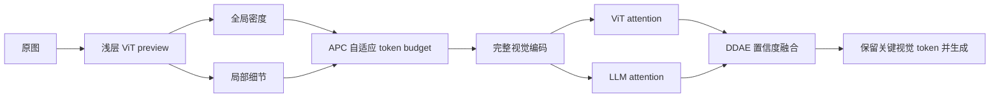
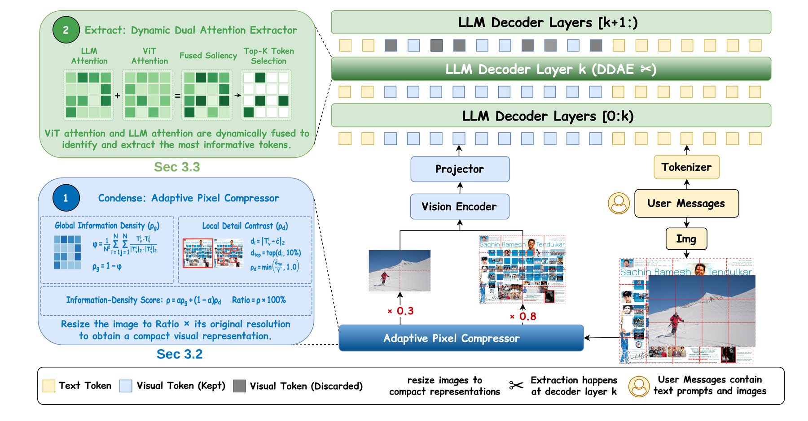

# PACE：统一的视觉压缩与抽取式 VLM 加速

> **复现级别：核心机制 + 真实 checkpoint 公开数据验证。** APC、DDAE 公式和 Qwen2.5-VL 自适应分辨率路径均实际执行；没有把小样本结果冒充论文完整 benchmark。

## 论文信息

| 项目 | 内容 |
| --- | --- |
| 论文链接 | [arXiv 2608.27206](https://arxiv.org/abs/2608.27206) |
| 公司/机构 | Sun Yat-sen University |
| 首次公开日期 | 2026-08-27（arXiv v1） |
| 原文开源代码 | 是：[PACE](https://github.com/jjL357/PACE)（本次核对 commit `7755240`） |
| Adapter | `pace-vlm` |
| 本地复现代码 | [`src/auto_research/reproductions/pace_vlm/`](https://github.com/daiwk/auto-research/tree/main/src/auto_research/reproductions/pace_vlm/) |

## 原始论文总结

### 背景与主要改动

VLM 的视觉 token 一方面在 prefill 阶段带来大量计算，另一方面在抽取阶段仍会保留大量与问题无关的内容。PACE 将两个阶段拆开处理：APC 用浅层 ViT preview 同时估计全局语义密度和局部细节，按图像难度自适应缩放；DDAE 再融合 LLM 与视觉编码器的注意力，以置信度决定两种证据各占多少权重，而不是固定只信一种注意力图。



<!-- paper-figure:start -->
### 原论文关键图

[](https://arxiv.org/html/2608.27206v1/figures/overview.png)

> **原论文 Figure 4（关键图）**：展示原论文的整体流程、关键阶段及其数据流向。图片来自[原论文](https://arxiv.org/abs/2608.27206)，版权归原作者所有；点击图片可查看来源。
<!-- paper-figure:end -->

### 核心公式

设浅层视觉特征为 $z_i$，全局密度使用 token 两两相似度的反量，局部细节取偏离背景最大的 top-$k$ token：

$$
D_g=1-\frac{1}{N(N-1)}\sum_{i\ne j}\cos(z_i,z_j),\qquad
D_l=\frac{1}{k}\sum_{i\in\operatorname{TopK}}\lVert z_i-\bar z\rVert_2.
$$

APC budget 为 $r=\operatorname{clip}(\alpha D_g+(1-\alpha)D_l,r_{min},1)$。DDAE 对两路归一化注意力 $a_L,a_V$ 依据其离散度生成权重：

$$
w=\operatorname{softmax}([\sigma(a_L),\sigma(a_V)]/\tau),\qquad
a=w_La_L+w_Va_V.
$$

### 论文离线与线上效果

论文在 Qwen2.5-VL-7B 上报告：只保留约 **10%** 视觉 token 时仍保留平均 **93.8%** 原模型性能，TTFT 最高约 **3.1×** 加速；同时覆盖 3B checkpoint 与多类 VQA/文档理解任务。该工作是推理算法论文，没有工业线上 A/B。

## 本地复现

> **本地对照口径**：基线是同一 Qwen2.5-VL checkpoint 的原始视觉分辨率；实验组是 PACE APC 自适应分辨率。正式比较看 RealWorldQA answer accuracy、输入 token、生成时延和峰值显存；不适用 DIN。公式 mini-suite 中，细节图相对平滑图的保留率高 **95.00 个百分点**。

快速机制验证：

```bash
auto-research reproduce --paper pace-vlm --seed 42
```

真实 CUDA 路径：

```bash
python -m auto_research.reproductions.pace_vlm.checkpoint \
  --output runs/pace-vlm-realworldqa.json \
  --revision <pinned-model-revision> \
  --dataset-revision <pinned-dataset-revision> \
  --examples 8 --seed 42
```

机制指标见 [`metrics/mechanism-seed42.json`](metrics/mechanism-seed42.json)，A30 的可审计 checkpoint 指标见 [`../../gpu-validations/pace-vlm-a30-20260829.json`](../../gpu-validations/pace-vlm-a30-20260829.json)。该 CUDA smoke test 使用公开 SmolVLM2-500M 与 POPE/COCO 子集验证 APC 在真实视觉特征上的执行路径；默认 runner 仍支持 Qwen2.5-VL + RealWorldQA，前者不冒充后者的论文级结果。模型权重和原始预测不提交 GitHub。

## Evolve 接入

论文映射为 `checkpoint_vlm:pace-apc`。`vlm-checkpoint` 第一代可以与 direct/context-first/elimination 等输入配方公平比较，后续迭代图像 budget、最大生成长度和提示模板；来源论文 ID 会写入 trial 记录。

## 复现边界

本地正式结果是小型 RealWorldQA checkpoint smoke，不覆盖论文完整 11 个 benchmark；当前 runner 实测 APC 主路径，DDAE 以独立公式和单测验证，尚未复制作者约 2,000 行的模型 fork 与定制 kernel。
