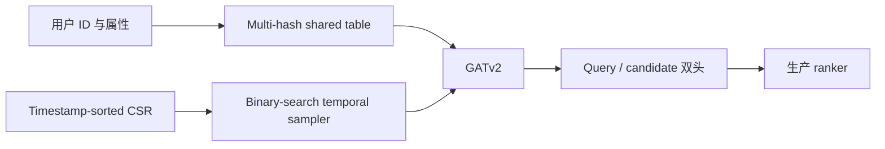
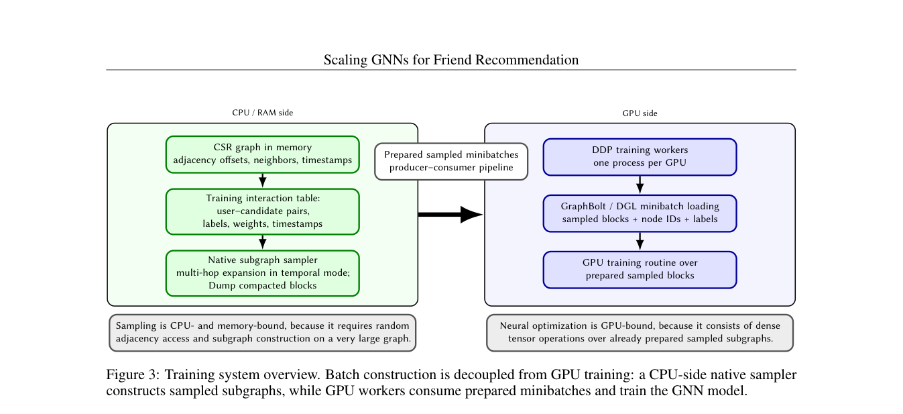

# VK Friend-GNN：多哈希表示与时序邻居采样

> **Fidelity：核心机制复现。** 本地执行多哈希共享表、按时间排序邻接与二分 cutoff，并在公开数据上与同候选集基线比较。

## 论文信息

| 项目 | 内容 |
|---|---|
| 论文链接 | [arXiv 2608.27413](https://arxiv.org/abs/2608.27413) |
| 公司/机构 | AI VK（第一作者第一署名单位） |
| 首次公开日期 | 2026-08-27（arXiv v1） |
| 原文开源代码 | 是：[makut/VK-GNN](https://github.com/makut/VK-GNN) |
| Adapter | `friend-gnn` |
| 本地复现代码 | [`src/auto_research/reproductions/friend_gnn/`](https://github.com/daiwk/auto-research/tree/main/src/auto_research/reproductions/friend_gnn/) |

## 原始论文总结

### 背景与主要改动

超大社交图既放不下完整用户 ID 表，又必须防止采到未来好友边。论文用三个独立 hash 查共享表并拼接投影，以 timestamp-sorted CSR + binary search 得到历史邻居前缀，再由 GATv2 和 query/candidate 双头打分。



<!-- paper-figure:start -->
### 原论文关键图

[](https://arxiv.org/pdf/2608.27413#page=6)

> **原论文 Figure 3（关键图）**：展示原论文的训练流程与关键优化环节。图片来自[原论文](https://arxiv.org/abs/2608.27413)，版权归原作者所有；点击图片可查看来源。
<!-- paper-figure:end -->

### 核心公式

$$
e_u=T_{h_1(u)}\|T_{h_2(u)}\|T_{h_3(u)},\qquad p=\operatorname{lower\_bound}(ts_u,\tau-\Delta).
$$

### 论文离线与线上效果

194M 用户、28B 边；ID 表压缩超过 **98%**。生产 A/B 相对强基线：好友添加 **+16%**，独立好友添加用户 **+11.5%**。

## 本地复现

> **本地对照口径**：基线为相同全候选目录上的 popularity ranker，实验组为 Friend-GNN 时序图 proxy；Hit@10 相对提升 **247.62%**，仅用于本地机制对照。

MovieLens-1M 相同全库候选口径：Hit@10 **0.0656 → 0.2281**，NDCG@10 **0.0387 → 0.1100**。该大幅变化只说明时序图邻接在此 proxy 上比 popularity 强，不可外推为 VK 线上提升。

指标见 [`metrics/movielens-1m-seed42.json`](metrics/movielens-1m-seed42.json)。

```bash
auto-research reproduce --paper friend-gnn --dataset-dir data --seed 42
```

## 复现边界

MovieLens 物品转移图不是好友图；未复刻 VK 私有日志、194M 用户图、分布式 GATv2 和生产 ranker。
