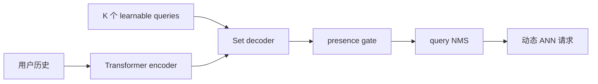
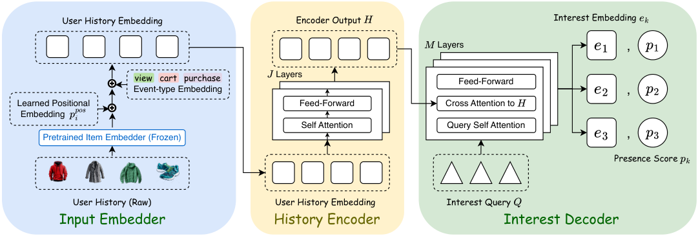

# SetMIR：把多兴趣召回建模为集合预测

> **复现级别：核心机制 + 公开数据。** 复现兴趣集合、presence 门控和 query-level NMS。

## 论文信息

| 字段 | 内容 |
|---|---|
| 论文链接 | [arXiv 2608.30251](https://arxiv.org/abs/2608.30251) |
| 公司/机构 | Snap Inc.（第一作者第一署名单位） |
| 首次公开日期 | 2026-08-31（arXiv v1） |
| 原文开源代码 | 否：未发现原作者公开代码（核查日期：2026-09-05） |
| Adapter | `setmir` |
| 本地复现代码 | [`src/auto_research/reproductions/setmir/`](https://github.com/daiwk/auto-research/tree/main/src/auto_research/reproductions/setmir/) |

## 原始论文总结

### 背景与主要改动

SetMIR 用 K 个可学习 query 解码无序兴趣集合，Hungarian matching 强制一对一分工以抑制兴趣坍缩；presence head 判断本次请求实际需要哪些兴趣，服务时再用 query-level NMS 删除重复 ANN 请求。

<!-- paper-figure:start -->
### 原论文关键图

> **原论文 Figure 1（关键图）**：展示原论文的整体流程、关键阶段及其数据流向。图片来自[原论文](https://arxiv.org/abs/2608.30251)，版权归原作者所有；点击图片可查看来源。
<!-- paper-figure:end -->

### 核心公式

集合匹配目标为 $\min_{\sigma\in S_K}\sum_k \mathcal L(q_k,y_{\sigma(k)})$；推理只派发 presence 通过且未被 NMS 抑制的 query。

### 论文离线与线上效果

论文在 Snap DPA 上减少 33% ANN 请求，总体 CVR +3.1%，并已作为生产召回源部署。

## 本地复现

用公开类型簇代理兴趣 query，执行 presence 与相关性 NMS；NDCG@10 从 0.05401 到 0.05665。三 seed 产物见 [`metrics/public-seeds42-44.json`](metrics/public-seeds42-44.json)。

> **本地对照口径**：基线 NDCG@10=0.05401，实验组 NDCG@10=0.05665，相对变化 +4.90%。

## 复现边界

未复刻私有 DPA 历史、生产 Transformer checkpoint 与 ANN dispatch；仅声明 CPU 公共数据路径。
