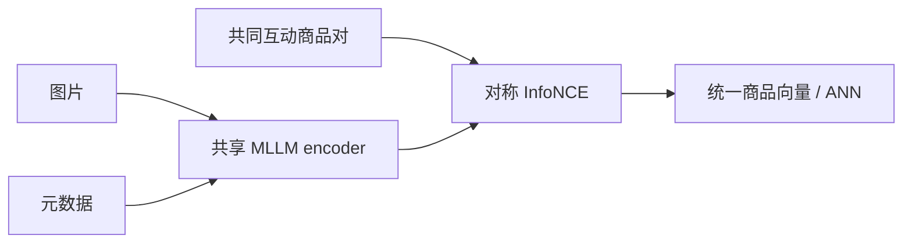
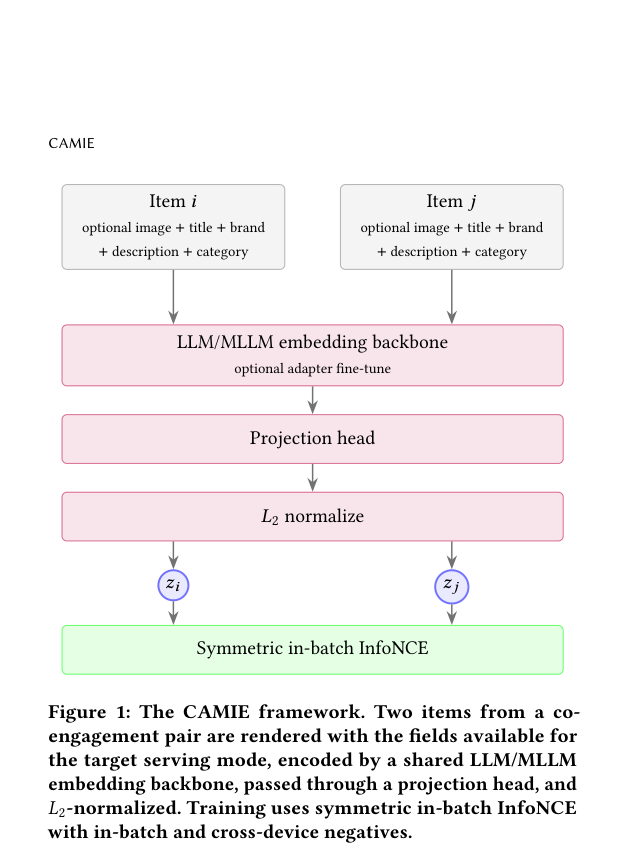

# CAMIE：用共同互动对齐多模态商品向量

> **复现级别：核心机制 + 公开数据。** 复现内容向量、共同互动正对和对称检索打分。

## 论文信息

| 字段 | 内容 |
|---|---|
| 论文链接 | [arXiv 2608.30255](https://arxiv.org/abs/2608.30255) |
| 公司/机构 | Snap Inc.（第一作者第一署名单位） |
| 首次公开日期 | 2026-08-31（arXiv v1） |
| 原文开源代码 | 否：未发现原作者公开代码（核查日期：2026-09-05） |
| Adapter | `camie` |
| 本地复现代码 | [`src/auto_research/reproductions/camie/`](https://github.com/daiwk/auto-research/tree/main/src/auto_research/reproductions/camie/) |

## 原始论文总结

### 背景与主要改动

CAMIE 用同一个 LLM/MLLM 接口编码图片和商品元数据，再从用户旅程挖掘共同互动商品对，以对称 in-batch InfoNCE 把“内容相近”校正为“行为上会共同转化”。同一 checkpoint 同时支持多模态和纯文本召回。

<!-- paper-figure:start -->
### 原论文关键图

> **原论文 Figure 1（关键图）**：展示原论文提出的核心架构、主要模块及其连接关系。图片来自[原论文](https://arxiv.org/abs/2608.30255)，版权归原作者所有；点击图片可查看来源。
<!-- paper-figure:end -->

### 核心公式

目标为 $\mathcal L=-\frac12[\log\frac{e^{q_a^Tk_b/\tau}}{\sum_j e^{q_a^Tk_j/\tau}}+\log\frac{e^{q_b^Tk_a/\tau}}{\sum_j e^{q_b^Tk_j/\tau}}]$。

### 论文离线与线上效果

生产总体流量 CTR +0.211%、CVR +1.911%，已部署。

## 本地复现

公开 MovieLens 的内容特征和共现 transition 代理共同互动，NDCG@10 为 0.05121（基线 0.05401）；负结果保留在 [`metrics/public-seeds42-44.json`](metrics/public-seeds42-44.json)，不把小数据退化包装成提升。

> **本地对照口径**：基线 NDCG@10=0.05401，实验组 NDCG@10=0.05121，相对变化 -5.18%。

## 复现边界

未包含私有 DPA 用户旅程、生产 MLLM checkpoint 与 ANN 服务；仅声明 CPU 核心机制。
