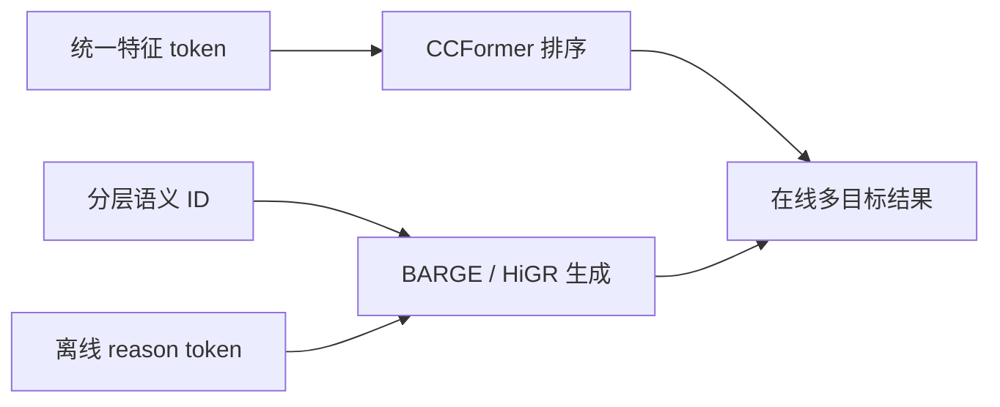
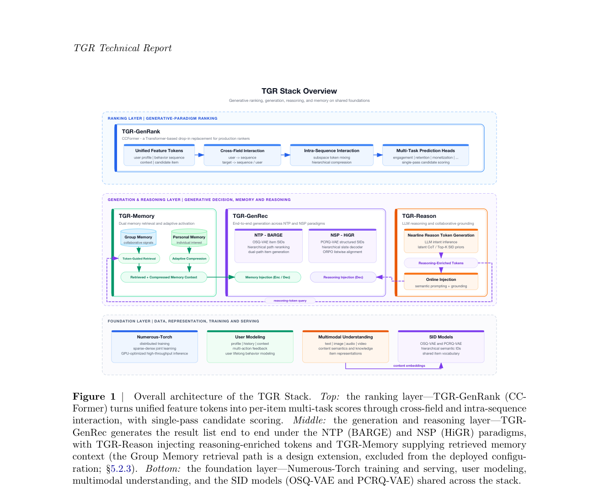

# TGR：统一生成、排序与离线推理注入

> **复现级别：核心机制 + 公开数据。** 复现分层语义 ID 路径、列表目标和 reason-token 注入的组合。

## 论文信息

| 字段 | 内容 |
|---|---|
| 论文链接 | [arXiv 2609.00986](https://arxiv.org/abs/2609.00986) |
| 公司/机构 | Tencent（TGR Team） |
| 首次公开日期 | 2026-09-01（arXiv v1） |
| 原文开源代码 | 否：未发现原作者公开代码（核查日期：2026-09-05） |
| Adapter | `tgr` |
| 本地复现代码 | [`src/auto_research/reproductions/tgr/`](https://github.com/daiwk/auto-research/tree/main/src/auto_research/reproductions/tgr/) |

## 原始论文总结

### 背景与主要改动

TGR 把工业推荐的三个方向纳入同一框架：CCFormer 承担可扩展排序，BARGE/HiGR 用分层语义 ID 生成单物品或整页列表，TGR-Reason 把离线生成的 reason token 注入在线解码，避免请求时再做昂贵 rollout。

<!-- paper-figure:start -->
### 原论文关键图

> **原论文 Figure 1（关键图）**：展示原论文提出的核心架构、主要模块及其连接关系。图片来自[原论文](https://arxiv.org/abs/2609.00986)，版权归原作者所有；点击图片可查看来源。
<!-- paper-figure:end -->

### 核心公式

本地核心路径累积分层路径置信度，并与 transition/content 列表目标联合：$s_i=\sum_l p(z_i^l\mid H)\prod_{j\le l}(0.6+p(z_i^j\mid H))+\lambda s_i^{list}$。

### 论文离线与线上效果

论文报告 CCFormer CTR +3.57%、广告收入 +1.71%；BARGE、HiGR 和 TGR-Reason 也分别通过线上实验或全量发布验证。

## 本地复现

MovieLens 100K 三 seed 固定协议下 NDCG@10 从 0.05401 提升到 0.05953。完整产物见 [`metrics/public-seeds42-44.json`](metrics/public-seeds42-44.json)。

> **本地对照口径**：基线 NDCG@10=0.05401，实验组 NDCG@10=0.05953，相对变化 +10.24%。

## 复现边界

未复刻私有 semantic-ID catalog、生产 CCFormer checkpoint 与在线生成服务；仅实现公开数据可审计核心机制。
