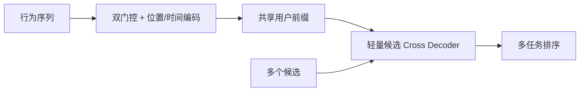
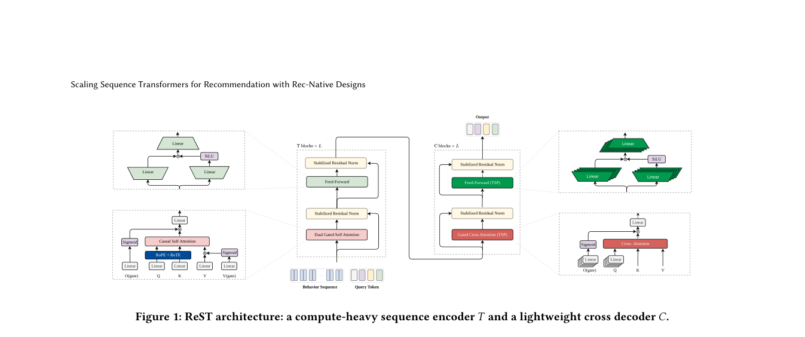

# ReST：面向工业排序的推荐原生序列 Transformer

> **复现级别：核心机制 + 公开数据。** 复现双门控时序编码、重用户编码/轻候选交叉的计算路径。

## 论文信息

| 字段 | 内容 |
|---|---|
| 论文链接 | [arXiv 2609.01240](https://arxiv.org/abs/2609.01240) |
| 公司/机构 | ByteDance（第一作者第一署名单位） |
| 首次公开日期 | 2026-09-01（arXiv v1） |
| 原文开源代码 | 否：未发现原作者公开代码（核查日期：2026-09-05） |
| Adapter | `rest` |
| 本地复现代码 | [`src/auto_research/reproductions/rest/`](https://github.com/daiwk/auto-research/tree/main/src/auto_research/reproductions/rest/) |

## 原始论文总结

### 背景与主要改动

ReST 不直接照搬语言 Transformer：双门控注意力抑制行为噪声，RoPE 与相对时间编码同时表达顺序和时间间隔；系统侧把一次请求拆成可复用的重型用户 encoder 与轻型候选 cross decoder，实现 compute-once、decode-many。

<!-- paper-figure:start -->
### 原论文关键图

> **原论文 Figure 1（关键图）**：展示原论文提出的核心架构、主要模块及其连接关系。图片来自[原论文](https://arxiv.org/abs/2609.01240)，版权归原作者所有；点击图片可查看来源。
<!-- paper-figure:end -->

### 核心公式

核心可写为 $h_u=\mathrm{DualGate}(H)$，$s(u,i)=\mathrm{CrossDecode}(h_u,e_i)$，其中 $h_u$ 在同一请求的所有候选间复用。

### 论文离线与线上效果

一周线上 A/B 中 online AUC 提升 1.31%，核心收入指标提升 11.93%，P99 保持在 50 ms，并已全量部署。

## 本地复现

在 MovieLens 100K 固定 220 用户/360 物品协议上执行时序衰减、信号门控与候选交叉路径；三 seed 结果见 [`metrics/public-seeds42-44.json`](metrics/public-seeds42-44.json)。本地 NDCG@10 为 0.05372（基线 0.05401），说明该私域工业结构不能仅凭公开小数据宣称普适提升，但核心计算与负结果均可审计。

> **本地对照口径**：基线 NDCG@10=0.05401，实验组 NDCG@10=0.05372，相对变化 -0.53%。

## 复现边界

未复刻私有行为日志、生产 checkpoint 和 shared-prefix serving kernel；本实现仅声明 CPU 公共数据核心机制，不宣传 CUDA 路径。
