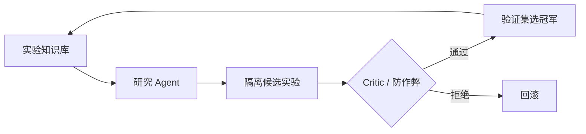
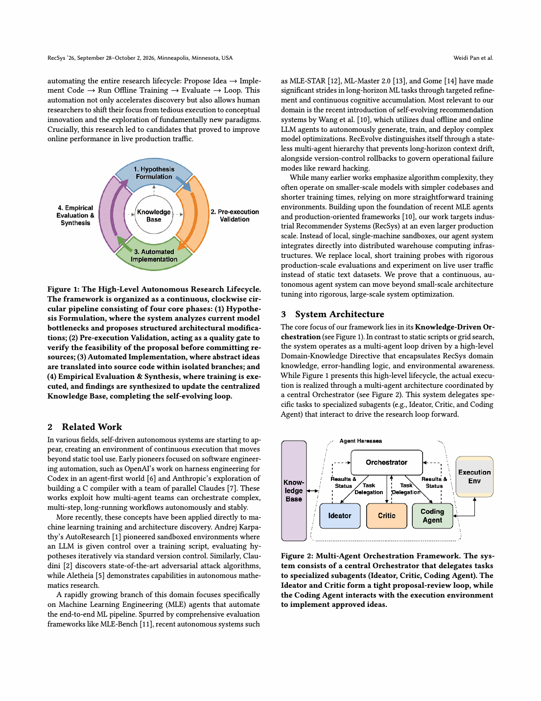

# RecEvolve：知识驱动的推荐系统自主进化

> **复现级别：核心机制 + 公开数据。** 实现提案、critic gate、隔离试验、冠军继承、回滚与 reward-hack 拒绝。

## 论文信息

| 字段 | 内容 |
|---|---|
| 论文链接 | [arXiv 2609.01622](https://arxiv.org/abs/2609.01622) |
| 公司/机构 | Google（第一作者第一署名单位） |
| 首次公开日期 | 2026-07-20（论文/arXiv 元数据） |
| 原文开源代码 | 否：未发现原作者公开代码（核查日期：2026-09-06） |
| Adapter | `recevolve` |
| 本地复现代码 | [`src/auto_research/reproductions/recevolve/`](https://github.com/daiwk/auto-research/tree/main/src/auto_research/reproductions/recevolve/) |

## 原始论文总结

RecEvolve 让研究 Agent 从实验知识库提出模型变体，以独立验证集选择冠军，并用版本化状态支持失败回滚。系统显式防止通过极端温度等方式“刷指标”，让上一轮结论成为下一轮可审计的研究知识。

<!-- paper-figure:start -->
### 原论文关键图

> 原论文总体架构图。图片来自原论文，版权归原作者所有；点击图片查看来源。
<!-- paper-figure:end -->

### 原文效果

系统自主运行 41 个实验，离线 NDCG@50 从 0.4796 提升到 0.5751（+19.9%）。生产 A/B 中用户满意度提升 3.77%、独特内容提升 7.44%，冷启动发现时间指标降低 16.50%。

## 本地复现

MovieLens 100K 上用固定候选空间执行完整研究控制流；三 seed 结果见 [`metrics/public-seeds42-44.json`](metrics/public-seeds42-44.json)。本地指标用于比较同一公开协议下的控制策略，不复刻 Google 私有 Two-Tower 数值。

## 复现边界

未复刻 Google 私有日志、TPU 集群、生产 coding-agent 工具链和线上实验归因；该 adapter 作为推荐 Evolve 的统一多轮控制器算子。
