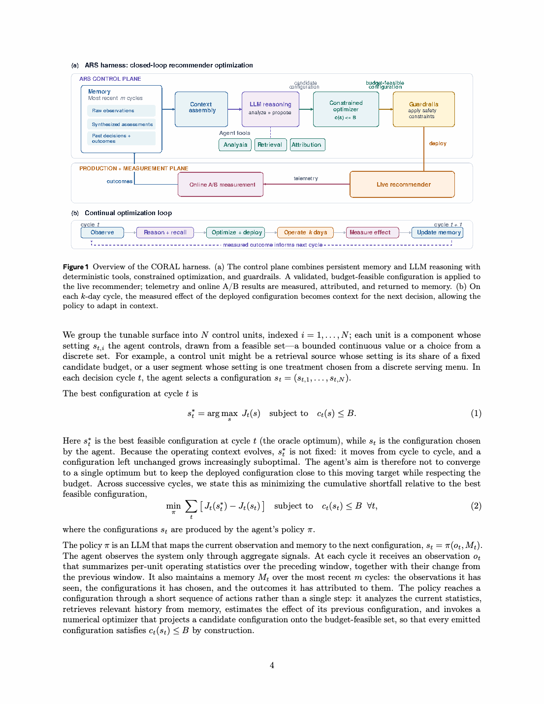

# CORAL：面向生产推荐系统的 LLM 原生研究闭环

> **复现级别：核心机制 + 公开数据。** 实现有预算约束的配置提案、短期实验记忆、效果反馈与下一轮更新。

## 论文信息

| 字段 | 内容 |
|---|---|
| 论文链接 | [arXiv 2609.02730](https://arxiv.org/abs/2609.02730) |
| 公司/机构 | Meta AI（第一作者第一署名单位） |
| 首次公开日期 | 2026-09-02（arXiv v1） |
| 原文开源代码 | 否：未发现原作者公开代码（核查日期：2026-09-06） |
| Adapter | `coral` |
| 本地复现代码 | [`src/auto_research/reproductions/coral/`](https://github.com/daiwk/auto-research/tree/main/src/auto_research/reproductions/coral/) |

## 原始论文总结

CORAL 把推荐优化建模为连续闭环：LLM 根据目标、预算和最近实验记忆生成结构化配置，执行系统验证约束并运行实验，再把观测结果写回下一轮上下文。与一次性自动调参相比，它强调可执行约束、短记忆和生产反馈。

<!-- paper-figure:start -->
### 原论文关键图

> 原论文系统与实验流程图。图片来自原论文，版权归原作者所有；点击图片查看来源。
<!-- paper-figure:end -->

### 原文线上效果

Meta 数百万用户实验中，部署配置使视频观看 session 提升 0.16%、观看时长提升 0.15%，低信号新用户 session 提升 0.23%，且没有增加 serving 成本。另一服务的第二轮实验在 engagement 中性的前提下，将首轮年化容量节省再提高 44%。

## 本地复现

在 MovieLens 100K 上执行五轮预算分配、三轮记忆和 validation-only blend；三 seed 产物见 [`metrics/public-seeds42-44.json`](metrics/public-seeds42-44.json)。该结果只验证控制器闭环和约束可执行性，不把公开小数据效果等同于 Meta 线上因果增益。

## 复现边界

未接入 Meta 私有遥测、生产 LLM、实验平台或线上流量；实现可作为推荐 Evolve 的控制器算子组合使用。
