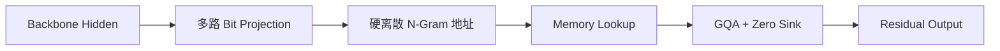
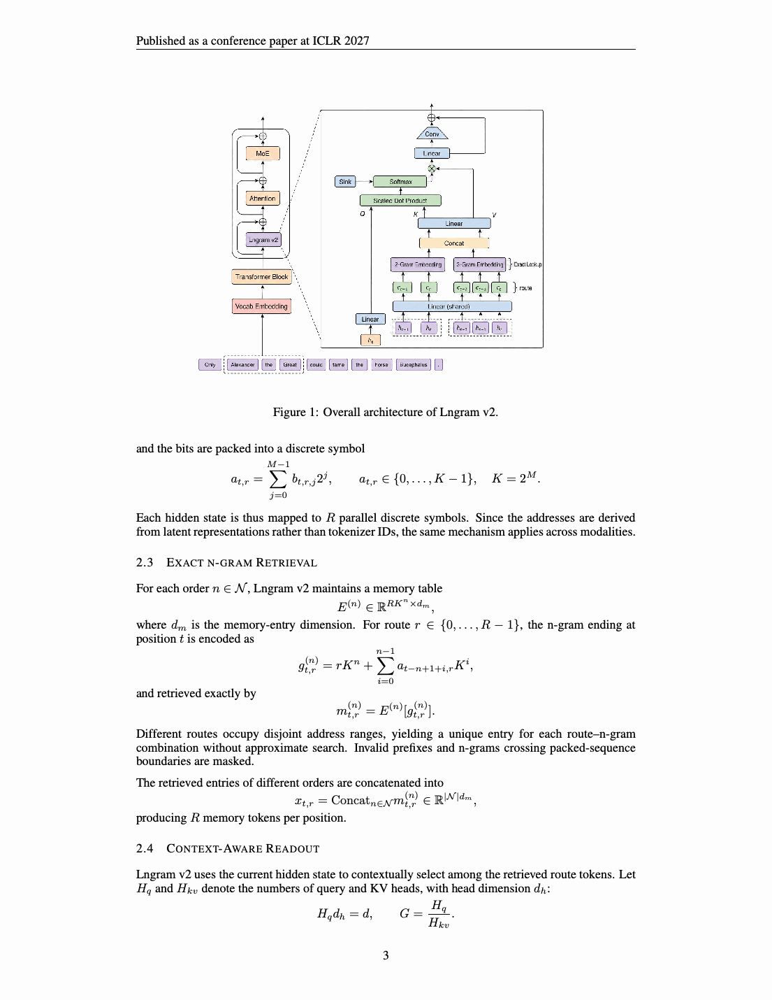

# Lngram v2：可解释离散表示的 Latent N-Gram Memory

> **复现级别：核心机制 + 真实 VLM checkpoint GPU 验证。** 实现多路离散寻址、精确 n-gram 查表、反事实 surrogate gradient 和带零 Sink 的 GQA 读出。

## 论文信息

| 字段 | 内容 |
|---|---|
| 论文链接 | [arXiv 2609.03426](https://arxiv.org/abs/2609.03426) |
| 公司/机构 | 北京邮电大学（第一作者第一署名单位；合作者含快手） |
| 首次公开日期 | 2026-09-03（arXiv v1） |
| 原文开源代码 | 否：未发现原作者公开代码（核查日期：2026-09-06） |
| Adapter | `lngram-v2` |
| 本地复现代码 | [`src/auto_research/reproductions/lngram_v2/`](https://github.com/daiwk/auto-research/tree/main/src/auto_research/reproductions/lngram_v2/) |

## 原始论文总结

Lngram v2 把 backbone hidden state 投影成多路二进制地址，以最近 1/2-gram 的离散组合 O(1) 查 memory table；多个 route token 经 GQA 读回主干。硬地址保证表示可解释，反事实邻接地址提供训练梯度，零 Sink 允许模型拒绝无用记忆。

<!-- paper-figure:start -->
### 原论文关键图

> 原论文模型结构与离散记忆路径。图片来自原论文，版权归原作者所有；点击图片查看来源。
<!-- paper-figure:end -->

### 原文效果

相较 Lngram v1，论文报告总 memory 参数减少 82.6%、单 token 激活参数减少 95.2%，离散 ID 的语义恢复率达到 65.77%–84.27%，并在 Keye 2B/30B 多模态模型验证。

## 本地复现与 GPU 证据

CPU 三 seed 机制结果见 [`metrics/public-seeds42-44.json`](metrics/public-seeds42-44.json)；真实 Qwen2.5-VL-3B-Instruct 多模态 hidden state 与 A100 反向传播回执见 [`../../gpu-validations/lngram-v2-a100-20260906.json`](../../gpu-validations/lngram-v2-a100-20260906.json)。

## 复现边界

未执行 Keye 2B/30B 全量预训练或论文规模语料；GPU 验证只声明真实公开 VLM hidden state 上的机制、梯度和显存可执行，可作为 LLM/多模态 Evolve memory 算子。
