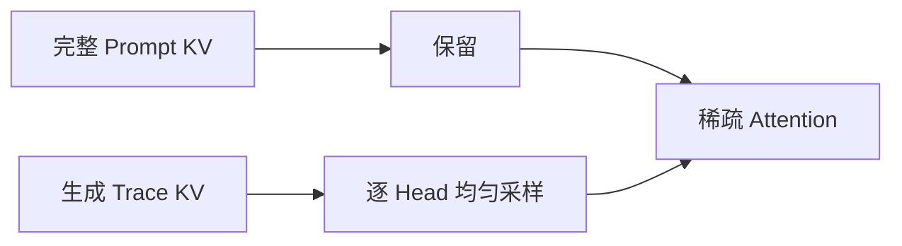
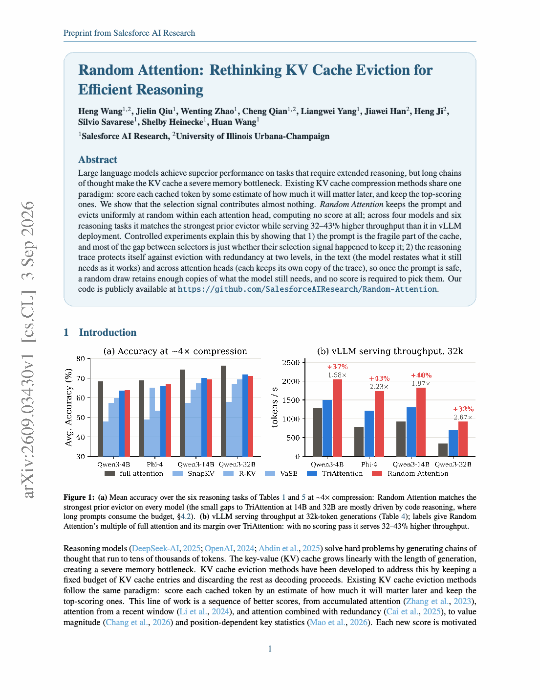

# Random Attention：无需重要性打分的 KV Cache 淘汰

> **复现级别：核心机制 + 真实 checkpoint GPU 验证。** 保留完整 prompt，并对生成 trace 按 attention head 独立均匀随机采样。

## 论文信息

| 字段 | 内容 |
|---|---|
| 论文链接 | [arXiv 2609.03430](https://arxiv.org/abs/2609.03430) |
| 公司/机构 | Salesforce AI Research（第一作者第一署名单位） |
| 首次公开日期 | 2026-09-03（arXiv v1） |
| 原文开源代码 | 是：[SalesforceAIResearch/Random-Attention](https://github.com/SalesforceAIResearch/Random-Attention) |
| Adapter | `random-attention` |
| 本地复现代码 | [`src/auto_research/reproductions/random_attention/`](https://github.com/daiwk/auto-research/tree/main/src/auto_research/reproductions/random_attention/) |

## 原始论文总结

传统 KV 淘汰先计算 token 重要性，Random Attention 则始终保护 prompt，仅在已生成 token 中逐 head 独立随机保留固定预算；它省掉评分 pass，也避免所有 head 被同一排序规则约束。

<!-- paper-figure:start -->
### 原论文关键图

> 原论文方法与结果概览。图片来自原论文，版权归原作者所有；点击图片查看来源。
<!-- paper-figure:end -->

### 原文效果

论文在四个模型、六项任务和 32k 上下文验证，在相同 KV 预算下保持推理质量；接入 vLLM 后，相对最强重要性淘汰基线的吞吐提升为 32%–43%。

## 本地复现与 GPU 证据

CPU 三 seed 机制结果见 [`metrics/public-seeds42-44.json`](metrics/public-seeds42-44.json)；真实 Qwen checkpoint、WikiText-2 KV 张量和 A100 运行回执见 [`../../gpu-validations/random-attention-a100-20260906.json`](../../gpu-validations/random-attention-a100-20260906.json)。验证严格使用等预算 prompt+recent 基线。

## 复现边界

未声称复刻论文六任务矩阵和官方 vLLM kernel 吞吐；本地 GPU 路径验证真实 KV 张量上的选择与 attention 重建，并可作为 LLM Evolve attention 算子。
