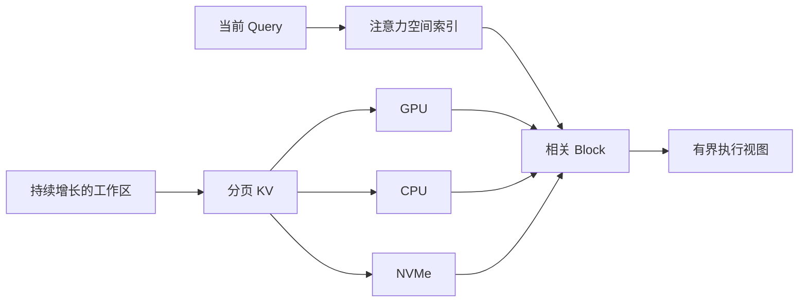
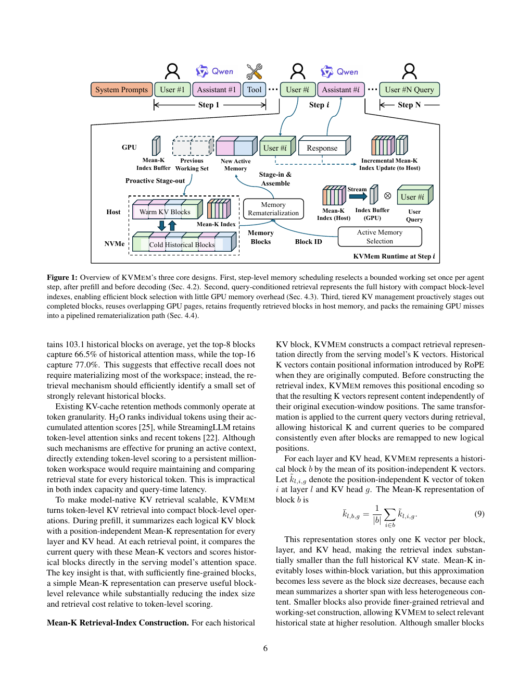

# KVMEM：把百万 token Agent 工作区虚拟化为分页 KV

> **复现级别：查询相关 block 选择 + 真实 checkpoint CUDA smoke。** 实现固定显存预算下的 query-conditioned KV 工作视图。

## 论文信息

| 字段 | 内容 |
|---|---|
| 论文链接 | [arXiv 2609.04852](https://arxiv.org/abs/2609.04852) |
| 公司/机构 | Shanghai University of Finance and Economics（第一作者第一署名单位） |
| 首次公开日期 | 2026-09-04（arXiv v1） |
| 原文开源代码 | 是：[kvmem/kvmem-qw3](https://github.com/kvmem/kvmem-qw3) |
| Adapter | `kvmem` |
| 本地复现代码 | [`src/auto_research/reproductions/kvmem/`](https://github.com/daiwk/auto-research/tree/main/src/auto_research/reproductions/kvmem/) |

## 原始论文总结

### 背景与主要改动

长寿命 Agent 的历史会同时超过显存和模型原生窗口；摘要压缩会丢证据，文本检索又要重复 prefill。KVMEM 把已计算 KV 分页放到 GPU、主存和 NVMe，用模型自身的注意力空间索引挑选相关 block，再物化为不超过原生窗口的执行视图。

<!-- paper-figure:start -->
### 原论文关键图

> **原论文系统图（关键图）**：展示 KV 工作区的分层存储、索引和按需物化。图片来自[原论文](https://arxiv.org/abs/2609.04852)，版权归原作者所有。
<!-- paper-figure:end -->

### 核心公式

对 block $b$ 的索引向量 $\bar{k}_b$，本地使用 $s_b=\langle q,\bar{k}_b\rangle/\sqrt d$ 排序，并在 block 预算内拼接命中的 KV；这保持地址空间与执行窗口解耦。

### 论文离线与线上效果

论文覆盖 LongMemEval、MemoryAgentBench、AgentLongBench 和最长 100 万 token 历史；DeepSWE 上 Qwen3.8-27B 从压缩基线 43.8% 提升到 48.4%，并在 24GB 消费级 GPU 上报告约 50 token/s。

## 本地复现

CPU fixture 见 [`metrics/synthetic-workspace-seeds42-44.json`](metrics/synthetic-workspace-seeds42-44.json)；真实公开 checkpoint 的 A100 结果见 [`../../gpu-validations/kvmem-a100-20260907.json`](../../gpu-validations/kvmem-a100-20260907.json)。

> **本地对照口径**：基线 recent-only 与实验组 query-conditioned selection 使用相同 block 预算；相对变化见 receipt（无法计算时不适用），不声称达到原系统吞吐。

## 复现边界

本地未复刻 GPU/CPU/NVMe 异步调度、NVFP4、MTP 和百万 token 完整系统实验。
