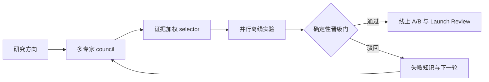
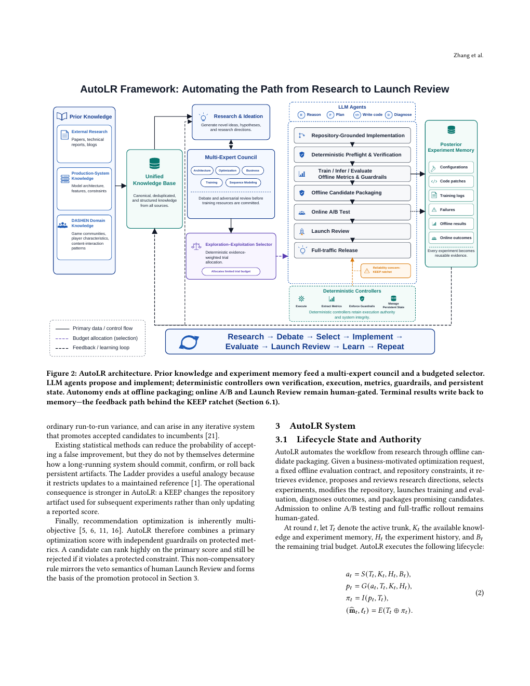

# AutoLR：从研究想法自动走到上线评审

> **复现级别：离线控制器核心。** 对输入候选与评审执行预算排序、独立指标门槛、持久化账本和人工评审打包；不包含实时 LLM 调研、自动代码生成或线上发布。

## 论文信息

| 项目 | 内容 |
| --- | --- |
| 论文链接 | [NetEase technical report](https://arxiv.org/abs/2609.04871) |
| 公司/机构 | NetEase, Inc. |
| 首次公开日期 | 2026-09-04（arXiv v1） |
| 原文开源代码 | 否：论文未提供官方/作者代码（核查日期：2026-09-07） |
| Adapter | `autolr` |
| 本地复现代码 | [`src/auto_research/reproductions/autolr/`](https://github.com/daiwk/auto-research/tree/main/src/auto_research/reproductions/autolr/) |

## 原始论文总结

### 背景与主要改动

AutoLR 将论文调研、方案辩论、代码实验、离线评估、A/B 测试与 Launch Review 串成长期状态机。LLM 负责语义推理和代码生成，确定性控制器保留预算分配、指标抽取、护栏和状态迁移权，防止噪声结果在 KEEP 链中被不断放大。

<!-- paper-figure:start -->
### 原论文关键图

> **原论文 Figure 2（关键图）**：展示研究、辩论、实验、上线证据和人工权限边界。图片来自[原论文](https://arxiv.org/abs/2609.04871)，版权归原作者所有。
<!-- paper-figure:end -->

### 核心公式

候选 $i$ 的预算分数为 $q_i=\lambda e_i+(1-\lambda)u_i-\gamma d_i$：兼顾已有证据 $e$、不确定性/探索价值 $u$ 和专家分歧风险 $d$，只有门控证据可以改变持久冠军状态。

### 论文离线与线上效果

论文审计数月日志得到 1,586 次完成的离线评估和 9 条 Launch Review；异质记录的正向相对提升描述性求和为内容消费渗透率 +5.75%、消费时长 +10.83%、有效播放 +5.55%，作者明确说明这些不是合并处理效应。

## 本地复现

2026-09-08 更正：旧版推荐分数混合不能代表 AutoLR，旧结果作废。`src/auto_research/reproductions/sep7_models.py` 的 `EvidenceController` 消费明确的候选和评审，调用实际训练/验证函数，冻结参考基线，逐指标拒绝违规候选，仅用 validation 选择后再报告 test。内置示例评审是确定性预算/数据检查，不冒充专家 LLM 辩论。

Python 调用 `reproduce("autolr", Path("data"), 42, ledger_path=Path("runs/autolr-ledger.json"))` 可保存并恢复离线账本。无合格候选时保留基线，不强制报告提升；`online_authorized` 始终为 false。

MovieLens 公开数据、seeds 42/43/44 的候选选择、分歧惩罚、NDCG 与 Recall 见 [`metrics/movielens-100k-seeds42-44.json`](metrics/movielens-100k-seeds42-44.json)。

> **本地对照口径**：基线与实验组使用相同固定预算；相对 NDCG/Recall 变化见指标产物（基线为零时不适用），不模拟内部 Launch Review。

## 复现边界

论文生产代码与 DASHEN 数据未公开；本实现可用于 Evolve 控制器组合，但不声称具备自动发布权限。
