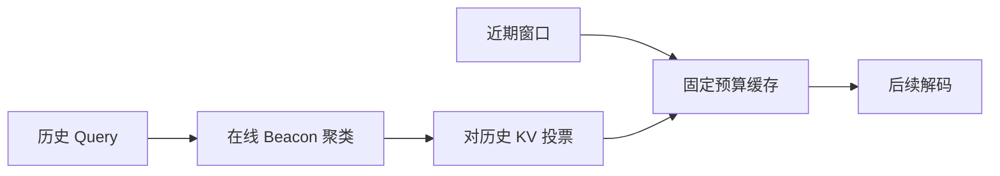
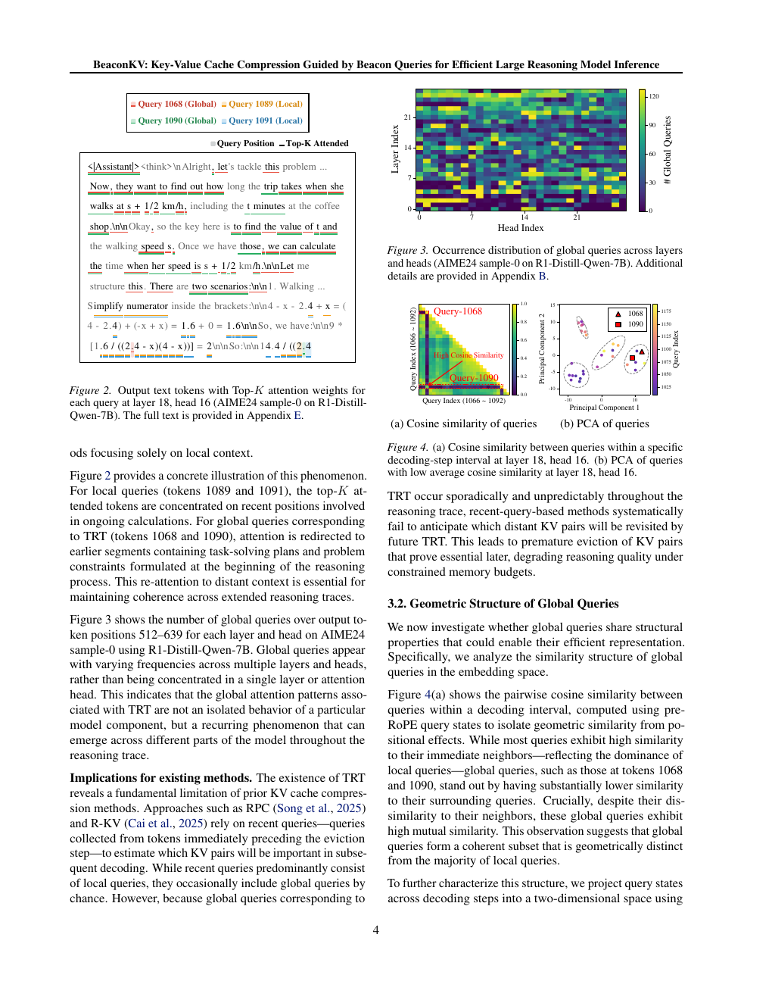

# BeaconKV：用 Beacon Query 指导推理 KV 压缩

> **复现级别：核心选择算法 + 真实 checkpoint CUDA smoke。** 保留近期 token，并用最远点采样维护能代表历史查询簇的 beacon。

## 论文信息

| 字段 | 内容 |
|---|---|
| 论文链接 | [arXiv 2609.04971](https://arxiv.org/abs/2609.04971) |
| 公司/机构 | Hanyang University（第一作者第一署名单位） |
| 首次公开日期 | 2026-09-04（arXiv v1） |
| 原文开源代码 | 否：未找到公开代码仓库（核查日期：2026-09-07） |
| Adapter | `beaconkv` |
| 本地复现代码 | [`src/auto_research/reproductions/beaconkv/`](https://github.com/daiwk/auto-research/tree/main/src/auto_research/reproductions/beaconkv/) |

## 原始论文总结

### 背景与主要改动

长推理中会出现重新关注早期计划的 Thought Revisiting Token，只用最近 query 预测未来注意力会丢失这些远程依赖。BeaconKV 对历史 query 聚类并维护少量代表 query，用它们为 KV 重要性投票，在固定缓存预算中兼顾近期上下文和远程重访。

<!-- paper-figure:start -->
### 原论文关键图

> **原论文方法图（关键图）**：展示 beacon query 如何预测远程 KV 的未来价值。图片来自[原论文](https://arxiv.org/abs/2609.04971)，版权归原作者所有。
<!-- paper-figure:end -->

### 核心公式

令 beacon 集合为 $B$，历史 key 为 $k_j$，本地按 $I_j=\max_{b\in B}\langle b,k_j\rangle$ 排序保留，同时强制保留最近窗口；beacon 以最远点准则覆盖 query 空间。

### 论文离线与线上效果

论文在四个开源推理模型和多类推理基准上报告最高 5.8 倍 KV 内存压缩、超过 4.3 倍吞吐提升，并基本保持全缓存准确率。

## 本地复现

CPU fixture 指标见 [`metrics/synthetic-long-context-seeds42-44.json`](metrics/synthetic-long-context-seeds42-44.json)；真实公开 checkpoint 的 A100 结果见 [`../../gpu-validations/beaconkv-a100-20260907.json`](../../gpu-validations/beaconkv-a100-20260907.json)。

> **本地对照口径**：基线 recent-only 与实验组 beacon 使用同一 checkpoint、序列和预算；相对变化见 receipt（无法计算时不适用），不复刻完整吞吐基准。

## 复现边界

本地没有实现推理引擎级 KV page 管理和 CUDA kernel；完整 32K 推理曲线仍以原论文为准。
