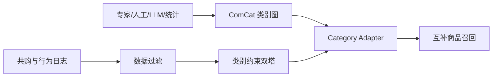
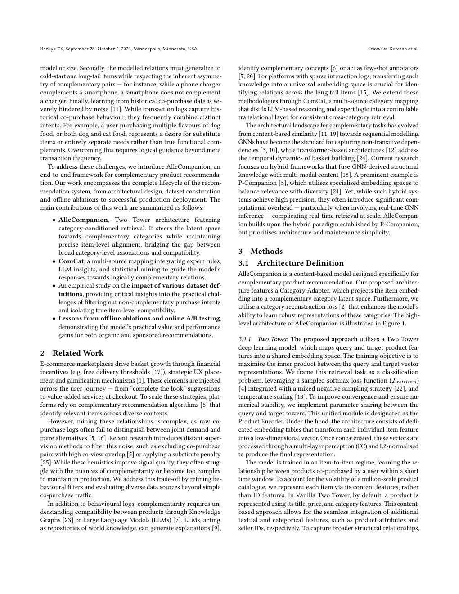

# AlleCompanion：从共购噪声中学习互补商品推荐

> **复现级别：公开数据上的核心机制 mini-suite。** 实现类别约束双塔、Category Adapter 与互补类别映射的组合打分。

## 论文信息

| 项目 | 内容 |
| --- | --- |
| 论文链接 | [RecSys 2026](https://arxiv.org/abs/2609.05063) |
| 公司/机构 | Allegro.com |
| 首次公开日期 | 2026-09-04（arXiv v1） |
| 原文开源代码 | 否：论文未提供官方/作者代码（核查日期：2026-08-13） |
| Adapter | `allecompanion` |
| 本地复现代码 | [`src/auto_research/reproductions/allecompanion/`](https://github.com/daiwk/auto-research/tree/main/src/auto_research/reproductions/allecompanion/) |

## 原始论文总结

### 背景与主要改动

共购不等于互补：相机与另一台相机可能经常一起浏览，却不如镜头真正互补。AlleCompanion 先用 ComCat 融合专家规则、人工反馈、LLM 推理和统计挖掘形成类别关系，再用类别约束双塔和 Category Adapter 把候选限制在合理的互补空间。

<!-- paper-figure:start -->
### 原论文关键图

> **原论文 Figure 1（关键图）**：展示 ComCat、类别适配与推荐服务的完整链路。图片来自[原论文](https://arxiv.org/abs/2609.05063)，版权归原作者所有。
<!-- paper-figure:end -->

### 核心公式

本地把类别互补先验写成受控残差：$s(u,i)=\langle e_u,e_i\rangle+\alpha c_{cat(u),cat(i)}+\beta r(u,i)$，其中 $c$ 来自类别图，$r$ 表示内容与行为转移一致性。

### 论文离线与线上效果

论文报告在 Allegro 全量平台流量上运行两周：Web/App 自然流量归因 GMV 分别提升 8.05%/9.35%，购物车场景分别提升 21.25%/15.73%，并服务每月超过 2,000 万活跃用户。

## 本地复现

MovieLens 公开数据、seeds 42/43/44 的 NDCG、Recall、类别一致性与运行配置见 [`metrics/movielens-100k-seeds42-44.json`](metrics/movielens-100k-seeds42-44.json)。

> **本地对照口径**：基线与实验组使用相同公开数据和候选预算；相对变化见指标产物（基线为零时不适用），不与 Allegro 线上 GMV 横向比较。

## 复现边界

ComCat 原始映射、Allegro 行为数据和生产服务未公开；本地实现的是可审计核心机制，不是生产系统复刻。
