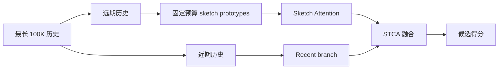
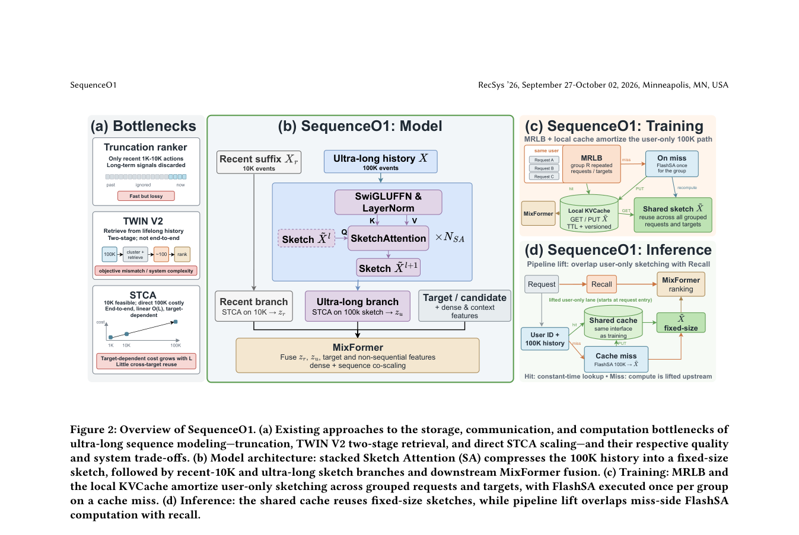

# SequenceO1：用 Sketch Attention 压缩超长用户序列

> **复现级别：公开数据核心机制。** 执行固定预算 prototype sketch 与 recent 双分支；MovieLens 不具备论文的 100K 事件历史。

## 论文信息

| 字段 | 内容 |
|---|---|
| 论文链接 | [arXiv v1](https://arxiv.org/abs/2609.08443) |
| 公司/机构 | ByteDance / Douyin |
| 首次公开日期 | 2026-09-08（arXiv v1） |
| 原文开源代码 | 否：未找到作者公开仓库（核查日期：2026-09-12） |
| Adapter | `sequenceo1` |
| 本地复现代码 | [`src/auto_research/reproductions/sequenceo1/`](https://github.com/daiwk/auto-research/tree/main/src/auto_research/reproductions/sequenceo1/) |

## 原始论文总结

### 背景与主要改动

直接注意全部历史难以服务 100K 级用户行为。SequenceO1 用 Sketch Attention 把远期历史压缩为固定数量原型，并保留近期行为分支；STCA 让 sketch 与 recent 信息并行交互，控制成本同时保留长期兴趣。

<!-- paper-figure:start -->
### 原论文关键图

> **原论文 Figure 2（关键图）**：展示原论文的整体流程、关键阶段及其数据流向。图片来自[原论文](https://arxiv.org/abs/2609.08443)，版权归原作者所有；点击图片可查看来源。
<!-- paper-figure:end -->

### 核心公式

远期特征 $H_o$ 被压成固定预算原型 $P=\operatorname{Sketch}(H_o,B)$，本地候选分数为 $0.65z(s_{recent})+0.35z(\max_{p\in P}p^\top e_i)$；因此远期分支成本不随历史长度增长。

### 论文离线与线上效果

论文在抖音与抖音极速版进行一个月 A/B，各项均显著；整体 30 日活跃 +0.1968%、时长 +1.4999%、完播 +2.3256%，随后全流量部署（Section 4.3, Table 4）。

## 本地复现与边界

MovieLens 100K 三种子结果见 [`metrics/movielens-100k-seeds42-44.json`](metrics/movielens-100k-seeds42-44.json)。原型由训练历史 farthest-first 初始化并做一次 assignment/update，固定为 4 个；未实现 MRLB、FlashSA 或线上 cache，且暂不登记不可执行的 evolve 标签。

> **本地对照口径**：同一 test 全物品排序下，基线 NDCG@10 为 0.05401，实验组为 0.05104，相对变化 -5.48%；短序列替代任务不支持线上外推。
