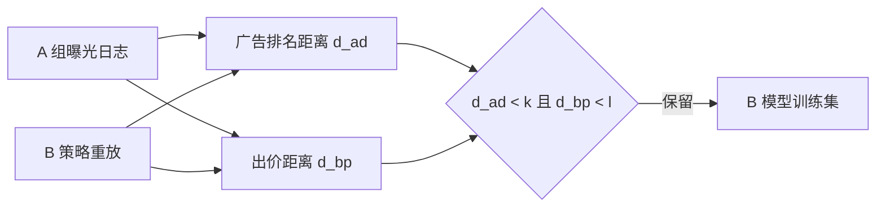
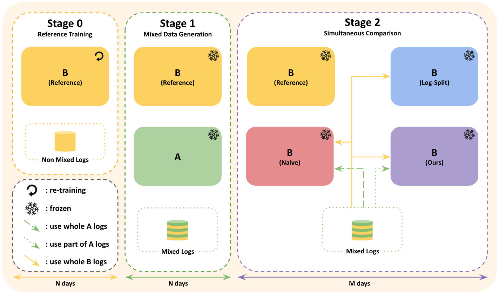

# BAFF：避免 RTB A/B 日志互相污染的出价感知过滤

> **复现级别：受控仿真核心机制。** 精确执行论文 $F(k,l)$ 过滤判据，以 B-only 训练作参照测量共享日志参数偏差；不把仿真结果称为线上提升。

## 论文信息

| 字段 | 内容 |
|---|---|
| 论文链接 | [arXiv v1](https://arxiv.org/abs/2609.08725) |
| 公司/机构 | Dable |
| 首次公开日期 | 2026-09-08（arXiv v1） |
| 原文开源代码 | 否：未找到作者公开仓库（核查日期：2026-09-12） |
| Adapter | `baff` |
| 本地复现代码 | [`src/auto_research/reproductions/baff/`](https://github.com/daiwk/auto-research/tree/main/src/auto_research/reproductions/baff/) |

## 原始论文总结

### 背景与主要改动

RTB 实验中 A/B 两个策略看到的竞价机会会互相影响；直接混用日志训练 B 模型会引入 treatment interference。BAFF 同时检查 A 广告在 B 排序中的位置差和 bid-price 差，只保留对 B 决策近似无干扰的 A 日志。

<!-- paper-figure:start -->
### 原论文关键图

> **原论文 Figure 1（关键图）**：展示原论文方法的总体设计和关键组成。图片来自[原论文](https://arxiv.org/abs/2609.08725)，版权归原作者所有；点击图片可查看来源。
<!-- paper-figure:end -->

### 核心公式

$d_{ad}=\operatorname{rank}_B(a_A)/K$，$d_{bp}=\max(bp_A-bp_B,0)/bp_A$；仅当两者分别小于 $k,l$ 时保留。

### 论文离线与线上效果

线上对照中 CPC treatment-effect gap 从 naive 的 9.85 降至 0.44，CTR gap 从 1.94 个百分点降至 0.40（Section 5.4, Tables 6–7）；这是干扰抑制准确性，不是业务 KPI uplift。

## 本地复现与边界

2,400 次受控拍卖、三种子结果见 [`metrics/controlled-rtb-seeds42-44.json`](metrics/controlled-rtb-seeds42-44.json)。仿真真实执行严格双轴过滤及 ridge 参数偏差诊断，但没有 Dable 私有 DSP 日志、生产 CTR 模型或市场侧 reference 实验。

> **本地对照口径**：基线是混用全部 A/B 日志，实验组执行 $F(0.5,0.5)$；各 seed 相对参数偏差变化见产物（可能为负），不适用业务提升百分比。
