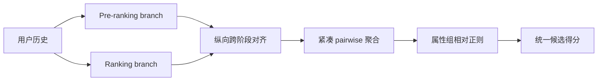
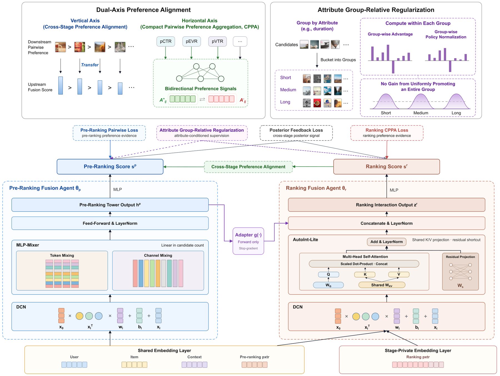

# UniRec：统一工业预排与精排

> **复现级别：公开数据核心机制。** 在同一候选空间执行纵向跨阶段对齐、紧凑 pairwise 聚合和组相对中心化；不复刻快手生产 cascade。

## 论文信息

| 字段 | 内容 |
|---|---|
| 论文链接 | [arXiv v1](https://arxiv.org/abs/2609.11052) |
| 公司/机构 | Kuaishou |
| 首次公开日期 | 2026-09-10（arXiv v1） |
| 原文开源代码 | 否：未找到作者公开仓库（核查日期：2026-09-12） |
| Adapter | `unirec` |
| 本地复现代码 | [`src/auto_research/reproductions/unirec/`](https://github.com/daiwk/auto-research/tree/main/src/auto_research/reproductions/unirec/) |

## 原始论文总结

### 背景与主要改动

预排模型既要贴近精排顺序，又受延迟限制。UniRec 把 pre-ranking/ranking 的表征和目标统一，通过纵向跨阶段对齐、紧凑 pairwise 聚合及 attribute group-relative regularization 缩小阶段间偏差。

<!-- paper-figure:start -->
### 原论文关键图

> **原论文 Figure 2（关键图）**：展示原论文提出的核心架构、主要模块及其连接关系。图片来自[原论文](https://arxiv.org/abs/2609.11052)，版权归原作者所有；点击图片可查看来源。
<!-- paper-figure:end -->

### 核心公式

本地用 $s=0.5z(s_{pre})+0.5z(s_{rank})+0.25\tanh(s_{rank}-a_g)+0.1(s-\bar s_g)$ 表达三块核心机制；$a_g$ 与 $\bar s_g$ 都只由候选所属属性组统计得到。

### 论文离线与线上效果

论文在 20% 快手线上流量运行一周：App 使用时长 +0.616%、总观看时长 +0.675%、视频观看时长 +0.755%、活跃用户 +0.189%，随后全量部署（Section 5.4, Table 5）。

## 本地复现与边界

MovieLens 100K、seeds 42/43/44 的统一公开口径见 [`metrics/movielens-100k-seeds42-44.json`](metrics/movielens-100k-seeds42-44.json)。blend 系数只在 validation 选择，test 隔离；短序列数据不能代表私有快手日志和生产延迟。本方法暂未映射进 evolve，因为主 evaluator 尚不能执行其完整算子，避免只登记标签。

> **本地对照口径**：同一 test 全物品排序下，基线 NDCG@10 为 0.05401，实验组为 0.04721，相对变化 -12.58%；这是公开替代任务的负结果。
