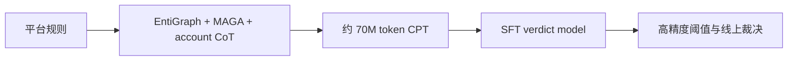
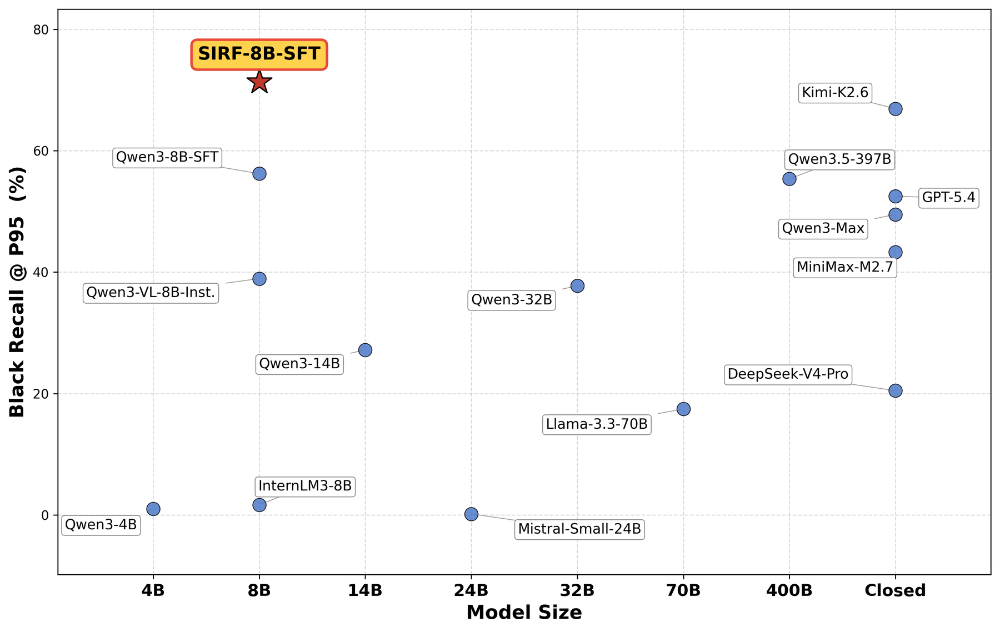

# SIRF：面向工业内容风控的规则内化基础模型

> **复现级别：概念诊断。** 执行规则关系合成、trigger/exemption 内化和 P95 阈值选择；线性模型替代 8B LLM CPT。

## 论文信息

| 字段 | 内容 |
|---|---|
| 论文链接 | [arXiv v1](https://arxiv.org/abs/2609.11752) |
| 公司/机构 | 小红书（第一作者署名单位） |
| 首次公开日期 | 2026-09-10（arXiv v1） |
| 原文开源代码 | 否：未找到作者公开仓库（核查日期：2026-09-14） |
| Adapter | `sirf` |
| 本地复现代码 | [`src/auto_research/reproductions/sirf/`](https://github.com/daiwk/auto-research/tree/main/src/auto_research/reproductions/sirf/) |

## 原始论文总结

### 背景与主要改动

SIRF 用 EntiGraph、MAGA 改写和账户级 CoT 合成长尾风控规则数据，通过 CPT 把复杂 trigger/exemption 规则写进模型权重，以单次 verdict 和可调阈值满足秒级线上判定。

<!-- paper-figure:start -->
### 原论文关键图

> **原论文 Figure 1（关键图）**：展示原论文方法的总体设计和关键组成。图片来自[原论文](https://arxiv.org/abs/2609.11752)，版权归原作者所有；点击图片可查看来源。
<!-- paper-figure:end -->

### 核心公式

本地把规则表示为触发、豁免及其交互项，训练模型后在 held-out policy cases 上扫描阈值，报告满足 Precision≥95% 的最大 Black Recall。

### 论文离线与线上效果

同源 Qwen3-8B-SFT 对照下 Black Recall@P95 提升 15.1 pp；裁决层多释放约 20% 误罚样本。冻结场景误罚相对下降约 70%，累计百万用户规模；正文还报告随机 treatment/control A/B 中 weekly active penetration 显著提升，但只披露“高个位数到低双位数”区间，没有精确值。

## 本地复现

> **本地对照口径**：同源线性特征为基线，加入规则交互项的实验组在三 seed 上 Black Recall@P95 相对提高 65.81%（绝对约 33.84 个百分点）；这不是论文 8B 模型或线上流量结果。

三种子结果见 [`metrics/policy-cases-seeds42-44.json`](metrics/policy-cases-seeds42-44.json)。论文线上结果、本地合成数据结果严格分开。

### 复现边界

没有私有账户数据、8B CPT、EntiGraph/MAGA 语言生成和线上 serving，因此本地结果不能验证论文业务提升。
