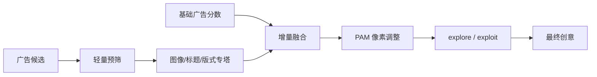
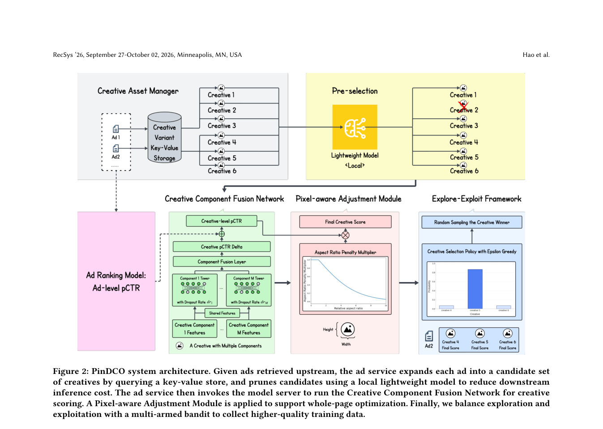

# PinDCO：面向整页收益的大规模动态创意优化

> **复现级别：公开数据核心机制。** 执行组件专塔、基于广告分数的增量融合、像素惩罚公式与候选筛选；不把 MovieLens 内容特征冒充 Pinterest 创意或生产流量。

## 论文信息

| 字段 | 内容 |
|---|---|
| 论文链接 | [arXiv v1](https://arxiv.org/abs/2609.11943) |
| 公司/机构 | Pinterest（第一作者第一署名单位） |
| 首次公开日期 | 2026-07-21（arXiv v1） |
| 原文开源代码 | 否：未发现原作者公开代码（核查日期：2026-09-15） |
| Adapter | `pindco` |
| 本地复现代码 | [`src/auto_research/reproductions/pindco/`](https://github.com/daiwk/auto-research/tree/main/src/auto_research/reproductions/pindco/) |

## 原始论文总结

### 背景与主要改动

生成式创意使每个广告的候选图像、标题与版式迅速增多。PinDCO 用组件专属 tower 分别编码异构创意，再预测相对基础广告排序 logit 的增量；PAM 根据相对长宽比惩罚过度占用瀑布流像素的创意，前置轻量筛选、缓存和动态 batching 控制线上成本，ε-greedy 流量为新创意收集较少偏的反馈。

<!-- paper-figure:start -->
### 原论文关键图

> **原论文 Figure 2（关键图）**：展示原论文提出的核心架构、主要模块及其连接关系。图片来自[原论文](https://arxiv.org/abs/2609.11943)，版权归原作者所有；点击图片可查看来源。
<!-- paper-figure:end -->

### 核心公式

CCFN 学习创意相对广告基线的增量 logit；PAM 精确实现 $S=O\,P(r)$，$P(r)=\mathrm{clip}(1-\tanh(k(r-1)),0,1)$。因此较高创意只有在增量收益足以抵消像素惩罚时才会胜出。

### 论文离线与线上效果

Pinterest 生产 A/B 中广告 CTR 相对提升 **3.09%**，整页指标为正，随后已在 Pinterest Ads 发布（Abstract；Section 4.2）。

## 本地复现

MovieLens 100K、seeds 42/43/44 的固定公开口径见 [`metrics/movielens-100k-seeds42-44.json`](metrics/movielens-100k-seeds42-44.json)。组件向量来自公开内容特征，content norm 只作为无像素数据时的可审计替代变量；blend 仅在 validation 选择，test 隔离。

> **本地对照口径**：基线 NDCG@10=0.05401，实验组 NDCG@10=0.05323，相对变化 -1.44%。

## 复现边界

未复刻 Pinterest 私有创意、用户/上下文特征、广告基线、在线 bandit 流量、缓存与服务集群。本实现不声明 CUDA 路径，也未接入 evolve，因为当前统一 evaluator 尚不能执行完整创意候选协议。
