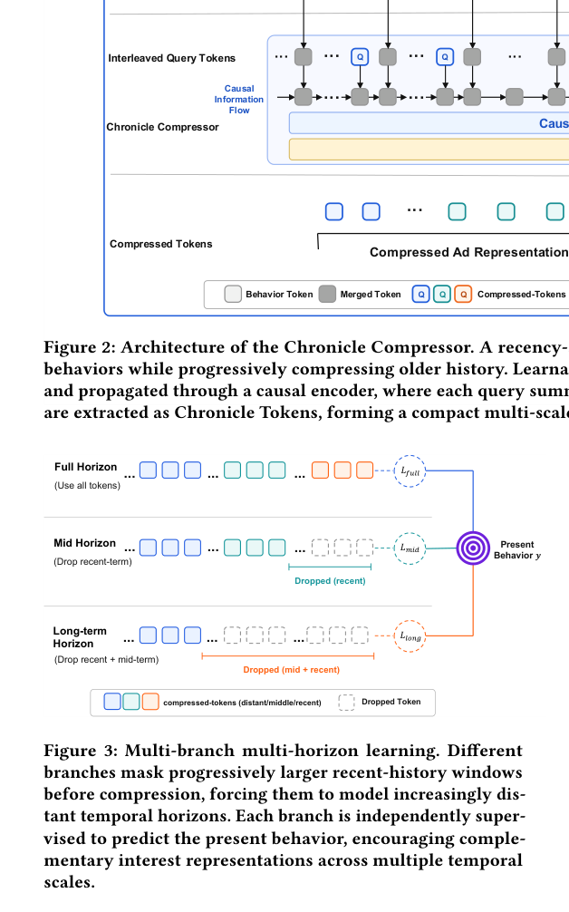

# ChronicleRec：时间锚定的终身用户兴趣压缩

> **复现级别：公开数据核心机制。** 执行近密远疏合并、因果 query 锚点、多 horizon 分支与面向近期目标的 alignment；不复刻腾讯私有 MixFormer 与缓存系统。

## 论文信息

| 字段 | 内容 |
|---|---|
| 论文链接 | [arXiv v1](https://arxiv.org/abs/2609.12375) |
| 公司/机构 | Tencent（第一作者所属团队；论文生产场景为 Weixin Moments Ads） |
| 首次公开日期 | 2026-09-11（arXiv v1） |
| 原文开源代码 | 否：未发现原作者公开代码（核查日期：2026-09-15） |
| Adapter | `chronicle-rec` |
| 本地复现代码 | [`src/auto_research/reproductions/chronicle_rec/`](https://github.com/daiwk/auto-research/tree/main/src/auto_research/reproductions/chronicle_rec/) |

## 原始论文总结

### 背景与主要改动

逐候选检索超长历史会重复计算，统一压成无序 token 又容易丢失时间结构。ChronicleRec 对近、中、远历史采用逐渐增大的合并步幅，把 query token 插入时间轴并使用 causal encoder，使每个 token 只概括其锚点之前的历史；多分支分别遮掉不同长度的近期行为，alignment 预训练再用压缩过去预测近期意图。生成的 Chronicle Tokens 与候选无关，可缓存并复用于多个候选。

<!-- paper-figure:start -->
### 原论文关键图

> **原论文 Figure 3（关键图）**：展示多个分支遮蔽不同长度的近期行为、分别预测当前行为，从而学习互补时间尺度的 multi-horizon 训练结构。图片来自[原论文](https://arxiv.org/abs/2609.12375)，版权归原作者所有；点击图片可查看来源。
<!-- paper-figure:end -->

### 核心公式

窗口 token 为 $u_w=\sum_{i\in S_w}m_iE_i/\max(\sum_i m_i,1)$；因果编码后只读取 query 位置得到 $C$。多分支分别遮蔽 $\delta_j$ 个近期行为，并以 $\mathcal L_{align}=\sum_j\bar w_j\operatorname{BCE}(\hat y_j,y)$ 对齐近期意图。

### 论文离线与线上效果

KuaiRand 上 Multi-ChronicleRec GAUC 0.5580，接近 Full-Attn 0.5601，高于 VISTA 0.5518；Tencent AdLive 上为 0.8034。Weixin Moments Ads 七天 A/B 中 GMV **+1.61%**，95% CI 为 **[+0.678%, +2.547%]**（Section 4.2、4.9）。

## 本地复现

MovieLens 100K、seeds 42/43/44 的固定协议见 [`metrics/movielens-100k-seeds42-44.json`](metrics/movielens-100k-seeds42-44.json)。alignment 只读取 train 历史与 validation target，最终 test 在模型选择后才评估。

> **本地对照口径**：基线 NDCG@10=0.05401，实验组 NDCG@10=0.04053，相对变化 -24.96%。

## 复现边界

公开短序列不能代表 2K–4K 乃至更长的生产历史；本地用线性 alignment 替代四层 causal Transformer，未复刻 AdLive、MixFormer 和异步 KV cache。实现只声明 CPU 公开数据核心机制。
