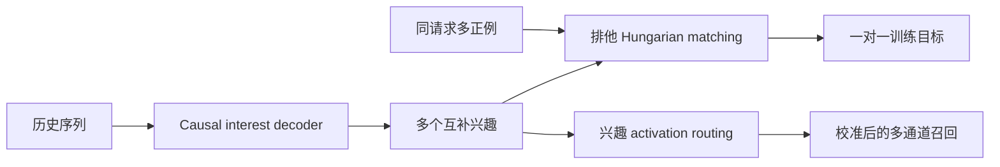
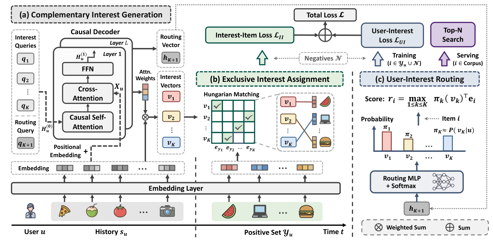

# MIMA：用多正例排他分配学习互补兴趣

> **复现级别：公开数据核心机制。** 执行多正例分组、一对一最小成本分配、互补兴趣更新和兴趣激活校准；生产 causal Transformer 由公开序列特征替代。

## 论文信息

| 字段 | 内容 |
|---|---|
| 论文链接 | [arXiv v1](https://arxiv.org/abs/2609.12842) |
| 公司/机构 | Alibaba International Digital Commerce Group（第一作者第一署名单位） |
| 首次公开日期 | 2026-09-11（arXiv v1） |
| 原文开源代码 | 否：未发现原作者公开代码（核查日期：2026-09-15） |
| Adapter | `mima` |
| 本地复现代码 | [`src/auto_research/reproductions/mima/`](https://github.com/daiwk/auto-research/tree/main/src/auto_research/reproductions/mima/) |

## 原始论文总结

### 背景与主要改动

传统多兴趣召回每个训练样本只有一个正例，容易反复更新同一个最相似兴趣并造成 interest collapse。MIMA 把同一请求共同出现的物品视为多正例集合，用 causal decoder 生成多个兴趣，再用 Hungarian matching 强制正例与兴趣一对一监督；routing 模块估计每个兴趣的激活概率，使不同通道的分数可比较。

<!-- paper-figure:start -->
### 原论文关键图

> **原论文 Figure 2（关键图）**：展示原论文提出的核心架构、主要模块及其连接关系。图片来自[原论文](https://arxiv.org/abs/2609.12842)，版权归原作者所有；点击图片可查看来源。
<!-- paper-figure:end -->

### 核心公式

对兴趣 $i_k$ 与正例 $p_j$ 构造代价 $C_{kj}=-i_k^\top p_j$，求 $\pi^*=\arg\min_\pi\sum_k C_{k,\pi(k)}$；推理时再以 $\log a_k$ 校准各兴趣通道得分。本地 mini-suite 对小规模矩阵穷举求得与 Hungarian 目标等价的精确最优一对一分配。

### 论文离线与线上效果

工业离线 HR@100/500/1000 相对最佳基线提升 7.98%/12.24%/13.03%。七天生产 A/B 中交易数 **+5.60%**、交易额 **+5.44%**，独占曝光比例增加 5.12 个百分点（Section 5.5，Tables 5–6）。

## 本地复现

MovieLens 100K、seeds 42/43/44 的统一结果见 [`metrics/movielens-100k-seeds42-44.json`](metrics/movielens-100k-seeds42-44.json)。训练正例只来自历史序列，不读取 validation/test 答案；blend 只由 validation 选择。

> **本地对照口径**：基线 NDCG@10=0.05401，实验组 NDCG@10=0.04589，相对变化 -15.03%。

## 复现边界

公开数据没有生产“同请求多成交”日志，本地以相邻行为组替代；未复刻阿里私有 catalog、生产 causal Transformer checkpoint 和在线召回系统。当前不映射 evolve，避免只有 registry 标签而无可执行候选协议。
