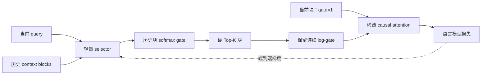
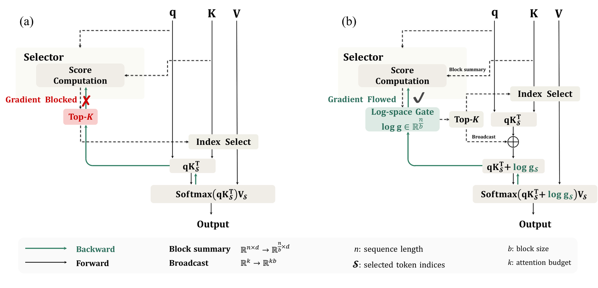

# SAS：用语言模型损失端到端学习稀疏注意力排序

> **复现级别：公开数据核心机制。** 本地真实训练冻结主干后的 selector，执行 softmax 归一化 gate、历史块 Top-K、当前块常驻和 attention softmax 内的 log-gate；不把 PyTorch 参考实现宣称为 Triton 加速实现。

## 论文信息

| 字段 | 内容 |
|---|---|
| 论文链接 | [arXiv v1](https://arxiv.org/abs/2609.13141) |
| 公司/机构 | Tencent HY LLM Frontier / HKUST (Guangzhou) / HKUST（第一作者署名单位） |
| 首次公开日期 | 2026-09-11（arXiv v1） |
| 原文开源代码 | 是：[Tencent-Hunyuan/Simple-Attention-Sparsification](https://github.com/Tencent-Hunyuan/Simple-Attention-Sparsification) |
| Adapter | `sas-attention` |
| 本地复现代码 | [`src/auto_research/reproductions/sas_attention/`](https://github.com/daiwk/auto-research/tree/main/src/auto_research/reproductions/sas_attention/) |

## 原始论文总结

### 背景与主要改动

硬 Top-K 只能改变被选中的索引，语言模型损失无法沿离散索引直接训练 selector。SAS 不再蒸馏 dense attention：selector 先给历史块连续打分，训练时保留 Top-K 块的连续 gate，并把 `log(gate)` 加到注意力 logits 内。这样最终 token prediction loss 可直接优化“哪些上下文真正影响预测”。历史块 gate 共同 softmax 归一化，当前块始终使用单位 gate，避免历史上下文整体权重漂移。

<!-- paper-figure:start -->
### 原论文关键图

> **原论文 Figure 1（关键图）**：展示原论文方法的总体设计和关键组成。图片来自[原论文](https://arxiv.org/abs/2609.13141)，版权归原作者所有；点击图片可查看来源。
<!-- paper-figure:end -->

### 核心公式

对历史块 selector 分数 $s$，先计算 $g=\operatorname{softmax}(s)$，当前块固定 $g_0=1$。选择集合 $\mathcal S=\operatorname{TopK}(s)$ 后，SAS 使用

$$
o=\operatorname{softmax}\left(qK_{\mathcal S}^{\top}/\sqrt d+\log g_{\mathcal S}\right)V_{\mathcal S}.
$$

Top-K 索引本身仍是离散的，但被选 gate 保留连续数值，因此语言模型损失可以经过 attention softmax 更新 selector。论文消融显示：softmax 内 log-gate、跨历史块归一化和连续排序信息三者都很关键。

### 论文离线与线上效果

- 1024-token budget、Qwen3-4B：MATH500 从 SeerAttention-R 的 84.67 提升到 **90.65**，GPQA-Diamond 从 39.84 提升到 **50.41**（Table 2）。
- 2048-token budget、Qwen3-4B：BFCL multi-turn 从 29.00 提升到 **32.50**（Table 4）。
- Qwen3-4B 单卡稳态 decode：512K context、batch 1 相对 dense attention 达到 **5.6×**，batch 8 在 64K 达到约 **13×**（Figure 7）。

## 本地复现

WikiText-2、seeds 42/43/44 的统一产物见 [`metrics/wikitext-2-seeds42-44.json`](metrics/wikitext-2-seeds42-44.json)。同一 tiny decoder 先训练 30 steps；SAS 从该权重复制并冻结 backbone，只训练 selector 24 steps。validation 用于观察，配置固定后才读取 test。

| 公开 CPU 指标（3 seeds 均值） | Dense | SAS |
|---|---:|---:|
| Test perplexity | 139.652 | 139.677 |
| 参与 attention 的 causal positions | 100% | 53.85% |

> **本地对照口径**：Dense 基线 test PPL=139.652，SAS 实验组 test PPL=139.677，相对变化 +0.018%（越低越好）。

SAS 的 test PPL 相对 dense 为 **+0.018%**（数值越低越好），即 tiny setting 下基本持平而非显著提升；selector 梯度范数均值为 $4.65\times10^{-5}$，证明最终 LM loss 确实到达 selector。这里的“减少 46.15% positions”是路由口径，不是墙钟加速。

## 复现边界

本地实现物化稠密注意力矩阵，仅用于验证论文的选择与梯度机制；没有复刻 Qwen3-4B/8B/14B、OLMo3-7B、OpenR1-Math-220k、LongBench、BFCL、VitaBench，也没有接入原文 Triton/FlashAttention kernel 和 SGLang benchmark。因此当前 adapter 是 CPU 的 L2 核心机制复现，不需要 GPU receipt，也不得引用论文 5.6×/13× 作为本地性能结果。CUDA kernel 路径将在 A100/A30 实测后单独升级。
