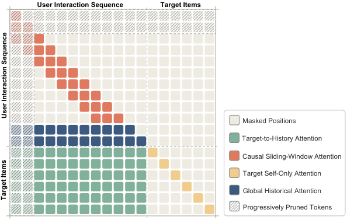

# LazFormer: Scaling Transformers for Industrial Recommendation via Transferable Generative Pre-training

> **复现级别：公开数据核心机制。** 私有日志、生产 checkpoint 与 serving 栈均未复刻。

## 论文信息

| 字段 | 内容 |
|---|---|
| 论文链接 | [arXiv v1](https://arxiv.org/abs/2609.14978) |
| 公司/机构 | Alibaba International Digital Commerce Group（第一作者署名单位） |
| 首次公开日期 | 2026-09-14（arXiv v1） |
| 原文开源代码 | 否：截至 2026-09-16 未找到原作者公开仓库 |
| Adapter | `lazformer` |
| 本地复现代码 | [`src/auto_research/reproductions/lazformer/`](https://github.com/daiwk/auto-research/tree/main/src/auto_research/reproductions/lazformer/) |

## 原始论文总结

### 背景与主要改动

先做可迁移生成式预训练，再用 ranking residual adapter、近密远疏 token 与 hybrid sparse attention 适配排序；两周 A/B 报告 IPV +5.21%、GMV +9.85%。

<!-- paper-figure:start -->
### 原论文关键图

> **原论文 Figure 2（关键图）**：展示原论文方法的总体设计和关键组成。图片来自[原论文](https://arxiv.org/abs/2609.14978)，版权归原作者所有；点击图片可查看来源。
<!-- paper-figure:end -->

### 核心公式

本地实现把论文的核心机制约束为确定性候选打分：GESE 显式组合 relevance、集合多样性、faithfulness 与上下文 selector；LazFormer 分离可迁移预训练映射和 ranking residual adapter，并只在 validation 选择融合系数。

### 论文离线与线上效果

论文线上结论来自正文生产 A/B；本地只报告同一公开候选集和切分上的离线指标，不把二者混为同一种提升。

## 本地复现

### 线上与本地结果

线上数字来自论文正文 A/B，不与本地 MovieLens 结果混写。本地 seeds 42/43/44 见 [`metrics/movielens-100k-seeds42-44.json`](metrics/movielens-100k-seeds42-44.json)。首个 seed 的统一 NDCG@10 基线为 0.05401，实验组为 0.05048，相对变化 -6.53%。

> **本地对照口径**：同一公开候选集、同一切分下，基线 NDCG@10=0.05401，实验组 NDCG@10=0.05048，相对变化 -6.53%。

## 复现边界

本地只验证公开数据上的核心状态转换；未复刻私有训练数据、大模型生成器、生产流量反馈或在线服务。当前不映射 evolve，避免 registry-only 标签。
