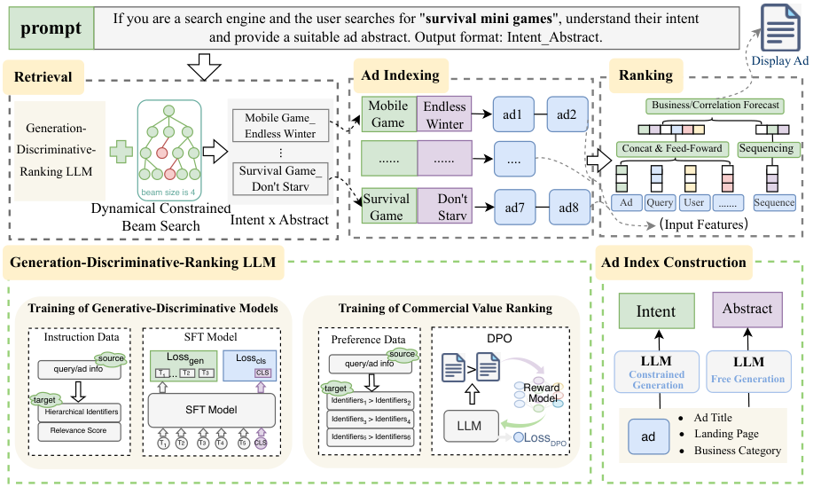

# One-Step Retrieval Framework for Real-Time Sponsored Search Ads Using Hierarchical Text Representations

> **复现级别：公开数据核心机制。** 本地在 MovieLens 100K 执行层次标识、联合打分和受约束检索；不使用腾讯私有广告日志或生产索引。

## 论文信息

| 字段 | 内容 |
|---|---|
| 论文链接 | [arXiv v1](https://arxiv.org/abs/2609.18296) |
| 公司/机构 | Tencent（第一作者署名单位） |
| 首次公开日期 | 2026-09-16（arXiv v1） |
| 原文开源代码 | 否：截至 2026-09-19 未找到原作者公开仓库 |
| Adapter | `angle` |
| 本地复现代码 | [`src/auto_research/reproductions/angle/`](https://github.com/daiwk/auto-research/tree/main/src/auto_research/reproductions/angle/) |

## 原始论文总结

### 背景与主要改动

以意图标识×摘要标识组织广告语义层次，用生成、判别和排序联合目标训练，并在请求侧动态约束 beam 只产生合法标识。

<!-- paper-figure:start -->
### 原论文关键图

> **原论文 Figure 1（关键图）**：展示原论文提出的核心架构、主要模块及其连接关系。图片来自[原论文](https://arxiv.org/abs/2609.18296)，版权归原作者所有；点击图片可查看来源。
<!-- paper-figure:end -->

### 核心公式

本地以 `s = s_gen + 0.15 s_dis` 保留生成相关性与层次标识判别信号，再由请求相关合法标识集合约束 beam；融合系数只在 validation 上选择。

### 论文离线与线上效果

论文在 Weixin Top Stories 线上 A/B 报告消费 +1.81%、GMV +2.16%、点击 +1.50%、转化 +1.44%、曝光 +2.49%。这些是原文生产结果，不等于本地 MovieLens 指标。

## 本地复现

本地 seeds 42/43/44 见 [`metrics/movielens-100k-seeds42-44.json`](metrics/movielens-100k-seeds42-44.json)。

> **本地对照口径**：同一 MovieLens 100K 候选集和时间切分下，基线与实验组使用相同评测；本地相对变化记录在指标文件中，不以论文线上 % 替代。

## 复现边界

本地在 MovieLens 100K 执行层次标识、联合打分和受约束检索；不使用腾讯私有广告日志或生产索引。
