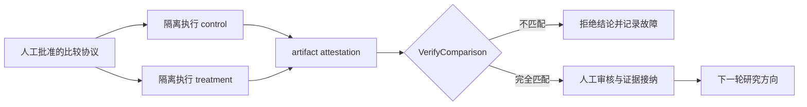
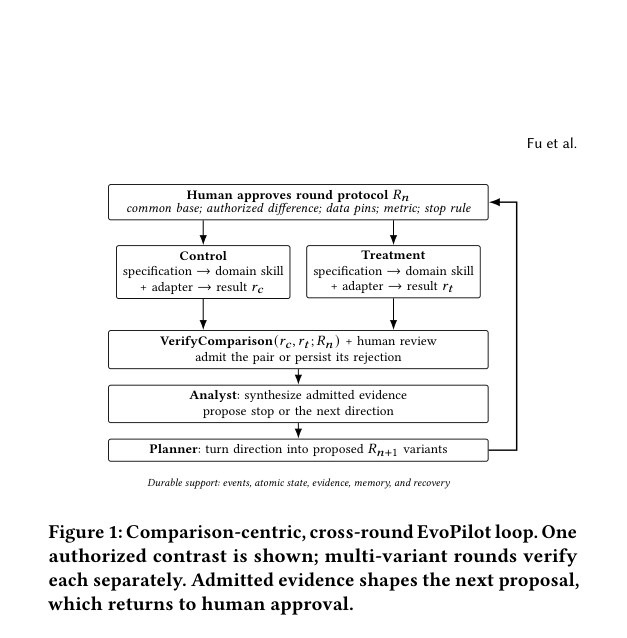

# Verify, Don't Trust: Agentic Model Development for Video Discovery Retrieval at Scale

> **复现级别：公开数据核心机制。** 本地复现的是 EvoPilot 的比较协议与 fail-closed 验证器，并在同一 MovieLens 切分上运行匹配的交互头对照；不是 Meta VDD 生产系统复刻。

## 论文信息

| 字段 | 内容 |
|---|---|
| 论文链接 | [arXiv v1](https://arxiv.org/abs/2609.21257) |
| 公司/机构 | Meta Platforms（第一作者署名单位） |
| 首次公开日期 | 2026-09-18（arXiv v1） |
| 原文开源代码 | 否：截至 2026-09-21 未找到原作者公开仓库 |
| Adapter | `evopilot` |
| 本地复现代码 | [`src/auto_research/reproductions/evopilot/`](https://github.com/daiwk/auto-research/tree/main/src/auto_research/reproductions/evopilot/) |

核心机制实现在 `src/auto_research/reproductions/latest_20260921.py`。

## 原始论文总结

### 背景与主要改动

EvoPilot 不把“某个训练任务完成”直接当成研究证据，而把**控制组与实验组的匹配比较**作为证据单元。协议固定 shared base、数据版本、评测器、有效输出深度和唯一允许变化的 treatment；执行结束后，从产物读取实际状态并 fail closed，最后仍需人工审核才能接纳结论。

<!-- paper-figure:start -->
### 原论文关键图

> **原论文 Figure 1（关键图）**：展示原论文方法的总体设计和关键组成。图片来自[原论文](https://arxiv.org/abs/2609.21257)，版权归原作者所有；点击图片可查看来源。
<!-- paper-figure:end -->

### 核心公式

论文将证据接纳写成
`A(c,t;R) = 1[Verify_R(c,t)] · 1[Review_R(c,t)]`。本地 `verify_comparison` 检查两臂终态、共同 base、数据、评测器、有效输出深度、产物 provenance，以及实际差异是否严格等于批准的 treatment。任何缺失或额外变化都会拒绝比较。

### 论文离线与线上效果

论文报告：原始不匹配比较曾错误显示离线 hit rate 下降 22 个百分点；修复输出深度后，匹配比较提升 3.20 个百分点。随后 7 天随机线上实验使 VDD slice 的 GSRR 相对提升 0.66%。这些是 Meta 生产结果，不等于本地 MovieLens 指标。

## 本地复现

> **本地对照口径**：匹配的 two-tower 代理基线 `Hit@10=0.10909`，交互头实验组 `Hit@10=0.10455`，相对变化 `-4.17%`；比较通过协议校验，但负结果原样保留，不等同于论文生产提升。

本地 seeds 42/43/44 见 [`metrics/movielens-100k-seeds42-44.json`](metrics/movielens-100k-seeds42-44.json)。指标文件同时记录：输出深度不匹配的 pair 被拒绝、只有交互头开关变化的匹配 pair 被接纳。

## 复现边界

公开 MovieLens 上执行比较协议、artifact attestation、fail-closed pair verifier 与 validation-only 交互头对照；不复刻 Meta VDD 私有视频日志、百亿级索引、远程工作流或线上流量。
