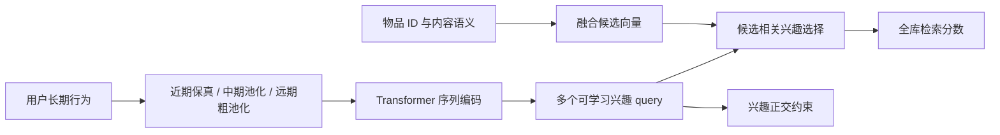
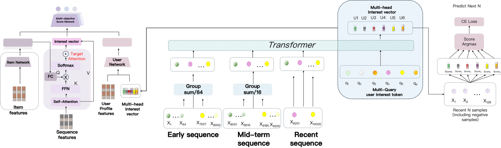

# MuSeR：分层长序列与多兴趣检索

> **复现级别：概念验证（非论文完整复现）。** 本地训练了分层时间压缩、Transformer 编码、可学习多查询兴趣、候选自适应兴趣融合与正交约束；但论文的 ERNIE→BGE 多模态语义链路被公开商品标签替代，因此不能把本地结果称为 MuSeR 论文效果。

## 论文信息

| 字段 | 内容 |
|---|---|
| 论文链接 | [arXiv v1](https://arxiv.org/abs/2609.23677) |
| 公司/机构 | Baidu（第一作者所属机构） |
| 首次公开日期 | 2026-09-20（arXiv v1） |
| 原文开源代码 | 否：截至 2026-09-26 未找到原作者发布的 MuSeR 实现仓库 |
| Adapter | `muser` |
| 本地复现代码 | [`src/auto_research/reproductions/muser/`](https://github.com/daiwk/auto-research/tree/main/src/auto_research/reproductions/muser/) |

## 原始论文总结

### 背景与主要改动

工业用户长期行为可达十万级，直接截断丢掉稳定偏好，直接 Transformer 编码又超预算。MuSeR 将最近行为原样保留，中期与远期行为分别用更大步幅汇聚；压缩后的序列由轻量 Transformer 编码。多组可学习 query 从序列状态提取不同兴趣，候选物品再通过相似度 softmax 选择兴趣。论文还把 ERNIE 生成的内容摘要蒸馏后用 BGE 编码，与 ID embedding 对齐并融合；训练使用 next-K 对比目标和兴趣正交正则。生产侧异步缓存长期表示、在线刷新短期表示，并配合分层检索。

原论文的架构图、线上部署图和实验表见[官方正文 Figure 2–3 / Table I](https://arxiv.org/html/2609.23677v1)。本页 Mermaid 是按正文机制重绘，避免把本地标签实验误标为论文多模态模型。

<!-- paper-figure:start -->
### 原论文关键图

> **原论文 Figure 2（关键图）**：展示原论文提出的核心架构、主要模块及其连接关系。图片来自[原论文](https://arxiv.org/abs/2609.23677)，版权归原作者所有；点击图片可查看来源。
<!-- paper-figure:end -->

### 核心公式

令压缩序列状态为 `H`、查询为 `q_m`，则兴趣向量为 `u_m=softmax(q_m Hᵀ/√d)H`。给定候选 `e_i`，用 `α_m=softmax_m(cos(u_m,e_i)/τ)` 选择兴趣，得分为 `Σ_m α_m cos(u_m,e_i)/τ`。正样本与负样本上的交叉熵叠加 `λΣ_{m≠n}(u_mᵀu_n)²` 抑制兴趣坍缩。本地代码实际优化这两项，而非仅展示公式。

### 论文离线与线上效果

原文在 Amazon 2023 的 Instruments、Scientific、Game 子集与 Baidu 私有日志上报告 Recall@K / NDCG@K；Baidu APP 线上 A/B 报告 DAU `+0.26%`、总会话时长 `+0.89%`，均 `p<0.05`。这些是**论文原始结果**，不能由本地数据重现。

## 本地复现

> **本地对照口径**：最近序列单兴趣 ID 为基线，三 seed test Recall@10 均值 `0.0100`；完整本地实验组 `0.0257`，相对 `+156.7%`、绝对 `+0.0157`。这是低绝对值的诊断结果，不代表论文方法在目标场景中取得显著提升。

本地使用 KuaiRand-Pure 的前 50 万条原始日志与 `user_id<10000`，保留其中 48,075 条正反馈；得到 12,462 个训练前缀、2,140 个 validation 用户末二正例之一与 2,140 个 test 用户最后正例。四组同样训练 800 步、seed 42/43/44；从各集合固定随机抽取 1,000 条作完整 7,583 物品排序，屏蔽历史已见物品。实验不是论文的 Amazon 数据，也没有在线 A/B。

| 本地完整物品排序，三 seed test 均值 | Recall@10 | NDCG@10 |
|---|---:|---:|
| 分层压缩 + 多兴趣 + 公开标签融合 | 0.0257 | 0.0129 |
| 仅最近序列 + 单兴趣 + ID | 0.0100 | 0.0053 |
| 去掉分层压缩 | 0.0247 | 0.0132 |
| 去掉公开标签融合 | 0.0110 | 0.0054 |

**本地对照口径**：同数据、相同预算的“最近序列单兴趣 ID”是基线。小规模切片中，分层压缩消融差距很小，不能声称此模块获得稳健收益；标签融合与多兴趣的组合有探索性信号，但不能归因于论文的 ERNIE/BGE。完整逐 seed 数字见[指标文件](metrics/kuairand-pure-seeds42-44.json)。

复现命令：`auto-research reproduce --paper muser --dataset-root data`。数据按仓库的公开 KuaiRand-Pure 加载协议获取；首次下载需联网。

## 复现边界

- 公开数据只有视频标签作为内容特征，没有论文使用的 ERNIE 摘要、ERNIE-Speed 蒸馏、BGE 文本/视频向量；这决定了本实验只能列为概念验证。
- 使用单机压缩和全库精确排序，不复刻十万级行为、异步缓存、HNSW 分层 beam、延迟和生产流量。
- 该数据切片训练/评测规模远小于论文，三 seed 不等于线上显著性；指标只能比较同一公开协议下的这些实现变体。
