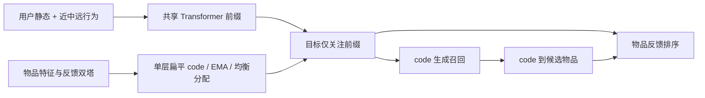
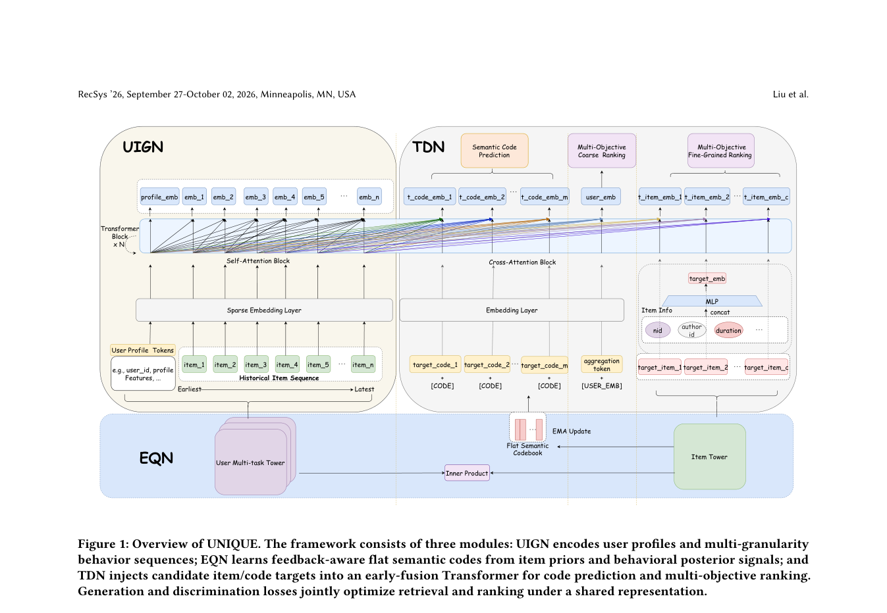

# UNIQUE：统一召回与排序

> **复现级别：公开数据缩比机制实验（概念验证）。** 执行了反馈感知单层扁平量化、EMA 与频率平衡、用户多粒度前缀、目标注意力分离、code 生成与曝光排序联合训练；缺少百度生产特征、多目标头和在线基础设施，不能称为完整论文复现。

## 论文信息

| 字段 | 内容 |
|---|---|
| 论文链接 | [arXiv v1](https://arxiv.org/abs/2609.23718) |
| 公司/机构 | Beihang University（第一作者 Zhuang Liu 所属机构；实习研究在百度完成，其他多位作者属 Baidu） |
| 首次公开日期 | 2026-09-20（arXiv v1） |
| 原文开源代码 | 否：截至 2026-09-26 未找到原作者发布的 UNIQUE 实现仓库 |
| Adapter | `unique` |
| 本地复现代码 | [`src/auto_research/reproductions/unique/`](https://github.com/daiwk/auto-research/tree/main/src/auto_research/reproductions/unique/) |

## 原始论文总结

### 背景与主要改动

传统召回与排序分开优化，召回侧较难利用排序反馈；多层残差量化又可能逐层积累误差。UNIQUE 将物品先映射到**一个扁平 code**：物品向量由用户反馈监督的双塔编码，最近邻分配经使用频率校正，并用 EMA 更新码本。用户静态特征、近期行为、中期行为及兴趣摘要构成前缀；候选 item/code 各自只关注这一前缀，而不读取其他候选。共享的编码结果同时训练 code 分布和多个排序目标，推理时先按 code 提名，再对对应物品排序。

原论文 Figure 1 的完整 EQN/UIGN/TDN 架构和 Table 2–5 的离线及线上实验见[官方正文](https://arxiv.org/html/2609.23718v1)。上图是按核心机制重绘，不表示本地含有论文的私有特征或线上 serving。

<!-- paper-figure:start -->
### 原论文关键图

> **原论文 Figure 1（关键图）**：展示原论文提出的核心架构、主要模块及其连接关系。图片来自[原论文](https://arxiv.org/abs/2609.23718)，版权归原作者所有；点击图片可查看来源。
<!-- paper-figure:end -->

### 核心公式

物品编码 `z_i` 归一化后，扁平分配为 `c_i=argmin_j ||z_i-e_j||² (p_j M)^τ`；本地使用 `τ=0.5`，并用 `z_i+sg(e_{c_i}-z_i)` 做直通估计。目标 token 以 `softmax(q_t K_prefixᵀ/√d)V_prefix` 读取前缀，不发生目标间注意力。总损失结合曝光点击 BCE、code 交叉熵、反馈双塔 BCE、量化约束；本地额外使用归一化播放时长的缩比辅助损失。

### 论文离线与线上效果

原文使用 KuaiRand-Pure 和百度内部场景；Mobile Baidu 线上 A/B 报告总观看时长 `+0.96%`、总分发量 `+1.08%`、留存 `+0.70%`。这些是**论文原始线上结果**，本地没有相应流量与系统，不能移作本地指标。

## 本地复现

> **本地对照口径**：同一早融合排序器、同数据和训练预算下，去掉联合 code 生成是基线，三 seed test CTR-AUC 均值约 `0.5282`；完整缩比实验组约 `0.5270`，相对 `-0.23%`。本地没有观察到稳定提升。

使用 KuaiRand-Pure 原始日志前 50 万行、`user_id<10000`，共保留 107,850 条曝光；训练 16,279 条、逐用户最后两条曝光作为 validation 1,709 条和 test 1,917 条。用户历史只包含当时之前的正反馈，短历史用最早已见物品左填充。每变体每 seed 训练 300 步；固定随机抽 400 条真实曝光计算 CTR-AUC；对其中最多 100 条正反馈先预测前四个 code，再按映射候选排序，排除历史已见物品。该切片规模和特征量均小于论文。

| 三 seed test 均值 | CTR-AUC | 前四 code 候选覆盖 | Code perplexity | 平均候选池 |
|---|---:|---:|---:|---:|
| 联合召回与排序 | 0.5270 | 0.0833 | 60.29 | 649.29 |
| 去掉联合生成 | 0.5282 | 不适用 | 60.41 | 不适用 |
| 去掉平衡校正 | 0.5198 | 0.3300 | 23.26 | 2077.65 |

去掉平衡校正时，更多物品挤入少数热门 code，因此四 code 覆盖看似更高，但候选池扩大约三倍；**这不是更高效的召回**。联合模型的 reranked Recall@10 三 seed 仅 `0.01/0/0`，绝对效果很弱。切片无法支持论文效益声明。逐 seed 指标见[本地指标文件](metrics/kuairand-pure-seeds42-44.json)。

运行：`auto-research reproduce --paper unique --dataset-root data`。默认公开 KuaiRand-Pure 数据由仓库加载器获取，首次运行需联网。

## 复现边界

- 仅用公开 item ID、标签、点击/长播与播放时长；没有百度的文本、发布者、细粒度反馈和多场景目标头。
- 公开日志切片未重建工业 code-to-item 索引、实时新鲜度、P99 服务时延或线上 A/B。高均衡度不等于高质量召回。
- 现有三 seed 指标只是小规模机制诊断；未按论文量级调参，不能把论文线上收益归因于本地模型。
