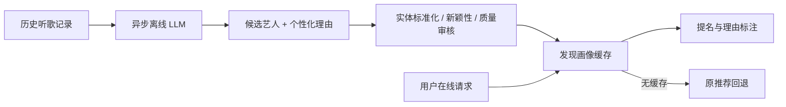
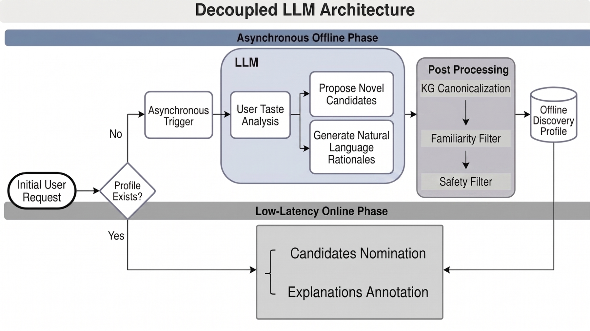

# Google YouTube Music：离线 LLM 理由生成与在线解耦

> **复现级别：公开数据概念验证。** 本地使用真实 Qwen2.5-7B-Instruct 生成新艺人提名与自然语言理由，执行目录映射、已听过过滤、理由证据检查及只读缓存在线回退。Google 的 Gemini、私有音乐知识图谱、LLM-as-a-Judge 和线上多臂 A/B 不可公开复刻；公开 Last.fm 命中率不是用户信任或线上互动效果。

## 论文信息

| 字段 | 内容 |
|---|---|
| 论文链接 | [arXiv v1](https://arxiv.org/abs/2609.23877) |
| 公司/机构 | Google LLC（第一作者 Xiao Liu 的署名单位） |
| 首次公开日期 | 2026-09-20（arXiv v1） |
| 原文开源代码 | 否：截至 2026-09-27 未找到原作者发布的系统实现仓库 |
| Adapter | `music-rationales` |
| 本地复现代码 | [`src/auto_research/reproductions/music_rationales/`](https://github.com/daiwk/auto-research/tree/main/src/auto_research/reproductions/music_rationales/) |

## 原始论文总结

### 背景与主要改动

用户愿意听熟悉的艺人，却可能不敢点开陌生艺人。论文将计算昂贵的 Gemini 推理移到异步离线阶段：根据完整的听歌历史生成“发现画像”，包含未听过的艺人和个性化理由；通过实体标准化与 LLM 评审过滤不可信理由；在线阶段只取缓存的画像，缺失时退回原有推荐。这样既能给候选附上解释，又避免在用户请求链路上运行大模型。论文的多臂 holdback 把新增提名与理由标注分开，发现理由是主导 shelf engagement 提升的因素。



### 原论文关键图

原论文 Figure 2 展示异步画像生成与低延迟在线阶段的分离，见[原文图示和图注](https://arxiv.org/html/2609.23877v1)。图片版权归原作者所有。

<!-- paper-figure:start -->
### 原论文关键图

[](https://arxiv.org/html/2609.23877v1/llm_arch_new.png)

> **原论文 Figure 2（关键图）**：展示原论文提出的核心架构、主要模块及其连接关系。图片来自[原论文](https://arxiv.org/abs/2609.23877)，版权归原作者所有；点击图片可查看来源。
<!-- paper-figure:end -->

### 核心公式与机制

对用户 `u` 的历史 `H_u`，离线生成器产生画像
`P_u = {(artist_i, rationale_i)}`。通过艺人目录映射 `canonicalize(artist_i)`
保证实体真实、`artist_i ∉ H_u` 保证新颖性、质量审核保证理由有历史依据。
在线查询仅取 `P_u` 并给推荐结果补充理由；若 `P_u` 缺失或无有效项，则用原推荐系统回退。
本地公开版本把私有音乐 KG/评审换成公开艺人目录和可核验的共享 tag，
**不是**论文评审器的等效复现。

### 论文离线与线上效果

论文表 1 报告：新增提名的 uniqueness rate `74.00%`，YDD shelf engagement
`+22.43%`（95% CI `[16.93%, 27.93%]`），discovery retention `+8.07%`
（95% CI `[0.90%, 15.24%]`）。这些全是 Google 线上多臂实验结果，
不能与本地 Last.fm Hit@5 相减或声称被本地复现。

## 本地复现

> **本地对照口径**：原 CF 基线 test Hit@5 `0.40`；提名增强实验组 `0.38`，相对 `-5.0%`。这是公开数据单 seed 概念诊断，不代表线上互动变化。

官方 [HetRec Last.fm 2K](https://files.grouplens.org/datasets/hetrec2011/)
（非商业研究许可，归档 SHA-256
`6738f48195667ff03caaab4d32ca9a3133d8cc026b7c3cdaf6ce1010e913c59c`）
提供艺人、用户消费与公开标签。逐用户固定 seed 随机 80/10/10 切分，
仅从训练行为构造协同过滤候选；固定的 Qwen2.5-7B-Instruct checkpoint 在
离线阶段挑选至多五位候选并给出含已听艺人及共享 tag 的理由。
在线模拟分别给出“新提名优先、CF 补满五位”和“CF 顺序不变、只附解释”两臂。
不含真实曝光、解释点击率或因果实验。

本地对照与结论见[固定指标文件](metrics/lastfm2k-qwen25-7b-seed42.json)。
`CF Hit@5` 是无 LLM 的训练行为基线；`LLM 有效提名 Hit@5` 是经过
目录和理由过滤的生成候选；`缓存+回退 Hit@5` 衡量提名增强后的五位展示路径。
“只附解释”臂保持 CF 候选和顺序不变，因此离线 Hit@5 必然等于基线；
只能统计已有候选获得有效解释的覆盖率，**不能**从消费标签推断解释对用户行为的因果作用。
validation 固定提示和阈值，test 只作一次隔离评估。

| 100 用户、seed 42 | Validation | Test |
|---|---:|---:|
| 原 CF Hit@5 | 0.43 | 0.40 |
| 仅有效 LLM 提名 Hit@5 | 0.14 | 0.14 |
| LLM 提名优先、CF 补足 Hit@5 | 0.42 | 0.38 |
| 只附解释、保持 CF 顺序 Hit@5 | 0.43 | 0.40 |
| 原 CF 展示位的有效解释覆盖率 | 27.6% | 27.6% |
| 用户至少有一条有效缓存提名 | 48% | 48% |

100 位用户的提案中，197 条通过目录与理由审核，301 条被拒绝，
被检查提案通过率为 39.6%。**提名增强在这份公开数据上没有提高命中：**
test 为 `0.38`，低于原 CF 的 `0.40`；单 seed、小样本且无真实曝光，
只能算机制诊断，不作稳健优劣结论。只附解释的离线命中不变是构造性质，
并非解释“没有用”的证据；论文线上多臂 A/B 的因果效果无法在 Last.fm 上测出。

运行需公开数据与已下载的同 revision 模型权重，例如：

```bash
PYTHONPATH=src python -c 'from pathlib import Path; from auto_research.reproductions.music_rationales.experiment import reproduce; print(reproduce(Path("data"), seed=42, split="validation", users=100, device="cuda:0", model_path="/path/to/Qwen2.5-7B-Instruct"))'
```

## 复现边界

- 本地确实运行 7B 权重推理、目录/新颖性/共享标签约束以及缓存/回退路径；但既未调用 Gemini，也未复刻 Google 的专有 KG 和线上 judge。
- Last.fm 没有说明文字曝光与互动结果；Hit@5 只能衡量被藏起的艺人消费命中，不能验证理由带来的信任效应。
- 2011 年公开数据没有可靠曝光时间轴，本地使用固定随机逐用户切分，不能将它宣传为时间因果验证。
- 论文线上 `+22.43%` 属于原作者证据，本地结果只属于上述公开数据诊断。
