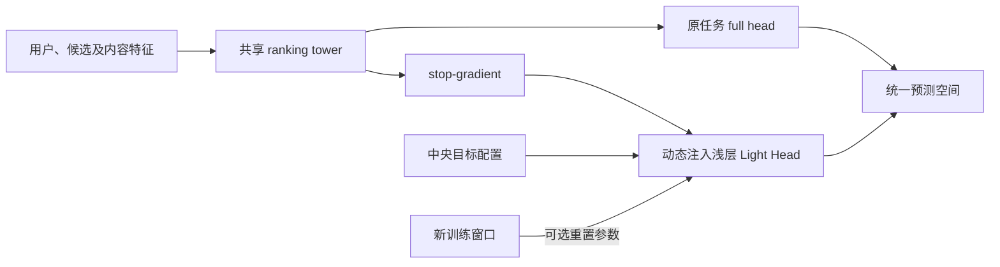
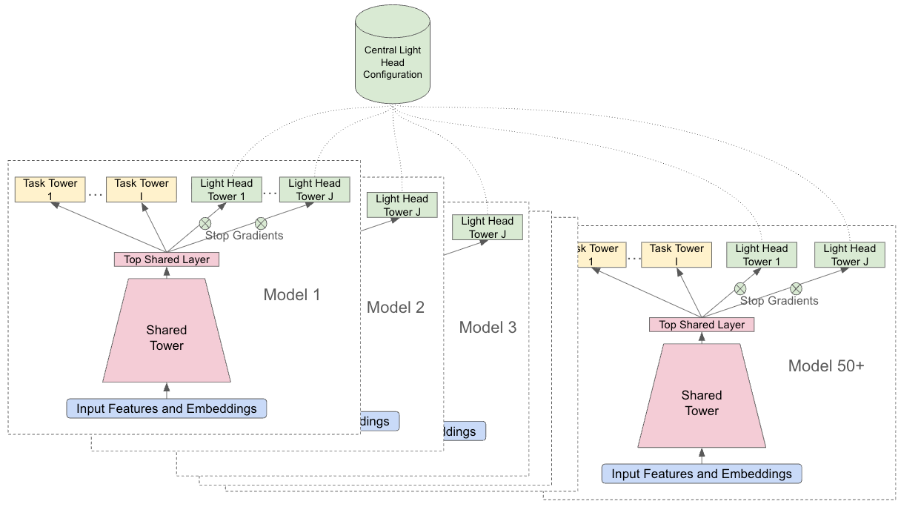

# Lightweight Ranking Heads：不用重训共享塔的多任务轻头

> **复现级别：公开数据核心机制。** 本地确实执行了动态注入、stop-gradient、训练窗口重置以及两个对应消融；没有 Google 私有流量、持续训练平台或线上下游模型。公开数据结果与论文线上结果严格分开。

## 论文信息

| 字段 | 内容 |
|---|---|
| 论文链接 | [arXiv v1](https://arxiv.org/abs/2609.25433) |
| 公司/机构 | Google LLC（第一作者署名单位） |
| 首次公开日期 | 2026-09-21（arXiv v1） |
| 原文开源代码 | 否：截至 2026-09-26 未找到原作者发布的对应实现仓库 |
| Adapter | `light-heads` |
| 本地复现代码 | [`src/auto_research/reproductions/light_heads/`](https://github.com/daiwk/auto-research/tree/main/src/auto_research/reproductions/light_heads/) |

## 原始论文总结

### 背景与主要改动

工业多任务 ranker 要添加新目标时，直接改动共享塔可能导致旧目标负迁移，还会让并行实验模型与下游模型输出空间不一致。论文把新增目标声明为中央配置，训练时在共享表示上动态挂一个浅头；轻头输入执行 `stop_gradient`，因此新目标不会回传到共享塔。每个持续训练窗口可以重置轻头参数，使不同上游模型的轻头训练年龄可比较。论文也报告了“不重置”和“去掉 stop-gradient”的消融，前者可能给数据稀疏的目标更好的拟合，后者可能损伤原任务。

### 原论文关键图

> 原论文 Figure 2，图像版权归原作者所有；[查看原文及图注](https://arxiv.org/html/2609.25433v1)。

<!-- paper-figure:start -->
### 原论文关键图

> **原论文 Figure 2（关键图）**：展示原论文的训练流程与关键优化环节。图片来自[原论文](https://arxiv.org/abs/2609.25433)，版权归原作者所有；点击图片可查看来源。
<!-- paper-figure:end -->

### 核心公式

令共享表示为 `h=f_θ(x)`，原任务为 `p_main=σ(g_φ(h))`，新目标为
`p_light=σ(q_ψ(stop_gradient(h)))`。因此只优化新目标损失时，
`∂L_light/∂θ=0`，而 `∂L_light/∂ψ≠0`。每个新训练窗口开始时可令
`ψ←init(seed)`；`θ` 和原任务参数 `φ` 保持不变。本地代码既测试梯度隔离，
也运行去掉 stop-gradient 与不重置轻头的两个消融。

### 论文离线与线上效果

论文在 YouTube 多任务模型上报告：轻头框架将联合实验周期从 24 天缩短到 11 天；
长周期目标的线上实验带来统计显著的 top-line engagement `+0.03%`、低质曝光
`-0.40%`，Primetime 垂类 engagement `+13.83%`。这些均为论文原始生产数据，
不是本地 MovieLens 结果。

## 本地复现

> **本地对照口径**：同预算不重置轻头为新任务基线，test AUC `0.6267`；标准重置实验组 `0.5109`，相对 `-18.48%`。这是公开数据短训练窗口的负结果。

MovieLens 100K 的原始显式评分按每个用户的时间顺序拆成 train/validation/test
（约 70/15/15）。已有目标为“评分 ≥4”，新轻头目标为更稀疏的“评分 =5”。
共享塔先训练 120 步；新任务在两个窗口各训练 40 步。三组使用相同初始塔、
数据和优化预算：标准轻头、保留上一窗口轻头、允许新任务梯度进入共享塔。

| 本地三 seed test AUC 均值 | 原任务 | 新任务 |
|---|---:|---:|
| 标准轻头：隔离梯度、窗口重置 | 0.6419 | 0.5109 |
| 不重置轻头 | 0.6419 | 0.6267 |
| 去掉 stop-gradient | 0.6244 | 0.6135 |

此短预算下，**重置明显不利于新任务**；而去掉梯度隔离使原任务 AUC 较低。
不能从这组三 seed 结果推论 YouTube 生产效益，更不能声称论文方法在所有数据上最好。
逐 seed 指标与切分口径见 [指标文件](metrics/movielens-100k-seeds42-44.json)。

## 复现边界

- 执行了论文定义性的“共享塔 + 动态轻头 + 梯度隔离 + 可选重置”；不是同名的后处理打分函数。
- MovieLens 星级目标只是公开的双任务替代，不包含 YouTube 的长周期奖励、视频消费或下游 co-training。
- 本地单机短训练窗口不模拟 Google 的持续学习、跨模型 fleet、统一配置服务或真实线上 A/B。
- 结果仅比较本地固定预算。后续若映射到 Evolve，必须由控制器实际执行插头与相同评测协议，不能只注册一个名称。
