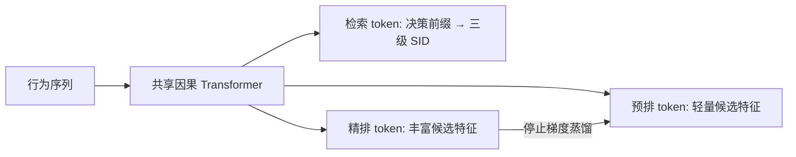
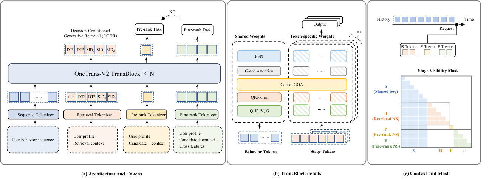

# OneTrans-V2：检索、预排和精排共享用户上下文

> **Fidelity：概念验证（非论文完整复现）；证据等级：L1 机制验证，使用完整 MovieLens-1M。** 三阶段核心计算与损失已执行，但公开 MovieLens 没有交易、广告供给和真实曝光漏斗，不能把代理指标解释为论文的业务提升。

## 论文信息

| 项目 | 内容 |
| --- | --- |
| 论文链接 | [arXiv 2609.28589](https://arxiv.org/abs/2609.28589) |
| 公司/机构 | ByteDance |
| 首次公开日期 | 2026-09-23（arXiv v1） |
| 原文开源代码 | 否：截至 2026-09-27 未找到作者发布的官方代码 |
| Adapter | `onetrans-v2` |
| 本地复现代码 | [`src/auto_research/reproductions/onetrans_v2/`](https://github.com/daiwk/auto-research/tree/main/src/auto_research/reproductions/onetrans_v2/) |

## 原始论文总结

### 背景与主要改动

工业推荐先检索海量候选，再预排缩小集合，最后精排。三套独立模型会反复编码同一用户历史，也难以让精排经验稳定反馈给上游。OneTrans-V2 保留三个阶段各自的输入与目标，却让它们共享一个因果 Transformer 用户上下文。行为序列不读阶段 token；每个阶段 token 只读请求时刻前的行为，不在阶段之间交叉读取。这既复用昂贵的用户编码，也防止未来信息泄漏。



<!-- paper-figure:start -->
### 原论文关键图

[](https://arxiv.org/html/2609.28589v1/fig2v6.png)

> **原论文 Figure 2（关键图）**：展示原论文提出的核心架构、主要模块及其连接关系。图片来自[原论文](https://arxiv.org/abs/2609.28589)，版权归原作者所有；点击图片可查看来源。
<!-- paper-figure:end -->

### 关键机制

- **决策条件生成召回（DCGR）**：先预测交互决策前缀，再自回归预测三级语义 ID；业务 offset 只改变决策前缀的排序，而不强行覆盖给定决策下的物品分布。原论文的决策包含购买、金额、新颖度和广告供给。[§4.2.1](https://arxiv.org/html/2609.28589v1#S4.SS2.SSS1)
- **预排与精排**：分别用轻量与更丰富的候选特征预测 CTR/CVR；精排 logits 停止梯度、中心化并按温度缩放，再向预排蒸馏。[§4.2.2](https://arxiv.org/html/2609.28589v1#S4.SS2.SSS2)
- **论文结果**：作者报告用户级 50/50 线上 A/B 中 GMV/user +9.74%，同硬件预算下三阶段端到端 QPS 为原级联的 3.2 倍。这是论文结果，不是本地公开数据测量。[§6.3](https://arxiv.org/html/2609.28589v1#S6.SS3)

### 核心公式

检索按决策前缀 $z$ 和三级 SID $c_{1:3}$ 分解为 $P(z,c_{1:3}\mid H)=P(z\mid H)\prod_{\ell=1}^{3}P(c_\ell\mid H,z,c_{<\ell})$。论文的决策分量包含购买、金额、发现度、广告供给；本地只监督可由公开评分/流派构造的两维代理，另外三类业务含义不能据此成立。

联合训练使用本地缩比权重 $\mathcal L=0.1(\mathcal L_{\rm decision}+\mathcal L_{\rm SID})+\mathcal L_{\rm pre}+\mathcal L_{\rm fine}+\mathcal L_{\rm KD}$，其中 KD 教师为停止梯度的精排 logits，先批内中心化再以温度 $0.5$ 缩放并 sigmoid；学生是预排 logits。这保留了论文的损失连接，但数据标签不是原文 CTR/CVR。

### 论文离线与线上效果

原文[§6.3](https://arxiv.org/html/2609.28589v1#S6.SS3)公布用户级 50/50 线上 A/B：GMV/user +9.74%，在同硬件预算下三阶段端到端 QPS 3.2 倍。这些来自私有电商系统；本地没有可对应的 GMV、广告收入、真实漏斗和服务集群，不把下表代理评分指标与其并列比较。

## 本地复现

> **本地对照口径**：本地没有可用的独立三级级联基线；实验组是共享三阶段的 MovieLens 代理机制，因而相对变化不适用。下表仅报告逐阶段可执行性，不是论文效果复现。

使用完整 MovieLens-1M 的按用户时间序列：最后两条分别留作 validation/test，所有训练前缀均早于这两条。共享骨干对行为使用因果 mask；检索、预排、精排 token 只 cross-attend 历史。检索在物品流派向量上拟合三级 residual-k-means SID，执行两维可观测的代理决策与三级自回归交叉熵；推理时可仅对这两维决策 logits 加 offset，而预排、精排和给定决策下的 SID 分布不受 offset 直接修改。预排读取 item ID，精排额外读取流派；两者分别优化评分 ≥3、评分 ≥4 的二元目标，另执行停止梯度的精排→预排蒸馏。默认 42/43/44 三种子、每种子 200 更新步。评测使用每位用户真实保留评分，不使用 sampled negative；报告各阶段 AUC/Brier、决策与 SID 精确率。offset 只做机制测试，不据此宣称业务价值提升。

| MovieLens-1M 三种子均值 | Validation | Test |
| --- | ---: | ---: |
| 预排：评分 ≥3 AUC | 0.55085 | 0.54883 |
| 精排：评分 ≥3 AUC | 0.57562 | 0.57336 |
| 预排：评分 ≥4 AUC | 0.55006 | 0.54108 |
| 精排：评分 ≥4 AUC | 0.56393 | 0.56426 |
| 检索：三级 SID 精确率 | 0.05456 | 0.05553 |

三种子差异和部分指标偏低；上述结果只能证明代理链路可运行，不能推出论文式收益，也没有独立级联基线可供效果归因。

**严禁混淆标签**：评分 ≥3/≥4 不是点击/转化，流派新颖度不是原论文完整发现度，MovieLens 更没有购买、金额、广告或真实三级曝光漏斗。故 adapter 标记为 `concept_demo`，不声称复刻 GMV、QPS 或完整 DCGR 业务控制。

```bash
auto-research reproduce --paper onetrans-v2 --dataset-dir data --seed 42
```

三种子逐项结果与数据指纹见 [`metrics/public-seeds42-44.json`](metrics/public-seeds42-44.json)。本地执行路径为 CPU，不宣传 CUDA；没有 A100/A30 验证收据。

## 复现边界

已执行共享因果用户编码、阶段隔离、三级 SID 自回归、可观测代理决策、双阶段多目标 BCE 与精排向预排蒸馏。未执行真实购买/金额/广告决策、工业物品编码、稀疏 MoE、Sequence-Native Training 的跨曝光摊销、线上服务与 A/B。
