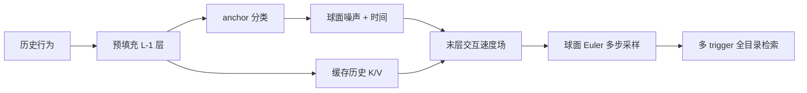
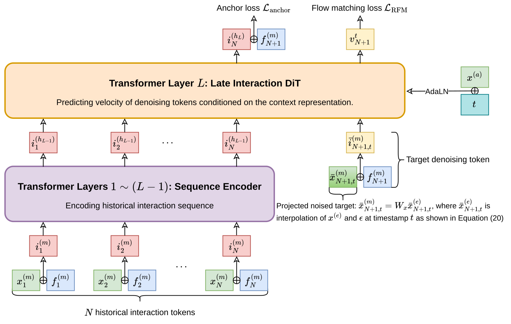

# X-Rec：球面流匹配的生成式召回

> **Fidelity：核心机制复现；证据等级：L2 公开数据集。** 公开 MovieLens 任务只检验算法链路，不代表 TikTok 流量或论文绝对结果。当前是低预算机制实验；在 MovieLens-1M 上，X-Rec 的三种子均值低于 U2I，不能宣称收益。

## 论文信息

| 项目 | 内容 |
| --- | --- |
| 论文链接 | [arXiv 2609.29180](https://arxiv.org/abs/2609.29180) |
| 公司/机构 | TikTok（ByteDance，论文署名机构） |
| 首次公开日期 | 2026-09-24（arXiv v1） |
| 原文开源代码 | 否：论文未提供官方/作者代码；截至 2026-09-27 未找到作者仓库 |
| Adapter | `xrec` |
| 本地复现代码 | [`src/auto_research/reproductions/xrec/`](https://github.com/daiwk/auto-research/tree/main/src/auto_research/reproductions/xrec/) |

## 原始论文总结

### 背景与主要改动

传统 U2I 召回将用户兴趣压缩为一个或少量向量，生成式语义 ID 方法则要逐 token 解码。X-Rec 直接在归一化 item embedding 球面上生成多个召回触发向量：先预测 item 所在的粗粒度聚类（anchor），再以该 anchor 为条件把球面噪声沿测地线流向目标 item。生成的向量与全量 item embedding 做近邻检索，可覆盖多个兴趣区域而无需语义 ID 量化。

论文的另一个重点是计算结构：历史行为先经过前 `L-1` 层 Transformer；每个去噪步只让当前生成 token 进入最后一层，与已编码的历史交互。时间和 anchor 经 AdaLN 调制最后一层。下面是原论文 Figure 2，不是本仓库重新绘制的图。



<!-- paper-figure:start -->
### 原论文关键图

[](https://arxiv.org/html/2609.29180v1#S3.F2)

> **原论文 Figure 2**：上方两条损失分别训练 anchor 预测和球面流；历史序列只在预填充阶段通过前面的层。图片来自[原论文](https://arxiv.org/html/2609.29180v1#S3.F2)，版权归原作者所有。
<!-- paper-figure:end -->

### 核心公式

给定球面噪声 $\epsilon$、目标 item 向量 $x$、夹角 $\omega=\arccos(\epsilon^\top x)$，训练路径和速度是

$$
\bar x_t=\frac{\sin((1-t)\omega)}{\sin\omega}\epsilon+\frac{\sin(t\omega)}{\sin\omega}x,
\qquad
\dot{\bar x}_t=\frac{\omega}{\sin\omega}\left(\cos(t\omega)x-\cos((1-t)\omega)\epsilon\right).
$$

模型最小化 $\mathcal L=\alpha\mathcal L_{\text{anchor}}+\beta\mathcal L_{\text{RFM}}$。推理时先把预测速度投影到当前球面点的切空间，再用 Riemannian Euler 积分产生 trigger。详见原文[§3.2–3.3](https://arxiv.org/html/2609.29180v1#S3)。

### 论文离线与线上效果

论文在 TikTok 垂类内容召回上连续两次上线：第一阶段使用球面流与末层交互，第二阶段再加入 anchor；[§5 Table 3](https://arxiv.org/html/2609.29180v1#S5) 报告垂类互动合计 **+4.1484%**，全局互动 **+0.0111%**。论文工业 streaming benchmark 中相对 SID-AR 的生成吞吐为 **3.46×**。这些都是原论文报告，不是本地公开数据实验结果；下方的 CPU 生成吞吐也不是生产 GPU streaming benchmark。

## 本地复现

> **本地对照口径**：同一全目录协议下，U2I 基线三种子 test NDCG@10 为 `0.00185`，X-Rec 实验组为 `0.00086`，相对均值 **-53.58%**；Hit@10 相对 **-60.00%**。这是本地低预算公开数据的负结果，不是 TikTok 线上收益的反证或复现。

使用完整 MovieLens-1M 数据集中的评分 ≥3 记录构造正反馈用户序列（6038 用户、3706 个物品）；每个用户尾部一条作为 validation、最后一条作为 test，只用更早历史训练。先用训练转移进行归一化 item 表征的全目录对比学习，再做球面 k-means anchor；X-Rec 依次训练训练前缀与每用户最后一个训练前缀。U2I 使用相同 item 向量、双层 Transformer 和同等总更新步数。两者均做已看物品过滤及全目录 Hit/NDCG@10，而非 sampled-negative 指标。由于 81.8 万训练前缀只抽样训练 160 步并在最后前缀上训练 40 步，当前评测只用于检查机制链路，尚不能比较充分收敛后的算法能力。

| 方法，三个种子 42/43/44 | Validation Hit@10 | Validation NDCG@10 | Test Hit@10 | Test NDCG@10 |
| --- | ---: | ---: | ---: | ---: |
| 双层 Transformer U2I | 0.00436 | 0.00178 | 0.00442 | 0.00185 |
| X-Rec 核心机制 | 0.00248 | 0.00109 | 0.00177 | 0.00086 |

这些数是三种子的算术均值；不同种子差异较大，不能推断线上 lift。逐种子验证集、测试集、训练预算及数据指纹见 [`metrics/public-seeds42-44.json`](metrics/public-seeds42-44.json)。

### 等更新步数的 SID-AR 对照

新增独立对照用同一份训练前缀和 train-only item 向量拟合三级 residual quantizer。SID-AR 使用双层历史 Transformer，逐级条件预测 SID token，并以 beam width 20 自回归生成；预测 SID 由量化码本重建为 trigger，随后对全物品向量做精确近邻检索。X-Rec 生成 20 个球面 trigger，两者均为 **20 trigger × 每个取 1 个近邻**；U2I 为 **1 trigger × 取 20 个近邻**。均在检索后过滤已看物品、按用户时间留最后两条作为 validation/test。三模型分别训练 200 次序列模型更新，训练批量均为 64；这只对齐更新次数，不对齐参数量、FLOPs 或收敛程度。

| MovieLens-1M 三种子均值 | Validation Recall@20 | Test Recall@20 | CPU 生成请求/秒 |
| --- | ---: | ---: | ---: |
| X-Rec | 0.00381 | 0.00282 | 1,918 |
| SID-AR | 0.00723 | 0.00707 | 9,567 |
| U2I | 0.00944 | 0.00823 | 11,951 |

吞吐只计模型生成，不计历史张量组装与精确近邻检索：同机 CPU、batch 16、预热 2 次、计时 5 次取中位数；三个 seed 的均值见[逐种子收据](metrics/fair-budget-seeds42-44.json)。它不是 A100/A30 的 GPU 数字，也不支持对论文的 3.46× 作直接验证。此缩比任务中 X-Rec 的召回和吞吐均低于 SID-AR，必须如实保留这个负结果。

```bash
PYTHONPATH=src python scripts/run_staged_retrieval_public.py --paper xrec-fair --dataset-dir data
```

```bash
auto-research reproduce --paper xrec --dataset-dir data --seed 42
```

## 复现边界

- 实际执行：item 对比学习、球面 anchor 聚类与 CE、测地线 RFM 监督、末层历史 K/V 复用、时间/anchor 调制、切空间速度、球面 Euler 和多 trigger 全目录检索。
- 未执行：TikTok 私有多属性日志与 streaming benchmark、工业 item encoder、ANN/在线 KV 服务、真实线上 A/B。MovieLens 没有原文的 target attribute，因此本地仅使用历史交互作为条件；本地新增的是 CPU 生成微基准，不是生产吞吐。
- 当前是 CPU 缩比训练，不宣传 CUDA 路径；没有 A100/A30 的 GPU 验证收据。本地结果只说明核心机制可运行，不是原论文结果复刻。
