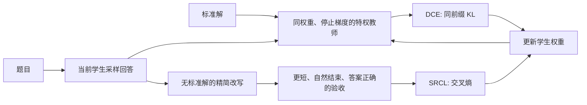
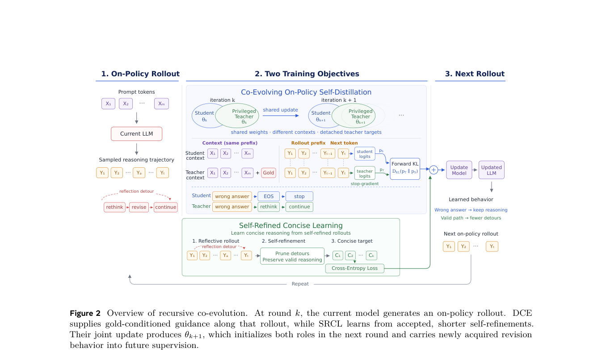

# Recursive Self-Improvement via On-Policy Distillation：动态共演化与精简自改写

## 论文信息

| 字段 | 内容 |
|---|---|
| 论文链接 | [arXiv v1](https://arxiv.org/abs/2609.30652) |
| 公司/机构 | 第一作者 Shangjian Yin：Meta AI / University of California, Riverside |
| 首次公开日期 | 2026-09-25（arXiv v1） |
| 原文开源代码 | 否：截至 2026-09-29，未找到原作者发布的训练仓库 |
| Adapter | `recursive-opsd` |
| 本地复现代码 | [`src/auto_research/reproductions/recursive_opsd/`](https://github.com/daiwk/auto-research/tree/main/src/auto_research/reproductions/recursive_opsd/) |

## 原始论文总结

论文文稿另有 2026-09-11 的内部日期；此处按 arXiv v1 首次公开时间记录。核心算法在 `src/auto_research/post_training/recursive_opsd.py`，运行入口在 `scripts/recursive_opsd_public_math.py`。

### 背景与主要改动

传统 OPSD 让学生只看题目、冻结的特权教师额外看标准解，在学生自己的输出前缀上做逐 token 蒸馏。教师停留在初始权重时，后续学生学到的回看和纠错行为无法反哺教师。论文提出两个互补改动：

1. **DCE（动态共演化）**：第 `k` 轮由当前学生采样回答 `yᵏ`；同一份当前权重、停止梯度且额外看到标准解的教师，对**相同回答前缀**给出分布 `qᵏ`。学生最小化 `KL(qᵏ‖pᵏ)`。更新后的权重同时成为下一轮学生和教师，教师不是独立优化的第二个模型。
2. **SRCL（精简自改写）**：当前模型只看题目及自己的原回答，不看标准解，生成更短的自包含解答。只有自然结束、确实更短、无显式反思／片段引用、且最终答案通过标准解验证的改写，才进入交叉熵训练；无合格改写时只做 DCE。



<!-- paper-figure:start -->
### 原论文关键图

[](https://arxiv.org/pdf/2609.30652#page=5)

> **原论文 Figure 2（关键图）**：展示原论文方法的总体设计和关键组成。图片来自[原论文](https://arxiv.org/abs/2609.30652)，版权归原作者所有；点击图片可查看来源。
<!-- paper-figure:end -->

### 核心公式

论文公式对应：

\[
L_{DCE}=\frac{1}{m}\sum_{t=1}^{m}D_{KL}\bigl(q_{k,t}\Vert p_{k,t}\bigr),\qquad
L_{joint}=\lambda_G L_{DCE}+\lambda_S L_{SRCL}.
\]

实现将标准解只送给停止梯度的特权教师及验收器。学生 rollout 和 SRCL 改写提示均不含标准解，避免把答案泄漏当作模型能力。冻结教师控制组仅固定同一 assistant-side 提示下的初始权重，不冒称论文中 **user-side 提示 + 冻结权重** 的原版 OPSD 基线。

### 论文离线与线上效果

以下将论文报告与本地机制诊断严格分开。

论文在 14,717 道 OpenThoughts 数学训练题、Qwen3 多尺度、AIME24/25/26 与 HMMT25 四项竞赛基准上，报告 Qwen3-4B DCE+SRCL 四项平均 `61.88% Average@12`；OPSD 为 `22.85%`。这是论文结果，**不是本地复现结果**。论文的生成上限 32K、每题 12 次、200 训练步、rank-128 LoRA、八卡 H100 均未在本地执行。

## 本地复现

本地只用公开 Qwen3-4B-Instruct-2507 与官方 GSM8K 的 4 道训练、2 道验证、2 道测试题，在 A100 上做 2 次 rank-8 更新、192-token 上限的机制诊断。seed `42`，固定同一数据、步数和生成上限。稳定指标文件为 [`qwen3-4b-gsm8k-seed42.json`](metrics/qwen3-4b-gsm8k-seed42.json)。

> **本地对照口径**：基线为训练前同一 checkpoint 的验证准确率；实验组为 DCE+SRCL，两者均为 1/2，相对变化不适用（样本仅 2 道）。

| 方法 | 验证准确率：训练前 → 训练后 | 平均验证输出 token：前 → 后 | 说明 |
|---|---:|---:|---|
| DCE+SRCL | 1/2 → 1/2 | 164.5 → 174.5 | 两轮 SRCL 均有通过验收的改写，LoRA 参数 L2 变化 `0.0100` |
| 冻结教师控制 | 1/2 → 1/2 | 164.5 → 174.0 | 同 assistant-side 特权提示，不等于论文 OPSD |
| DCE-only 控制 | 1/2 → 1/2 | 164.5 → 174.5 | 无 SRCL 梯度 |

三组在两道验证题上**没有准确率改善证据**，长度也没有变短；测试题仅在训练后读取，2/2 不能代表泛化收益。底层 JSON 及公开来源见 [A100 验证凭据](../../gpu-validations/recursive-opsd-a100-20260929.json)。

## 运行方式与边界

准备官方 [GSM8K](https://github.com/openai/grade-school-math) 的 `train.jsonl`、`test.jsonl` 放进 `data/gsm8k/`，并准备公开的 Qwen3-4B-Instruct-2507 checkpoint。CUDA 环境运行：

```bash
PYTHONPATH=src python scripts/recursive_opsd_public_math.py \
  --checkpoint /path/to/Qwen3-4B-Instruct-2507 \
  --data-dir data --output runs/recursive-opsd/metrics.json \
  --seed 42 --steps 2 --train-examples 4 \
  --validation-examples 2 --test-examples 2 --max-new-tokens 192
```

这是**概念验证**：目标函数、动态教师刷新、自改写及验收、真实 checkpoint 参数更新已经执行；但题目分布、规模、rank、训练步数及论文对照协议都不同。GSM8K 的数值答案验收也不能替代论文的 `math_verify` 盒装答案规则。后续只有在公开 OpenThoughts 精确切分、四项原始竞赛基准与同预算基线落地后，才能升级论文效果复现级别。
