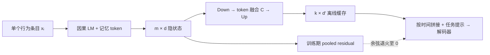
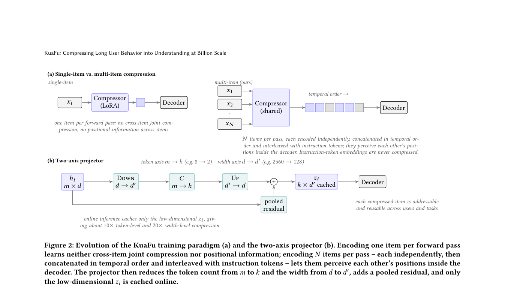

# KuaFu：条目级用户行为压缩与事实保真

> **复现级别：公开数据概念验证，尚未复现论文效果。** 本地真实运行 Qwen3-4B-Instruct、独立条目压缩、双轴投影和三段监督训练；幻觉感知 DAPO 的代码已实现并在 A100 执行采样与打分，但固定公开样例同组奖励相同，更新被正确跳过。不能把该运行称作四阶段训练完成，更不能将 MRQA 指标等同于腾讯线上 GMV。

## 论文信息

| 字段 | 内容 |
|---|---|
| 论文链接 | [arXiv v1](https://arxiv.org/abs/2609.31045) |
| 公司/机构 | 腾讯（第一作者署名单位） |
| 首次公开日期 | 2026-09-25（arXiv v1） |
| 原文开源代码 | 否：截至 2026-09-29，原文未给出 KuaFu 训练/部署仓库 |
| Adapter | `kuafu` |
| 本地复现代码 | [`src/auto_research/reproductions/kuafu/`](https://github.com/daiwk/auto-research/tree/main/src/auto_research/reproductions/kuafu/) |

## 原始论文总结

### 背景与主要改动

腾讯需要每周为海量用户刷新画像。逐条把原始行为文本送进大模型既慢又占空间；只截断长历史又容易遗漏时间、兴趣和因果信息。KuaFu 把**单个行为条目**作为最小压缩单位：压缩器对每条独立编码；投影器把 `m` 个高维记忆 token 降为 `k` 个低维缓存向量；解码器按用户行为顺序接收这些向量和任务提示。这样同一条目可以跨用户复用，不必因为某个用户新增行为而重算整个历史。



原论文的[Figure 1 和 Figure 2](https://arxiv.org/html/2609.31045v1)分别展示生产缓存链路及双轴投影结构；图片版权归原作者。

<!-- paper-figure:start -->
### 原论文关键图

[](https://arxiv.org/pdf/2609.31045#page=5)

> **原论文 Figure 2（关键图）**：展示原论文的训练流程与关键优化环节。图片来自[原论文](https://arxiv.org/abs/2609.31045)，版权归原作者所有；点击图片可查看来源。
<!-- paper-figure:end -->

### 核心公式与机制

每条目的投影形式为 `Up(C · Down(hᵢ)) + Pool(hᵢ)`；训练时 pooled residual 按余弦计划退火至零，线上仅保存低维 `k × d′` 缓存。原文有四个依次继承的阶段：文本重建、压缩问答（再分简单与复杂任务）、压缩器/解码器联合训练、仅更新解码器的幻觉感知 RL。本地实现了模块的训练集合、缓存边界、源文本判定和 DAPO token 比率/非对称裁剪/截断排除；公开 MRQA 小样本并不能替代作者的行为序列课程与 5K RL 样本。

### 论文离线与线上效果

原论文第 4.8 节是按访客随机分流的线上 A/B：全量部署后保留 5% 对照，十个月总体 GMV 相对提升 `1.37%`，95% 置信区间 `[0.71%, 2.03%]`。这是原作者的腾讯线上结果，**不是本地实验指标**。

## 本地复现

> **本地对照口径**：同解码器、同源 token 数的开头截断输入作为诊断基线，压缩缓存为实验组；dev F1 相对 `-23.4%`，但该输入消融不是独立训练的正式基线。

本地从[官方 MRQA SQuAD train/dev](https://github.com/mrqa/MRQA-Shared-Task-2019)各取 32 个不同原文段落的首个问题，固定 seed 42；训练时按条目数递增，以每条最多 24 token、最多 4 条、每条缓存 2 token 的预算运行三段监督训练。dev 只用于评估，未用于训练或选超参数。数据文件的 SHA-256、Qwen checkpoint revision、各阶段 loss 与完整指标见[固定结果](metrics/mrqa-squad-qwen3-4b-seed42.json)。

| Dev 输入方式（32 题） | EM | token F1 |
|---|---:|---:|
| KuaFu 压缩缓存 | 0.0000 | 0.0890 |
| 相同源 token 数：取开头 | 0.0000 | 0.1163 |
| 相同源 token 数：取结尾 | 0.0000 | 0.0953 |
| 全部保留的原文输入 | 0.0000 | 0.2634 |

**这轮没有发现压缩收益。** 三个 raw 控制复用的是在压缩输入上训练的解码器，只是输入消融，不是独立同预算训练的正式基线；32 题与单 seed 也不足以判断优劣。A100 的幻觉 RL smoke 在 4 个回答上得到同为 `1.0` 的奖励，梯度优势为零，因此返回 `skipped_zero_advantage`，没有把一次空更新写成成功训练。

进一步在 A100 上用同一公开 checkpoint、相同 32/32 题和三个种子，**另起模型**训练开头截断原文对照；对照完成 64 次 QA 更新，对应压缩组的两个 QA 阶段。完整输入长度限定为每条缓存 2 token 的总预算，结果见[独立对照指标](metrics/mrqa-independent-control-seeds42-44.json)：压缩组 dev F1 均值 `0.0952`，独立对照 `0.1249`，三个种子均未超过对照，EM 均为零。这仍**不是等 FLOPs 正式比较**：压缩组还训练重建阶段、encoder 和 projector；任务样本过小，也没有原论文私有数据及生产评测。

## 运行方式与边界

下载官方 MRQA 的 `SQuAD-train.jsonl.gz`、`SQuAD-dev.jsonl.gz` 到 `data/mrqa/`，本地准备公开 Qwen3-4B-Instruct-2507 checkpoint，并使用 NVIDIA CUDA：

```bash
export AUTO_RESEARCH_KUAFU_CHECKPOINT=/path/to/Qwen3-4B-Instruct-2507
auto-research reproduce --paper kuafu --dataset-dir data
```

也可直接运行 `python scripts/kuafu_public_mrqa.py --help` 调整公开数据诊断预算。训练数据、checkpoint 和评判器不打包进仓库。

若要重复上面的独立对照，在该脚本原有 MRQA 参数后添加 `--independent-control --seed 42`，再分别用 `43`、`44` 重跑；该模式需要足够显存重新加载一个 Qwen3-4B 模型。

- 腾讯私有行为日志、四个画像任务、十亿用户条目缓存与线上 A/B 不可在公开 MRQA 上重现。
- 公开脚本只跑三段监督训练；第四阶段的代码与采样已验证，但奖励没有形成有效更新。原文 generative reward model 的权重与完整标注未公开，不能拿小样本评判器代替生产结论。
- 本地小样本 EM/F1 低于原文报告规模；不得标记为论文数字复现，也不得接入 evolve 作为“已证明有效”的 operator。
