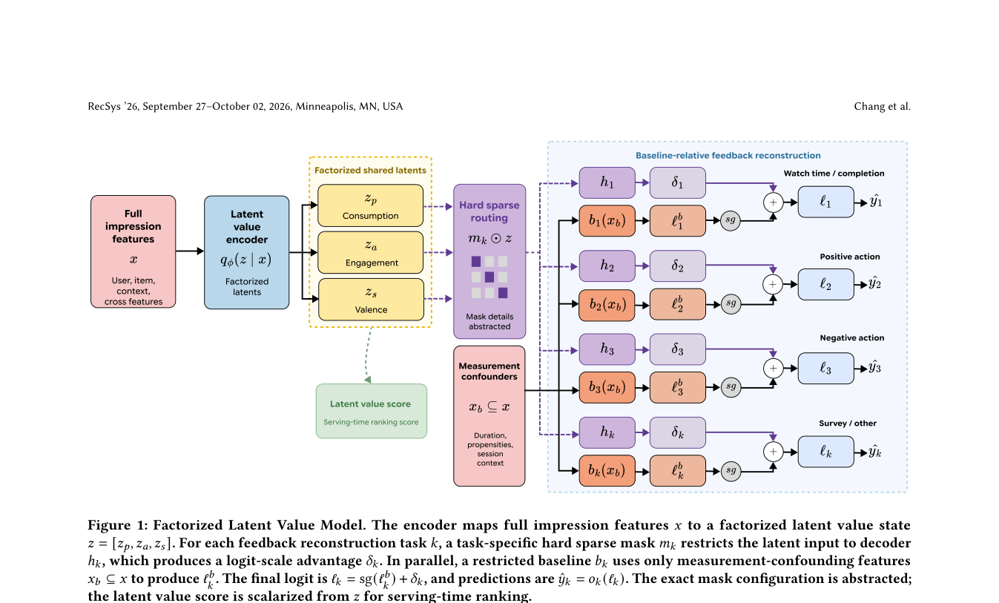

# FLVM：从行为反馈中分离潜在用户价值

> **复现级别：公开数据概念验证。** 本地执行了三因子高斯潜变量、受限基线、稀疏路由、停止梯度与 KL 损失；没有 YouTube 的满意度调查、生产特征和线上实验，不能据此声称复现 +2.67% 收益。

## 论文信息

| 字段 | 内容 |
|---|---|
| 论文链接 | [arXiv v1](https://arxiv.org/abs/2609.32839) |
| 公司/机构 | Google / YouTube（第一作者 Shuo Chang 所属机构） |
| 首次公开日期 | 2026-09-26（arXiv v1） |
| 原文开源代码 | 否：截至 2026-09-29，原文未列作者发布的 FLVM 实现仓库 |
| Adapter | `flvm` |
| 本地复现代码 | [`src/auto_research/reproductions/flvm/`](https://github.com/daiwk/auto-research/tree/main/src/auto_research/reproductions/flvm/) |

## 原始论文总结

### 背景与主要改动

短视频的观看时长会被视频长度、用户习惯和时段影响，同样的观看行为不一定代表喜欢。Google/YouTube 的 FLVM 不直接把各种行为当成单一偏好分数，而是用三维潜变量分别表示**消费、主动参与、参与方向（正负）**。时长等测量混杂因素只进入受限基线；完整的用户—视频信息进入潜变量编码器。每个反馈头只读取与其语义相符的因子，然后在 logit 空间叠加到停止梯度的基线上。

```mermaid
flowchart LR
  X[用户/视频/时长/时段] --> E[高斯编码器 q z|x]
  E --> Z[消费 zₚ / 参与 zₐ / 正负 zₛ]
  Z --> M[各反馈头固定稀疏路由 + 正增益]
  B[仅时长/时段等混杂特征] --> C[独立基线预测]
  C -->|stop-gradient| Y[最终反馈 logits]
  M --> Y
  Z --> S[潜在价值分数用于排序]
```

<!-- paper-figure:start -->
### 原论文关键图

[](https://arxiv.org/pdf/2609.32839#page=4)

> **原论文 Figure 1（关键图）**：展示原论文方法的总体设计和关键组成。图片来自[原论文](https://arxiv.org/abs/2609.32839)，版权归原作者所有；点击图片可查看来源。
<!-- paper-figure:end -->

原论文的[Figure 2](https://arxiv.org/html/2609.32839v1#S4.F2)进一步展示时长去偏和正负反馈分离；不把原文图或生产细节误标为本地结果。

### 核心公式

论文对每种反馈 $k$ 使用 $z=[z_p,z_a,z_s]$、固定路由 $m_k$，构造 $\delta_k=\operatorname{softplus}(\alpha_k)h_k(m_k\odot z)$ 和 $\ell_k=\operatorname{stopgrad}(b_k(x_b))+\delta_k$。训练目标是经观测 mask 与任务权重加权的反馈交叉熵、只训练受限基线的辅助交叉熵，以及 $\beta D_{KL}(q_\phi(z|x)\|N(0,I))$。排序时用 $\sigma(z_s)\operatorname{softplus}(z_p)$，不直接把主动参与 $z_a$ 当作正向偏好。原文的 mask 具体配置未公开；本地以观看→消费、点击→消费+参与、喜欢/讨厌→参与+正负的可检验配置实现。

### 论文离线与线上效果

原文 §4 报告 YouTube Shorts 的 Like PR-AUC 从 0.2522 到 0.3190、Dislike PR-AUC 从 0.0038 到 0.0054；Completion PR-AUC 则从 0.6898 降到 0.6722。14 天线上 A/B 的主要 viewer enjoyment 指标 +2.67%，guardrail 持平。均为**原作者私有系统结果**，不可与下方公开代理数据直接比较。

## 本地复现

> **本地对照口径**：实验组为 FLVM 缩比结构；基线为独立初始化和训练、读取相同曝光前特征、使用相同四种反馈与更新步数的共享塔多任务模型。两者不是 YouTube 生产模型，相对论文线上收益不适用。

使用 KuaiRand-Pure 的全部真实曝光，按全局时间做 70/15/15 切分。训练输入只有用户 ID、视频 ID、视频时长和曝光小时；后验点击、长观看、喜欢、讨厌仅用作标签，绝不进入输入。公开数据没有满意度调查或用户问卷，也不提供生产阶段的受限用户 propensity 特征，因此本地受限基线只包含时长与时段。`is_hate` 是稀疏显式负反馈，不将它解释成作者的全部 valence/满意度监督。四种标签均由日志明确记录；损失仍支持缺失标签 mask，避免将未来缺失值当零。validation 仅用于报告，test 与参数选择隔离。

三种子（42/43/44）、每组 300 步的完整指标保存在[固定结果](metrics/public-seeds42-44.json)。下表为三种子均值；AP 越高越好，但 test 仅有 755 个 like、34 个 hate，尤其不能把稀疏 hate 的波动解释成可靠提升。

<!-- local-results:start -->
| 方法 | Validation Like AP | Test Like AP | Test Hate AP |
|---|---:|---:|---:|
| FLVM | 0.01937 | 0.02075 | 0.00674 |
| 独立多任务基线 | 见原始指标 | 0.01850 | 0.00145 |
<!-- local-results:end -->

三种子 FLVM 的 like test AP 为 `0.01779 / 0.02355 / 0.02091`，hate AP 为 `0.01064 / 0.00122 / 0.00836`；负反馈结果明显不稳定。长观看 AP 在三种子均低于多任务基线；`z_s` 的 like-vs-hate 均值差有正有负，因此**未证实论文声称的稳定正负语义分离**。不把这个概念验证加入 Evolve 的“已证明收益”算子。

```bash
python scripts/flvm_public_kuairand.py --dataset-dir data \
  --steps 300 --seeds 42,43,44 \
  --output docs/reproductions/2609.32839-flvm/metrics/public-seeds42-44.json
auto-research reproduce --paper flvm --dataset-dir data --seed 42
```

本地为 CPU 路径，不声称 CUDA 验证。该实验不能验证论文的线上 viewer enjoyment、调查反馈、生产特征消融和跨新视频生命周期效应；也不能仅凭单个公开数据集把所学 $z_s$ 认定为可识别的用户满意度。
