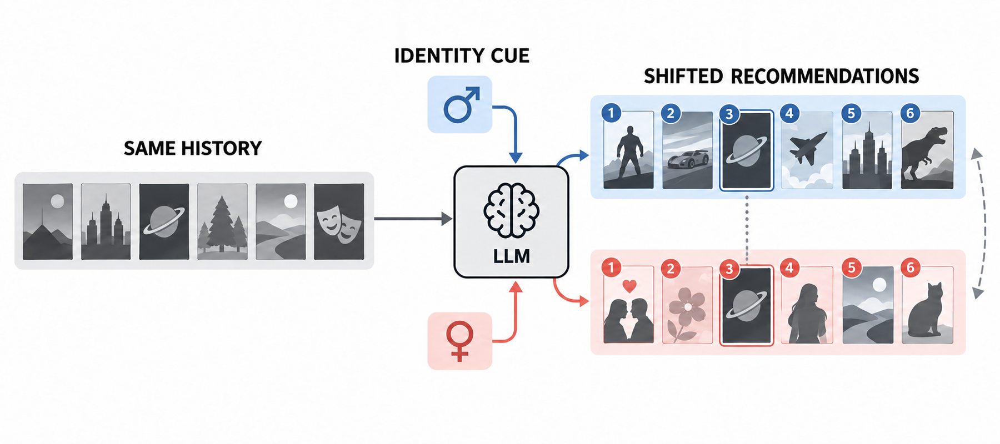

# Measuring and Mitigating Identity-Cue Preference Drift in LLM-based Recommender Systems

> **复现级别：L1 核心机制诊断。** 执行列表指标与后处理 reranker；身份 slice 和相关性由公开 fixture 给出，不生成真实用户画像。

## 论文信息

| 字段 | 内容 |
|---|---|
| 论文链接 | [arXiv 2609.34229](https://arxiv.org/abs/2609.34229) |
| 公司/机构 | University of Electronic Science and Technology of China（按第一作者署名单位） |
| 首次公开日期 | 2026-09-28（arXiv v1） |
| 原文开源代码 | 否：截至 2026-09-30 未找到原作者公开仓库 |
| Adapter | `promptshift` |
| 本地复现代码 | [`src/auto_research/reproductions/promptshift/`](https://github.com/daiwk/auto-research/tree/main/src/auto_research/reproductions/promptshift/) |

## 原始论文总结

### 背景与主要改动

在行为历史不变时比较身份提示与无身份参考列表，用 Drift 与 SliceShift 量化身份线索偏移，再依据用户主流度自适应混合原分与逆群体流行度。

<!-- paper-figure:start -->
### 原论文关键图

> **原论文 Figure 1（关键图）**：展示原论文方法的总体设计和关键组成。图片来自[原论文](https://arxiv.org/abs/2609.34229)，版权归原作者所有；点击图片可查看来源。
<!-- paper-figure:end -->

### 核心公式

对参考列表 $R$ 与身份提示列表 $C$，本地以集合重叠损失和共同条目的归一化位次变化计算 $Drift(R,C)$，再用群体流行度差计算 $SliceShift$。缓解阶段按用户主流度 $m$ 混合归一化相关分与逆流行度：$s'=(1-m)\hat{s}+m(1-p)$。

### 论文离线与线上效果

论文中的 benchmark、速度或训练曲线属于原文结果。本地三种子 mini-suite 仅检验机制和不变量，不与论文规模结果横比，也不外推线上收益。

## 本地复现

三种子诊断见 [`metrics/mechanism-seeds42-44.json`](metrics/mechanism-seeds42-44.json)。其中 `diagnostic_only=true`，不能进入正式能力排名。

> **本地对照口径**：基线为未经缓解的 identity-cued ranking，实验组执行自适应逆流行度 reranker；相对提升不适用（L1 机制诊断，不作正式能力比较）。

## 复现边界

执行列表指标与后处理 reranker；身份 slice 和相关性由公开 fixture 给出，不生成真实用户画像。
