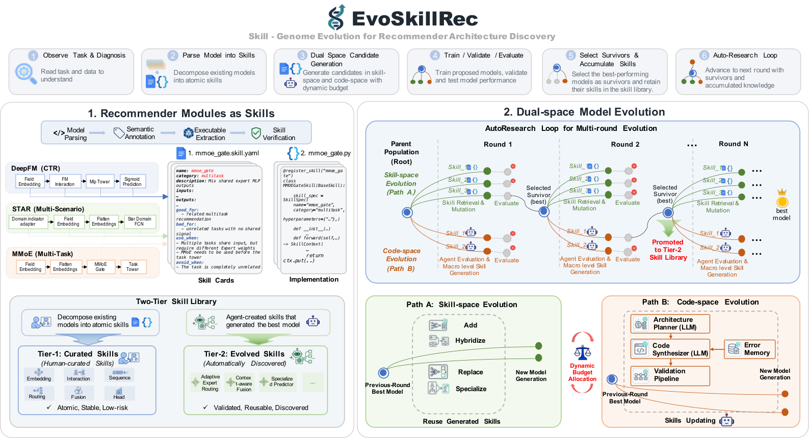

# EvoSkillRec: Skill-Genome Evolution for Recommender Architecture Discovery

> **复现级别：L1 核心机制诊断。** 执行 typed genome、validation evaluator、promotion 与 reuse；未调用外部 LLM 发明任意代码，也不复述论文大规模搜索收益。

## 论文信息

| 字段 | 内容 |
|---|---|
| 论文链接 | [arXiv 2609.34552](https://arxiv.org/abs/2609.34552) |
| 公司/机构 | City University of Hong Kong（按第一作者署名单位） |
| 首次公开日期 | 2026-09-28（arXiv v1） |
| 原文开源代码 | 是：[https://github.com/Xiaopengli1/EvoSkill-Rec](https://github.com/Xiaopengli1/EvoSkill-Rec) |
| Adapter | `evoskillrec` |
| 本地复现代码 | [`src/auto_research/reproductions/evoskillrec/`](https://github.com/daiwk/auto-research/tree/main/src/auto_research/reproductions/evoskillrec/) |

## 原始论文总结

### 背景与主要改动

把推荐网络拆成带输入输出类型的可执行 skill genome；控制器在约束空间组合技能，只有通过 validation 的创新才晋级并进入后续复用库。

<!-- paper-figure:start -->
### 原论文关键图

> **原论文 Figure 1（关键图）**：展示原论文提出的核心架构、主要模块及其连接关系。图片来自[原论文](https://arxiv.org/abs/2609.34552)，版权归原作者所有；点击图片可查看来源。
<!-- paper-figure:end -->

### 核心公式

设技能基因组为 $g=(s_1,\ldots,s_n)$，只有相邻技能类型满足 $O(s_i)=I(s_{i+1})$ 才可执行。验证分数 $V(g)$ 满足 $V(g)>V(g_0)+\epsilon$ 时，控制器才把 $g$ 晋级到可复用技能库。本地 adapter 真实执行类型校验、组合、验证、晋级与复用。

### 论文离线与线上效果

论文中的 benchmark、速度或训练曲线属于原文结果。本地三种子 mini-suite 仅检验机制和不变量，不与论文规模结果横比，也不外推线上收益。

## 本地复现

三种子诊断见 [`metrics/mechanism-seeds42-44.json`](metrics/mechanism-seeds42-44.json)。其中 `diagnostic_only=true`，不能进入正式能力排名。

> **本地对照口径**：基线为不执行技能变换的固定 genome，实验组执行 typed skill genome 并经过 validation 晋级；相对提升不适用（L1 机制诊断，不作正式能力比较）。

## 复现边界

执行 typed genome、validation evaluator、promotion 与 reuse；未调用外部 LLM 发明任意代码，也不复述论文大规模搜索收益。
