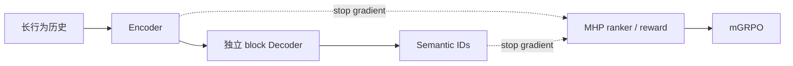
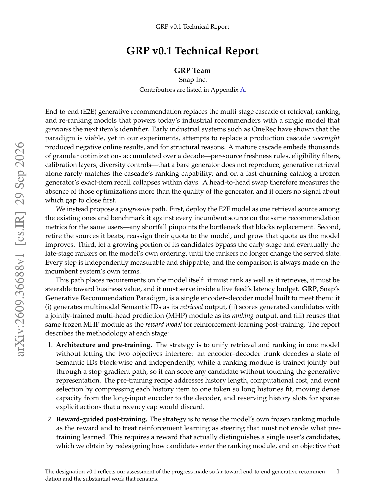

# GRP v0.1：渐进式端到端生成推荐

> **复现级别：L1 架构与目标机制。** 本地实现独立 SID block mask、生成/排序梯度隔离和 mGRPO 单边召回保护；不宣称复现 Snap 线上效果。

## 论文信息

| 字段 | 内容 |
|---|---|
| 论文链接 | [arXiv v1](https://arxiv.org/abs/2609.36688) |
| 公司/机构 | Snap Inc. |
| 首次公开日期 | 2026-09-29（arXiv v1） |
| 原文开源代码 | 否：截至 2026-09-30 未找到原作者仓库 |
| Adapter | `grp` |
| 本地复现代码 | [`src/auto_research/reproductions/grp/`](https://github.com/daiwk/auto-research/tree/main/src/auto_research/reproductions/grp/) |

## 原始论文总结

### 背景与主要改动

GRP 不是一次性替换成熟推荐漏斗，而是逐步把统一生成模型作为召回源接入，再替换弱源、增加配额并逐步绕过排序器。模型用 encoder-decoder 生成多模态 Semantic ID；MHP 通过 stop-gradient 路径联合学习排序，之后冻结为 RL reward。mGRPO 在 GRPO 上增加以 logged target 为锚点的单边 margin，只在策略开始牺牲原目标召回时惩罚。

### 核心公式

本地 mGRPO 目标保留 clipped policy ratio，并对 logged target 的相对概率下降施加单边 margin：只有当前策略相对参考策略牺牲原目标召回超过容忍区间时，保护项才激活。排序头读取 stop-gradient 的 encoder 与 SID 表征，因此排序损失不会反向改写生成路径。

<!-- paper-figure:start -->
### 原论文关键图

> 原论文首页的总体架构图；图片来自[原论文](https://arxiv.org/abs/2609.36688)，版权归原作者所有。
<!-- paper-figure:end -->

### 论文离线与线上效果

原文线上 retrieval-only 对比报告 view time `+0.46%`、shares `+0.77%`；bypass 与弱源替换组合报告 view time `+0.82%`、shares `+2.56%`，并报告端到端召回延迟下降 `69%`。这些仅作为工业 P0 证据。本地 `auto-research reproduce --paper grp` 只检查跨 block 不泄漏、候选排序有区分度、生成梯度与 mGRPO 梯度有限；三种子结果见 `metrics/mechanism-seeds42-44.json`。

## 本地复现

> **本地对照口径**：基线为不触发 logged-target 单边保护的同一 GRPO surrogate，实验组启用保护项；该 deterministic tensor mini-suite 只验证目标与梯度路径，效果相对变化不适用。

运行 `auto-research reproduce --paper grp` 可生成机制指标；三种子统一诊断见 [`metrics/mechanism-seeds42-44.json`](metrics/mechanism-seeds42-44.json)。

## 复现边界

未包含 Snap 私有数据、Qwen3-VL SID tokenizer、生产尺度训练、CUDA graph serving、反向目录和在线流量，因此标记 `concept_demo / l1_mechanism`，不进入 Evolve 的效果提升证据池。
