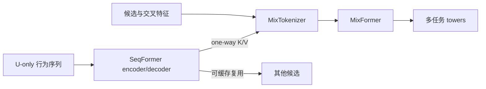
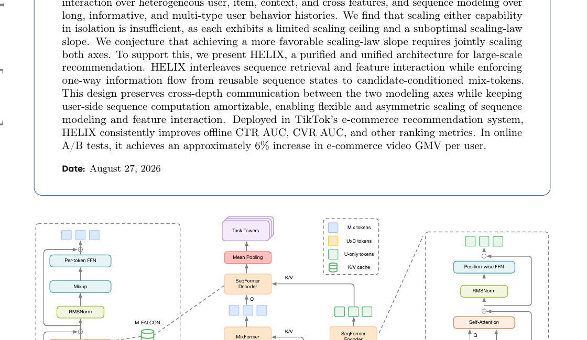

# HELIX：统一扩展特征交互与序列建模

> **复现级别：L1 架构机制。** 实现三流 token、单向 U-only 缓存、跨深度 MixFormer/SeqFormer 交互与多任务头；没有 TikTok 私有数据和线上流量。

## 论文信息

| 字段 | 内容 |
|---|---|
| 论文链接 | [HELIX](https://arxiv.org/abs/2609.37183) |
| 公司 / 机构 | TikTok / ByteDance Global E-Commerce Recommendation Video Team |
| 首次公开日期 | 2026-09-29（arXiv v1；文稿标注 2026-08-27） |
| 原作者代码 | 否：截至 2026-09-30，未找到原作者发布仓库 |
| 本地 adapter | `helix` |
| 本地复现代码 | [`src/auto_research/reproductions/helix/`](https://github.com/daiwk/auto-research/tree/main/src/auto_research/reproductions/helix/) |

## 原始论文总结

### 背景与主要改动

工业排序通常分别扩大异构特征交互与长行为序列，两条轴单独扩展都会遇到上限。HELIX 交错 SeqFormer 与 MixFormer，但强制信息只从可复用的 user-only sequence state 流向 candidate-conditioned mix tokens，使用户侧序列计算能跨候选复用，同时保持两轴的跨深度通信。

<!-- paper-figure:start -->
### 原论文关键图

> 原论文 Figure 1，展示 U-only / U×C / mix tokens 及 M-FALCON 单向交互；版权归原作者所有。
<!-- paper-figure:end -->

### 核心公式

本地用候选条件化 cross-attention 实现 $M' = M + \mathrm{Attn}(Q=M,K=S_U,V=S_U)$，而 $S_U$ 的更新不读取候选 token；MPTF 分支把 position-wise FFN 和 per-token FFN 的输出经门控融合。测试显式检查改变候选会改变输出，但不会改变缓存的 user state。

### 论文离线与线上效果

原文在 TikTok 电商推荐完整流量 A/B 中报告约 6% GMV/user 提升，细表给出最高 5.4624% 的对应实验项；同时报告 CTR/CVR AUC 改善。这是进入工业 P0 队列的证据，不是本站结果。

## 本地复现

运行 `auto-research reproduce --paper helix` 可生成机制指标。三种子统一诊断见 [`metrics/mechanism-seeds42-44.json`](metrics/mechanism-seeds42-44.json)；模型验证有限 loss、候选条件化 delta、user cache 不变与有限梯度。

## 复现边界

本地使用合成张量，不含私有训练数据、线上 A/B 或论文规模系统优化，因此 `reproduction_level=concept_demo`。只有接入公开公平数据、基线和多种子 validation/test 隔离后，才能讨论效果复现或进入 Evolve 搜索空间。
