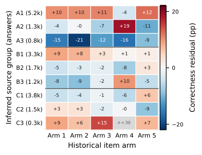

# Challenges and Solutions for Bandits in the Wild: Warm-Started Mixture Bandits for Cross-Cohort Slate Recommendation

> **复现级别：L1 核心机制诊断。** 执行固定强度 mixture prior、Thompson slate 与 posterior update；未复刻历史矩阵分解和 25 天部署。

## 论文信息

| 字段 | 内容 |
|---|---|
| 论文链接 | [arXiv 2609.37800](https://arxiv.org/abs/2609.37800) |
| 公司/机构 | DFKI / RPTU Kaiserslautern-Landau（按第一作者署名单位） |
| 首次公开日期 | 2026-09-29（arXiv v1） |
| 原文开源代码 | 是：[https://github.com/etowho/university-games](https://github.com/etowho/university-games) |
| Adapter | `cohortmix-ts` |
| 本地复现代码 | [`src/auto_research/reproductions/cohortmix_ts/`](https://github.com/daiwk/auto-research/tree/main/src/auto_research/reproductions/cohortmix_ts/) |

## 原始论文总结

### 背景与主要改动

从历史 cohort 学习用户群和 item arm，用元数据给新用户构造固定强度的混合 Beta 先验；每轮用 Thompson sampling 选择未曝光 slate，并按用户反馈独立更新后验。

<!-- paper-figure:start -->
### 原论文关键图

> **原论文 Figure 3（关键图）**：展示原论文方法的总体设计和关键组成。图片来自[原论文](https://arxiv.org/abs/2609.37800)，版权归原作者所有；点击图片可查看来源。
<!-- paper-figure:end -->

### 核心公式

$\hat\mu_{c,a}=(\alpha_0+s_{c,a})/(\alpha_0+\beta_0+s_{c,a}+f_{c,a})$，新用户先验为群组 membership 加权的固定强度 Beta pseudo-count。

### 论文离线与线上效果

25 天随机部署中，受限完整窗口子组的 early-to-late correctness change 组间差为 6.23 个百分点，95% bootstrap 区间 [0.5,11.9]，p=0.043；全体注册用户参与指标无显著差异。

## 本地复现

> **本地对照口径**：基线为论文机制关闭或默认状态，实验组为开启对应核心算子；本批只验证不变量和状态转换，跨模型相对变化不适用。

三种子诊断见 [`metrics/mechanism-seeds42-44.json`](metrics/mechanism-seeds42-44.json)。`diagnostic_only=true`，只证明核心状态转换、梯度或调度不变量可执行，不能进入正式能力排名。

## 复现边界

执行固定强度 mixture prior、Thompson slate 与 posterior update；未复刻历史矩阵分解和 25 天部署。
