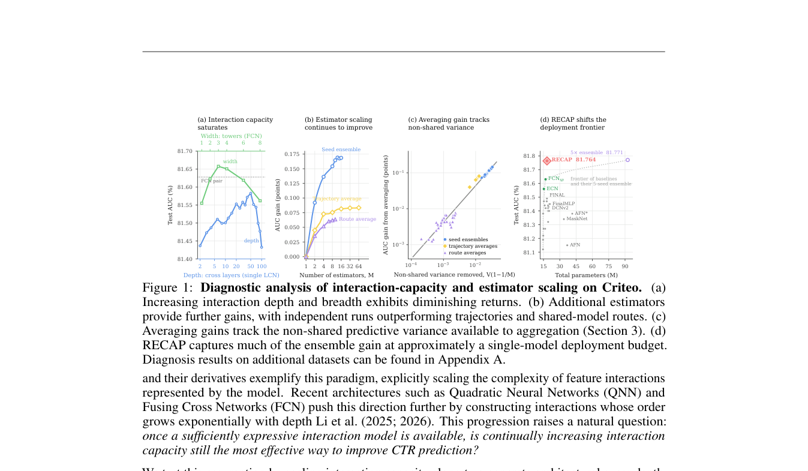

# Beyond Interaction Capacity: Estimator Scaling with Recursive Models for CTR Prediction

> **复现级别：L1 核心机制诊断。** 执行共享递归、route 平均、trajectory EMA 和可运行 RankMixer Evolve block；未做 benchmark 训练或独立模型蒸馏。

## 论文信息

| 字段 | 内容 |
|---|---|
| 论文链接 | [arXiv 2609.37905](https://arxiv.org/abs/2609.37905) |
| 公司/机构 | Georgia Institute of Technology / Google Research（按第一作者署名单位） |
| 首次公开日期 | 2026-09-29（arXiv v1） |
| 原文开源代码 | 否：截至 2026-10-01 未找到原作者公开仓库 |
| Adapter | `recap-ctr` |
| 本地复现代码 | [`src/auto_research/reproductions/recap_ctr/`](https://github.com/daiwk/auto-research/tree/main/src/auto_research/reproductions/recap_ctr/) |

## 原始论文总结

### 背景与主要改动

不再只增加单个 CTR predictor 的交互容量，而是扩展相关 estimator；RECAP 在共享参数的递归 backbone 上形成多条 route，并结合独立模型蒸馏、训练轨迹 EMA 与推理 route 平均。

<!-- paper-figure:start -->
### 原论文关键图

> **原论文 Figure 1（关键图）**：展示原论文提出的核心架构、主要模块及其连接关系。图片来自[原论文](https://arxiv.org/abs/2609.37905)，版权归原作者所有；点击图片可查看来源。
<!-- paper-figure:end -->

### 核心公式

$\bar Z_M=M^{-1}\sum_m Z_m$，共享 block 递归产生多 route logit 并做平均；本地同时保留训练轨迹 EMA。

### 论文离线与线上效果

原文在多个公开 CTR benchmark 上改善性能—参数 Pareto，但没有量化线上 A/B；因此本条只作为学术机制和 Evolve 算子。

## 本地复现

> **本地对照口径**：基线为论文机制关闭或默认状态，实验组为开启对应核心算子；本批只验证不变量和状态转换，跨模型相对变化不适用。

三种子诊断见 [`metrics/mechanism-seeds42-44.json`](metrics/mechanism-seeds42-44.json)。`diagnostic_only=true`，只证明核心状态转换、梯度或调度不变量可执行，不能进入正式能力排名。

## 复现边界

执行共享递归、route 平均、trajectory EMA 和可运行 RankMixer Evolve block；未做 benchmark 训练或独立模型蒸馏。
