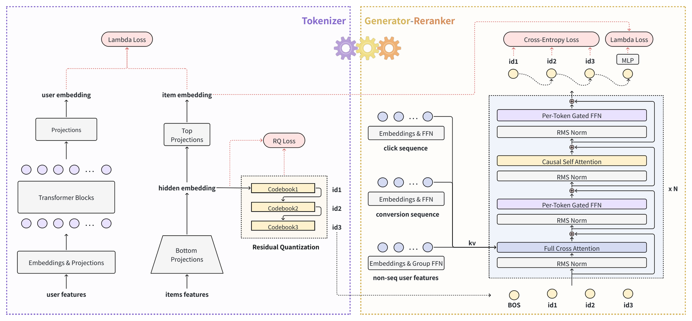

# Generative End-to-end Ad Retrieval at Douyin

> **复现级别：L1 核心机制诊断。** 执行 BasisVQ、前缀残差量化接口与碰撞 rerank；不复刻流式 PS、分钟级索引和线上流量，不把本地随机张量作为广告效果。

## 论文信息

| 字段 | 内容 |
|---|---|
| 论文链接 | [arXiv v1](https://arxiv.org/abs/2609.39327) |
| 公司/机构 | ByteDance（按第一作者署名单位） |
| 首次公开日期 | 2026-09-30（arXiv v1） |
| 原文开源代码 | 否：截至 2026-10-02 未找到原作者公开实现 |
| Adapter | `gear` |
| 本地复现代码 | [`src/auto_research/reproductions/gear/`](https://github.com/daiwk/auto-research/tree/main/src/auto_research/reproductions/gear/) |

## 原始论文总结

### 背景与主要改动

GEAR 用正交基参数化 BasisVQ/BasisRQ，使码本更新具有全局共享和稳定旋转；生成器输出层级 token，碰撞 item 再由上下文条件 reranker 精排。

<!-- paper-figure:start -->
### 原论文关键图

> **原论文关键图**：展示论文核心架构、训练流程或系统协议。图片来自[原论文](https://arxiv.org/abs/2609.39327)，版权归原作者所有；点击图片可查看来源。
<!-- paper-figure:end -->

### 核心公式

$q(z)=B c_{argmin_j\|zB-c_j\|}$；碰撞组内按 $s_i=h_u^Te_i$ 排序。

### 论文离线与线上效果

抖音广告 7 天线上 A/B、每组 5% 流量：ADSS +0.563%、ADVV +0.658%；冷启动激活率 +1.46%。

## 本地复现

> **本地对照口径**：基线为机制关闭或默认状态，实验组为开启对应核心算子；相对百分比不适用。本批指标只验证不变量、梯度或状态转换，不表示论文规模效果。

- 三种子诊断：[`metrics/mechanism-seeds42-44.json`](metrics/mechanism-seeds42-44.json)
- `diagnostic_only=true`，不进入正式能力排名。

## 复现边界

执行 BasisVQ、前缀残差量化接口与碰撞 rerank；不复刻流式 PS、分钟级索引和线上流量，不把本地随机张量作为广告效果。
