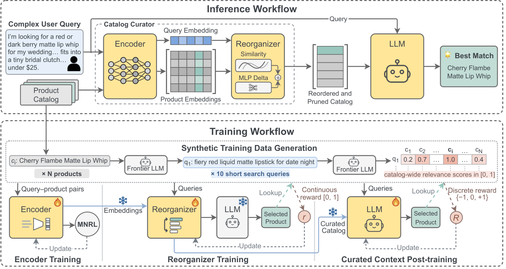

# RPTune: Learned Context Curation for LLM Catalog Search

> **复现级别：L1 核心机制诊断。** 只执行 rank/prune/position 核心编排，不调用 Gemini/Gemma、商家目录或论文训练。

## 论文信息

| 字段 | 内容 |
|---|---|
| 论文链接 | [arXiv v1](https://arxiv.org/abs/2610.00964) |
| 公司/机构 | Google（按第一作者署名单位） |
| 首次公开日期 | 2026-10-01（arXiv v1） |
| 原文开源代码 | 否：截至 2026-10-03 未找到原作者公开实现 |
| Adapter | `rptune` |
| 本地复现代码 | [`src/auto_research/reproductions/rptune/`](https://github.com/daiwk/auto-research/tree/main/src/auto_research/reproductions/rptune/) |

## 原始论文总结

### 背景与主要改动

用查询-商品编码器、可学习调整项和下游 LLM 反馈共同决定商品保留与摆放顺序；高优商品靠近提示词末端，再对编排后的目录做选择后训练。

<!-- paper-figure:start -->
### 原论文关键图

> **原论文 Figure 2（关键图）**：展示原论文提出的核心架构、主要模块及其连接关系。图片来自[原论文](https://arxiv.org/abs/2610.00964)，版权归原作者所有；点击图片可查看来源。
<!-- paper-figure:end -->

### 核心公式

$s_i=10e_q^Te_i+MLP([e_q;e_i])$，保留 top-k 后按分数升序排列。

### 论文离线与线上效果

7 个真实商家上编排平均提高 14.0 EM 点，后训练再提高 10.3 点。

## 本地复现

> **本地对照口径**：基线为机制关闭或默认状态，实验组执行定义性算子；L1 不报告正式相对提升，百分比不适用。

- 三种子诊断：[`metrics/mechanism-seeds42-44.json`](metrics/mechanism-seeds42-44.json)
- `diagnostic_only=true`，不进入正式能力排名。

## 复现边界

只执行 rank/prune/position 核心编排，不调用 Gemini/Gemma、商家目录或论文训练。
