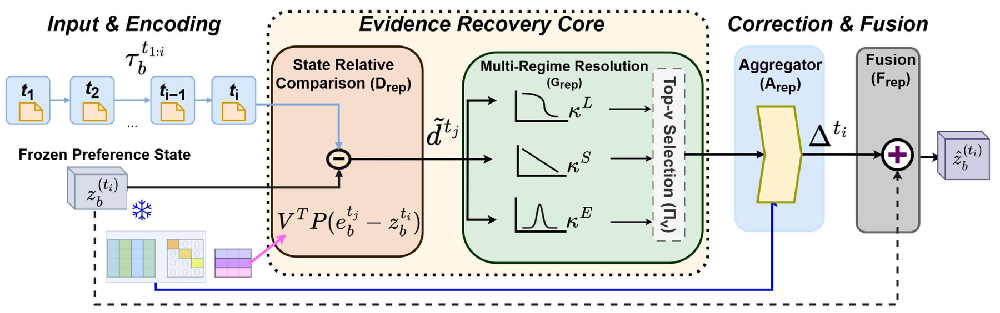

# Not All Is Lost: Repairing Lossy User Preference States of Personalization Encoders

> **复现级别：L1 核心机制诊断。** 执行 frozen-cache evidence selection 与 residual correction；用户批准为学术/Evolve 例外，无线上 A/B。

> **收录例外**：用户于 2026-10-02 明确批准的学术/Evolve 机制例外；论文没有量化线上 A/B，不进入工业证据结论。

## 论文信息

| 字段 | 内容 |
|---|---|
| 论文链接 | [arXiv 2610.01270](https://arxiv.org/abs/2610.01270) |
| 公司/机构 | 原文首页未列第一作者机构（按第一作者署名单位） |
| 首次公开日期 | 2026-10-01（arXiv v1） |
| 原文开源代码 | 否：截至 2026-10-02 未找到原作者公开实现 |
| Adapter | `repair-state` |
| 本地复现代码 | [`src/auto_research/recommendation_latest_20261002.py`](https://github.com/daiwk/auto-research/blob/main/src/auto_research/recommendation_latest_20261002.py) |

## 原始论文总结

### 背景与主要改动

冻结 encoder 与原 task head，从已有 forward cache 中比较各 timestep 表征和当前 preference state，选择长程、近期或局部 burst 的纠正证据并做 residual repair。

<!-- paper-figure:start -->
### 原论文关键图

> **原论文关键图**：展示论文核心架构、训练流程或系统协议。图片来自[原论文](https://arxiv.org/abs/2610.01270)，版权归原作者所有；点击图片可查看来源。
<!-- paper-figure:end -->

### 核心公式

$z'=z+\sum_{t\in TopK}softmax(q^T(h_t-z))(h_t-z)$。

### 论文离线与线上效果

12 个推荐 host 全部改善；Mamba4Rec/MovieLens MRR +3.96 点，head-only 仅 +0.19；个性化生成最高 +25.23%。

## 本地复现

> **本地对照口径**：基线为机制关闭或默认状态，实验组为开启对应核心算子。本批指标只验证不变量、梯度或状态转换，不表示论文规模效果。

- 三种子诊断：[`metrics/mechanism-seeds42-44.json`](metrics/mechanism-seeds42-44.json)
- `diagnostic_only=true`，不进入正式能力排名。

## 复现边界

执行 frozen-cache evidence selection 与 residual correction；用户批准为学术/Evolve 例外，无线上 A/B。
