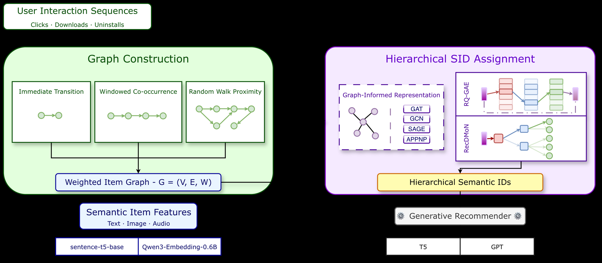

# Neither Black nor White: Balancing Semantic and Collaborative Signals with Graph-Informed Semantic IDs (GrIS)

> **复现级别：L1 核心机制诊断。** 执行 graph-informed 层级二分 ID；用户批准为学术/Evolve 例外，无线上 A/B，不进入工业证据结论。

> **收录例外**：用户于 2026-10-02 明确批准的学术/Evolve 机制例外；论文没有量化线上 A/B，不进入工业证据结论。

## 论文信息

| 字段 | 内容 |
|---|---|
| 论文链接 | [arXiv v1](https://arxiv.org/abs/2610.01533) |
| 公司/机构 | Huawei Ireland Research Centre（按第一作者署名单位） |
| 首次公开日期 | 2026-10-01（arXiv v1） |
| 原文开源代码 | 是：[https://github.com/hirc-airecs/graph-informed-sids](https://github.com/hirc-airecs/graph-informed-sids) |
| Adapter | `gris` |
| 本地复现代码 | [`src/auto_research/reproductions/gris/`](https://github.com/daiwk/auto-research/tree/main/src/auto_research/reproductions/gris/) |

## 原始论文总结

### 背景与主要改动

把 Semantic ID 构造重写为层级图划分：节点承载内容语义，边承载协同信号；图为空时退化为内容量化。

<!-- paper-figure:start -->
### 原论文关键图

> **原论文关键图**：展示论文核心架构、训练流程或系统协议。图片来自[原论文](https://arxiv.org/abs/2610.01533)，版权归原作者所有；点击图片可查看来源。
<!-- paper-figure:end -->

### 核心公式

$SID(i)=RecursivePartition(G,X)_i$；每层显式组合平滑后的语义与图邻接。

### 论文离线与线上效果

多个真实数据集上相对 CF-aware SOTA 的 Hit@10 最高提高 52%。

## 本地复现

> **本地对照口径**：基线为机制关闭或默认状态，实验组为开启对应核心算子；相对百分比不适用。本批指标只验证不变量、梯度或状态转换，不表示论文规模效果。

- 三种子诊断：[`metrics/mechanism-seeds42-44.json`](metrics/mechanism-seeds42-44.json)
- `diagnostic_only=true`，不进入正式能力排名。

## 复现边界

执行 graph-informed 层级二分 ID；用户批准为学术/Evolve 例外，无线上 A/B，不进入工业证据结论。
