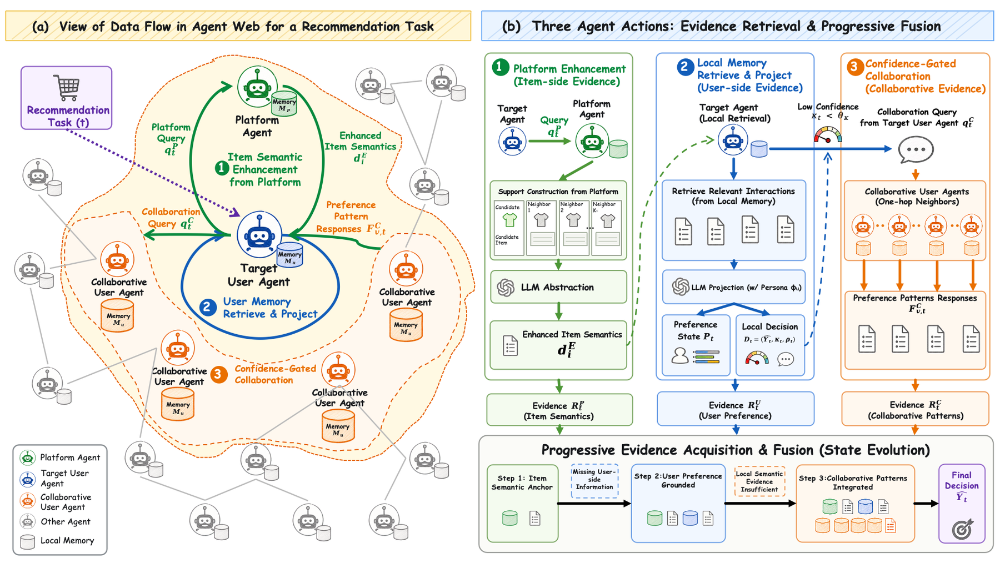

# AgentWebRec: Compact Evidence Fusion over the Agent Web for Personalized Recommendation

> **复现级别：L1 核心机制诊断。** 只执行有界检索与置信门控；不暴露私有记录，不运行 LLM Agent Web。

## 论文信息

| 字段 | 内容 |
|---|---|
| 论文链接 | [arXiv v1](https://arxiv.org/abs/2610.01705) |
| 公司/机构 | Beihang University（按第一作者署名单位） |
| 首次公开日期 | 2026-10-01（arXiv v1） |
| 原文开源代码 | 否：截至 2026-10-03 未找到原作者公开实现 |
| Adapter | `agent-web-rec` |
| 本地复现代码 | [`src/auto_research/reproductions/agent_web_rec/`](https://github.com/daiwk/auto-research/tree/main/src/auto_research/reproductions/agent_web_rec/) |

## 原始论文总结

### 背景与主要改动

先从平台获取候选语义，再按语义相关性和时间衰减检索目标用户私有记忆；仅在本地证据置信度不足时查询邻居 Agent 的紧凑偏好模式。

<!-- paper-figure:start -->
### 原论文关键图

> **原论文 Figure 2（关键图）**：展示原论文方法的总体设计和关键组成。图片来自[原论文](https://arxiv.org/abs/2610.01705)，版权归原作者所有；点击图片可查看来源。
<!-- paper-figure:end -->

### 核心公式

$w=eta w_{sem}+(1-eta)e^{-\gamma\Delta t}$；$\kappa<	heta$ 时才协作。

### 论文离线与线上效果

四个 InstructRec 域上均优于所比较基线。

## 本地复现

> **本地对照口径**：基线为机制关闭或默认状态，实验组执行定义性算子；L1 不报告正式相对提升，百分比不适用。

- 三种子诊断：[`metrics/mechanism-seeds42-44.json`](metrics/mechanism-seeds42-44.json)
- `diagnostic_only=true`，不进入正式能力排名。

## 复现边界

只执行有界检索与置信门控；不暴露私有记录，不运行 LLM Agent Web。
