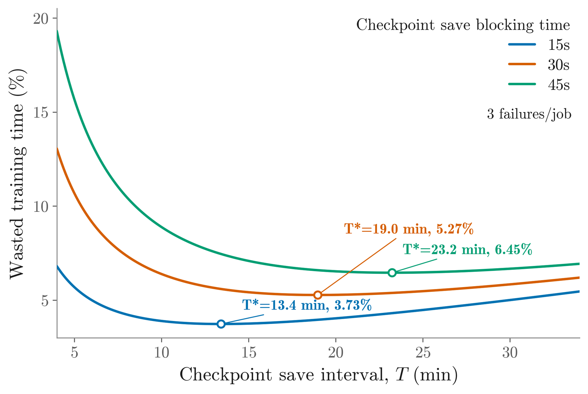

# Optimizing Effective Training Time for Large-Scale Recommendation Systems

> **复现级别：L1 核心机制诊断。** 执行 ETT 分解与 owner loss 归因；这是用户批准的生产基础设施例外，不声称推荐模型效果或线上 A/B 收益。

> **收录例外**：用户于 2026-10-02 明确批准的生产训练基础设施例外；部署指标是 ETT，不作为推荐模型效果或线上 A/B 收益。

## 论文信息

| 字段 | 内容 |
|---|---|
| 论文链接 | [arXiv 2610.02057](https://arxiv.org/abs/2610.02057) |
| 公司/机构 | Meta Platforms, Inc.（按第一作者署名单位） |
| 首次公开日期 | 2026-10-01（arXiv v1） |
| 原文开源代码 | 否：截至 2026-10-02 未找到原作者公开实现 |
| Adapter | `effective-training-time` |
| 本地复现代码 | [`src/auto_research/recommendation_latest_20261002.py`](https://github.com/daiwk/auto-research/blob/main/src/auto_research/recommendation_latest_20261002.py) |

## 原始论文总结

### 背景与主要改动

把端到端 wall time 分为真正消费新数据的训练时间与初始化、编译、checkpoint、发布和恢复等生命周期损耗，再按 owner 定位和优化。

<!-- paper-figure:start -->
### 原论文关键图

> **原论文关键图**：展示论文核心架构、训练流程或系统协议。图片来自[原论文](https://arxiv.org/abs/2610.02057)，版权归原作者所有；点击图片可查看来源。
<!-- paper-figure:end -->

### 核心公式

$ETT=training\_on\_new\_data / wall\_time$。

### 论文离线与线上效果

代表模型 ETT 平均提高 15.5%，最大 workload 达 85%；部署后全 fleet 从约 80% 提升到 90% 以上。

## 本地复现

> **本地对照口径**：基线为机制关闭或默认状态，实验组为开启对应核心算子。本批指标只验证不变量、梯度或状态转换，不表示论文规模效果。

- 三种子诊断：[`metrics/mechanism-seeds42-44.json`](metrics/mechanism-seeds42-44.json)
- `diagnostic_only=true`，不进入正式能力排名。

## 复现边界

执行 ETT 分解与 owner loss 归因；这是用户批准的生产基础设施例外，不声称推荐模型效果或线上 A/B 收益。
