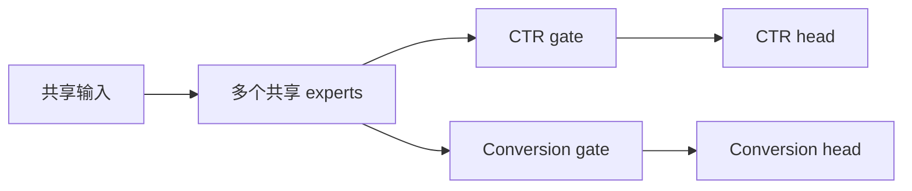
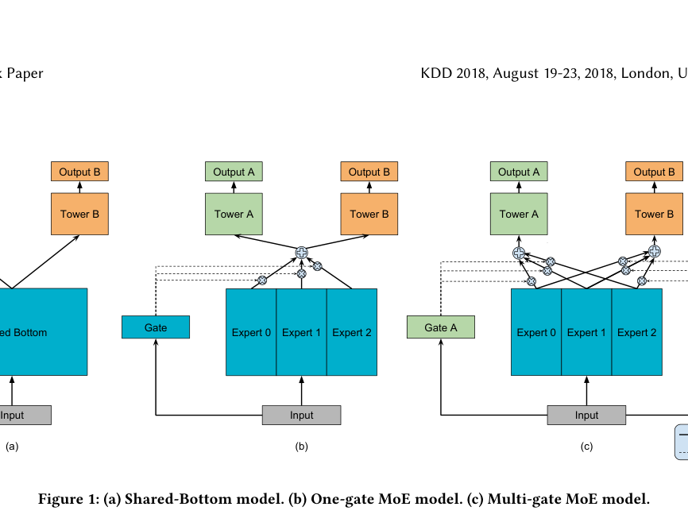

# MMoE：每任务独立门控的共享专家

> 复现级别：**核心机制复现**。实际训练共享 experts、任务专属 gates 与任务 heads；Google 私有业务特征未复刻。

## 论文信息

| 项目 | 内容 |
| --- | --- |
| 论文链接 | [KDD 2018 paper](https://research.google/pubs/modeling-task-relationships-in-multi-task-learning-with-multi-gate-mixture-of-experts/) |
| 公司/机构 | Google |
| 首次公开日期 | 2018-08-19（ACM KDD 2018） |
| 原文开源代码 | 否：论文未提供官方/作者代码（核查日期：2026-08-09） |
| Adapter | `mmoe` |
| 本地复现代码 | [`src/auto_research/reproductions/mmoe/`](https://github.com/daiwk/auto-research/tree/main/src/auto_research/reproductions/mmoe/) |

## 原始论文总结

### 背景与主要改动

共享底座的多任务模型会在任务相关性较低时产生负迁移。完全独立的模型又无法利用共性。

MMoE 建立一组共享专家，但为每个任务学习独立 softmax gate，让任务以不同权重组合专家。

<!-- paper-figure:start -->
### 原论文关键图

> **原论文 Figure 1（关键图）**：展示原论文方法的总体设计和关键组成。图片来自[原论文](https://research.google/pubs/modeling-task-relationships-in-multi-task-learning-with-multi-gate-mixture-of-experts/)，版权归原作者所有；点击图片可查看来源。
<!-- paper-figure:end -->

### 核心公式

$$
f^k(x)=\sum_i g_i^k(x)f_i(x),\qquad
g^k(x)=\operatorname{softmax}(W_{gk}x).
$$

### 论文离线与线上效果

论文用合成任务与真实推荐任务展示 MMoE 对不同任务相关性的稳健性；量化线上 lift 未公开，本条为经典例外。

## 本地复现

> **本地对照口径**：基线为 shared-bottom 双任务网络，实验组为每任务独立 gate 的共享 experts；平均任务 AUC 相对 **+1.30%**，见 `metrics/movielens-100k-seeds42-44.json`。

- 数据：MovieLens-100K 的 click/conversion 两任务构造。
- 基线：共享底层 MLP 加两个任务 head。
- 方法：四个共享 experts 与两套独立 gates。
- 运行：`auto-research reproduce --paper mmoe --dataset-dir data`

三 seed 下 CTR AUC 为 `0.55934→0.56882`，conversion AUC 为 `0.55503→0.56009`。
