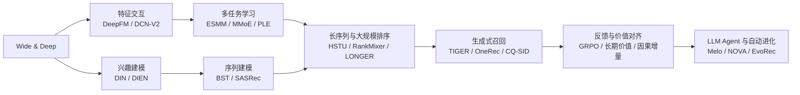

# 搜广推与 LLM 应用论文谱系与缺口

本页回答“主干是否覆盖、各路线如何演进、还缺什么”。单篇论文的公式、线上结果和
本地实验仍以[复现总览](README.md)及对应论文页为准；收录规则不因目录扩张而放宽。

## 谱系覆盖

| 谱系 | 代表方法 | 本仓库覆盖 | 当前状态 |
|---|---|---|---|
| 经典 CTR 与特征交互 | Wide & Deep、DeepFM、DIN、DCN-V2 | wide/deep、FM、候选感知兴趣、显式 cross | 已实现 |
| 序列兴趣与长历史 | DIEN、BST、SASRec、HSTU、LONGER、RankMixer、HyFormer | GRU 兴趣演化、因果 attention、token mixing、长序列压缩 | 已实现 |
| 多任务与转化 | ESMM、MMoE、PLE、TWICE | entire-space、task gate、专属/共享专家、延迟转化双时钟 | 已实现 |
| 双塔与图召回 | YouTube DNN、CS3、RankGraph-2、HARNESS-LM | sampled retrieval、双塔循环修正、多跳 PPR、非对称轻量检索 | 已实现 |
| 生成式推荐 | TIGER、OneRec、OneMall、CQ-SID、RecGPT-V3 | Semantic ID、序列生成、多场景 prompt、生成纠错与 latent intent | 已实现 |
| LLM 内容与知识增强 | KAR、NoteLLM、SERAL、RecoReward、Melo | 知识生成、内容压缩、认知画像、推荐器奖励、Agent grounding | 已实现 |
| 广告生成与长期价值 | GR4AD、UniVA、GrowthGR、SWAG、Causal Retrieval | 生成式广告、价值对齐、长期目标、滑窗出价、因果增量 | 已实现 |
| 新鲜度、冷启动与探索 | PinCLIP、Pin-SCALE、YouTube Freshness、Pinequalizer | 内容/协同对齐、engagement SID、IPS、uncertainty、曝光纠偏 | 已实现 |
| 训练与 serving 效率 | OneTrans、SOLARIS、Rec-Distill、TokenMixer-Large | KV cache、异步 latent、蒸馏、稀疏容量扩展 | 已实现 |
| 推荐系统自动进化 | Self-Evolving RecSys、NOVA、EvoRec | 实验记忆、验证级联、模型/方法双轨进化 | 已接入 evolve |

## 技术演进

这不是按发表时间强制串联的单一路径，而是仓库中可组合的能力层：传统排序仍是多数
生成式和 LLM 系统的 serving 基线；生成模型、Agent 和 RL 只有在公开数据上落实核心
机制后才进入“已实现”。

## 工业证据门槛

- 新增工业论文必须披露量化生产线上 A/B，或由用户明确认可统计显著的全流量发布；
- 论文线上 lift、本地公开数据结果和模块消融分别记录，不能互相替代；
- DeepFM、YouTube DNN、ESMM、MMoE、PLE 等具名经典例外只补齐技术主干，不构成
  后续论文免除线上证据的先例；
- 系统级 A/B 无法隔离模型、产品与 UI 贡献时，必须像 Melo 一样明确写出归因限制。

完整规则见[复现总览的选文与记录规则](README.md#selection-policy)。

## 当前缺口

| 缺口 | 原因 | 进入实现的前置条件 |
|---|---|---|
| FlashAttention 类 kernel-first serving | 普通 PyTorch 包装无法验证 IO-aware kernel 收益 | CUDA/Triton kernel、同硬件吞吐与显存对照 |
| 私有大规模广告竞价和 conversion logs | 公开数据缺 bid、budget、GMV 与成熟标签 | 可公开日志或能保留决策约束的等价 benchmark |
| 全链路 LLM 推荐产品复刻 | 检索索引、模型 checkpoint、流量编排通常私有 | 官方代码/模型或可审计的公开端到端环境 |
| AIGQ、RaG、RoleGen、LCU | 分别缺 reward、视频反馈、conversion trajectory 或公开数据授权 | 补齐对应公开数据与可执行反馈闭环 |
| RecoChain / DIG | 尚未核验量化线上 A/B | 论文正文给出可核验的生产实验数字 |

这些条目保持“缺口”状态，不创建只有名称、公式或固定打分的 adapter。
