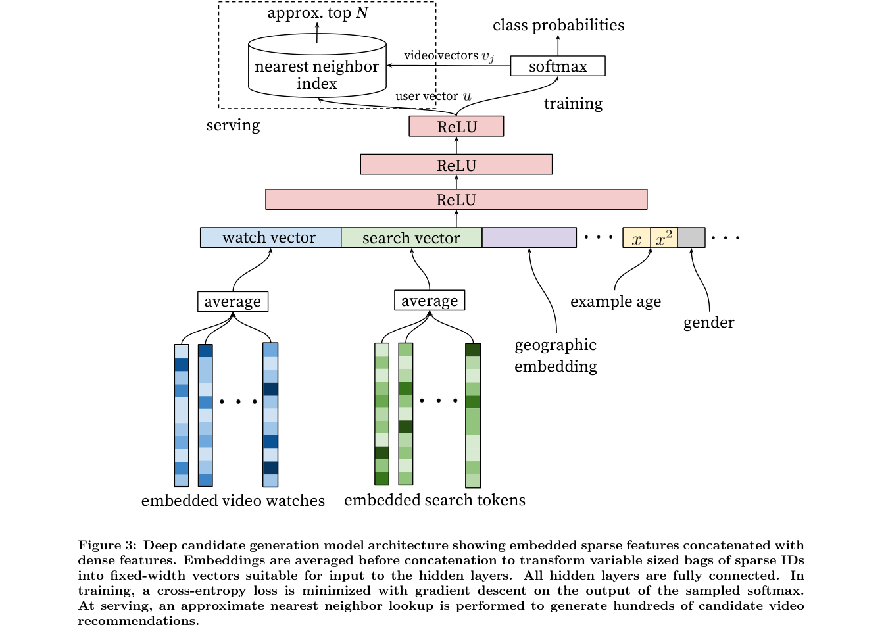

# YouTube DNN：候选生成中的深层用户塔

> 复现级别：**核心机制复现**。实际训练历史聚合、非线性用户塔和 item embedding 打分；YouTube 私有日志及生产 sampled softmax 未复刻。

## 论文信息

| 项目 | 内容 |
| --- | --- |
| 论文链接 | [RecSys 2016 paper](https://research.google/pubs/deep-neural-networks-for-youtube-recommendations/) |
| 公司/机构 | Google / YouTube |
| 首次公开日期 | 2016-09-15（ACM RecSys 2016） |
| 原文开源代码 | 否：论文未提供官方/作者代码（核查日期：2026-07-28） |
| Adapter | `youtube-dnn` |
| 本地复现代码 | [`src/auto_research/reproductions/youtube_dnn/`](https://github.com/daiwk/auto-research/tree/main/src/auto_research/reproductions/youtube_dnn/) |

## 原始论文总结

### 背景与主要改动

YouTube 将推荐拆成候选生成与精排。候选阶段要从百万量级视频中快速召回，传统矩阵分解难以吸收异构历史和上下文。

观看历史 embedding 经过聚合和多层网络形成用户向量，训练目标把下一次观看建模为大规模多分类；服务时用近邻检索取候选。

<!-- paper-figure:start -->
### 原论文关键图

> **原论文 Figure 3（关键图）**：展示原论文提出的核心架构、主要模块及其连接关系。图片来自[原论文](https://research.google/pubs/deep-neural-networks-for-youtube-recommendations/)，版权归原作者所有；点击图片可查看来源。
<!-- paper-figure:end -->

### 核心公式

$$
P(v=i\mid U)=\frac{\exp(v_i^\top u)}{\sum_j\exp(v_j^\top u)}.
$$

### 论文离线与线上效果

论文给出线上系统设计与离线比较，但未披露满足本项目硬门槛的量化线上 lift；本条是用户明确批准的经典例外。

## 本地复现

> **本地对照口径**：基线为历史均值 two-tower，实验组增加 YouTube DNN 非线性用户塔；NDCG@10 相对 **-6.61%**，见 `metrics/movielens-100k-seeds42-44.json`。

- 数据：完整 MovieLens-100K。
- 公平基线：历史平均池化 two-tower。
- 方法：在同一 item embedding、负采样和预算下增加非线性用户塔并执行全目录评估。
- 运行：`auto-research reproduce --paper youtube-dnn --dataset-dir data`

三 seed 下 NDCG@10 为 `0.02854→0.02666`，该缩放设置未复现论文方向性收益，作为负结果保留。
