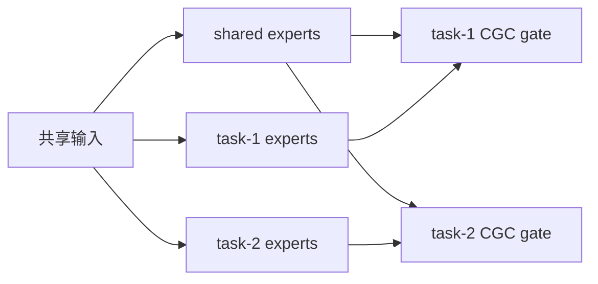
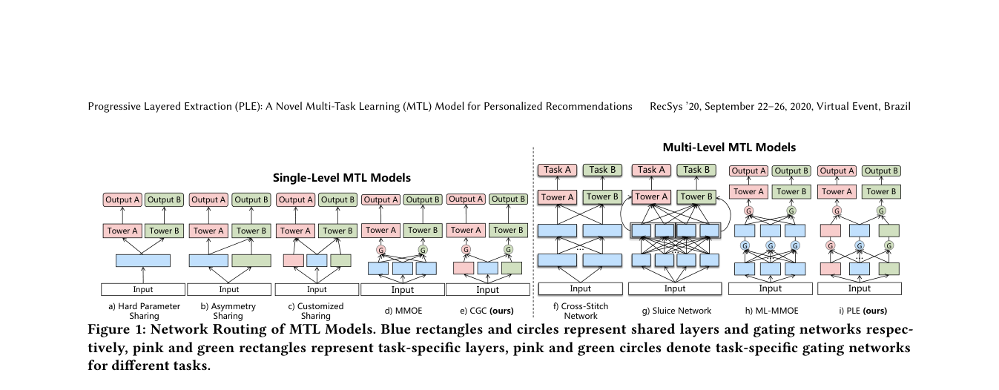

# PLE：共享与任务专属信息的渐进抽取

> 复现级别：**核心机制复现**。实际训练共享/任务专属 experts、CGC gates 和独立 heads；腾讯视频生产规模未复刻。

## 论文信息

| 项目 | 内容 |
| --- | --- |
| 论文链接 | [RecSys 2020 paper](https://doi.org/10.1145/3383313.3412236) |
| 公司/机构 | Tencent |
| 首次公开日期 | 2020-09-22（ACM RecSys 2020） |
| 原文开源代码 | 否：论文未提供官方/作者代码（核查日期：2026-08-09） |
| Adapter | `ple` |
| 本地复现代码 | [`src/auto_research/reproductions/ple/`](https://github.com/daiwk/auto-research/tree/main/src/auto_research/reproductions/ple/) |

## 原始论文总结

### 背景与主要改动

MMoE 仍让所有 experts 在所有任务间共享，任务冲突强时难以同时保留共性与个性。

PLE 将 experts 分成共享组和任务专属组，通过 CGC 门控逐层提取共享与特定信息，减少跷跷板现象。

<!-- paper-figure:start -->
### 原论文关键图

> **原论文 Figure 1（关键图）**：展示原论文方法的总体设计和关键组成。图片来自[原论文](https://doi.org/10.1145/3383313.3412236)，版权归原作者所有；点击图片可查看来源。
<!-- paper-figure:end -->

### 核心公式

$$
f^k(x)=\sum_{i\in E_k\cup E_s}g_i^k(x)f_i(x).
$$

### 论文离线与线上效果

原文在公开任务和腾讯视频推荐任务上优于 MMoE 等基线，并描述生产部署；本条按用户批准作为经典例外。

## 本地复现

> **本地对照口径**：基线为 MMoE，实验组为共享与任务专属 experts 的 CGC/PLE；平均任务 AUC 相对 **+1.34%**，见 `metrics/movielens-100k-seeds42-44.json`。

- 数据：MovieLens-100K 两任务 entire-space 构造。
- 基线：同预算的 MMoE。
- 方法：两组任务专属 experts 加共享 experts，各任务只门控自己的专属组与共享组。
- 运行：`auto-research reproduce --paper ple --dataset-dir data`

三 seed 下 CTR AUC 为 `0.56882→0.57982`，conversion AUC 为 `0.56009→0.56418`，两个任务均提升。
